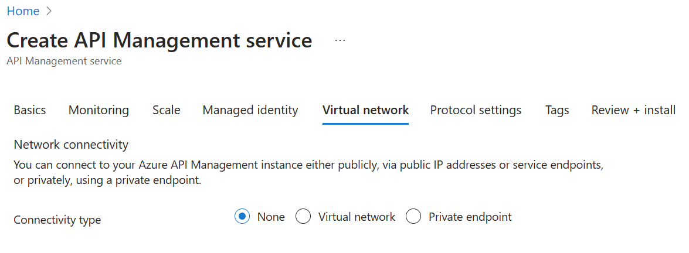

Using the naming convention defined [previously](../0-prerequisites/prerequisite-0-2-naming.md), fill in each required field and press *Review + Create*, followed by *Create* to provision the service. 

> Please bear in mind that this Azure API Management instance is entirely intended for the purposes of the lab, and the approach is simplified to provide every lab participant a common starting point. To that end, **please do not modify any settings beyond the ones we ask** for here as it may result in having to recreate the Azure API Management instance later, which is costly with respect to time.

Please note that the **service name must be unique**, this is where the owner value of your naming convention will be useful.

The naming conventions here are:
- Resource group: `rg-<environment>-<region>-<application-name>-<owner>-<instance>`
- APIM: `apim-<environment>-<region>-<application-name>-<owner>-<instance>`.

> Take note of the Azure API Management service name as you will need it for forming URLs in this lab.

Please use the **Developer** tier, which provides [all relevant features at the lowest cost](https://azure.microsoft.com/en-us/pricing/details/api-management/#pricing). 

Please do not modify other settings. Specifically, the *Virtual network* tab should remain as **None**. We will allude to best practices for securing access to Azure API Management later on in this workshop.

Once started, it is not necessary to remain on this page or in the Azure Portal. If you entered a valid email address, you will receive a provisioning completion email:

**VIDEO**: There is a video example that walks through creation and verification that you can find [HERE](https://youtu.be/LFKnYz5PnvU?si=mWGUtL1WGr1hFQRi)