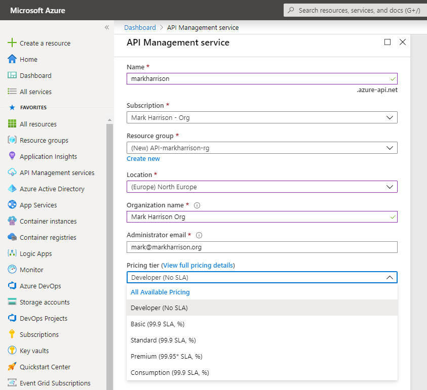
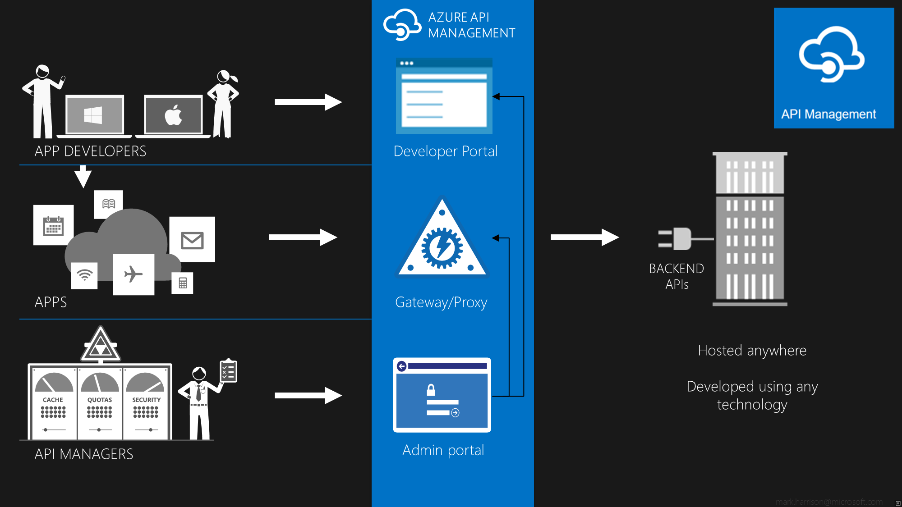
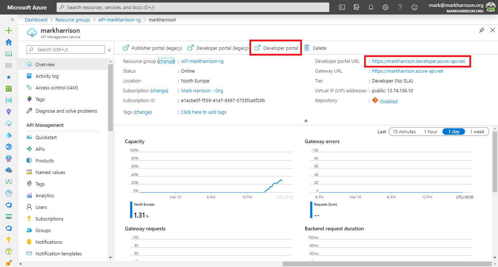

## Create an API Management instance

An instance can take sometime to provision - so have one created in advance of any demo.

Use appropriate values and hit [Create] to provision the service.

- The service name must be unique.
- For demo purposes, use the Developer tier.

Once the service has been provisioned, there will be:

- Publisher Administration - (now located in the Azure Management Portal - the older Publisher portal has now been deprecated)
- Developer portal
- Gateway

The link to the developer portal is at the top of the Overview blade.

