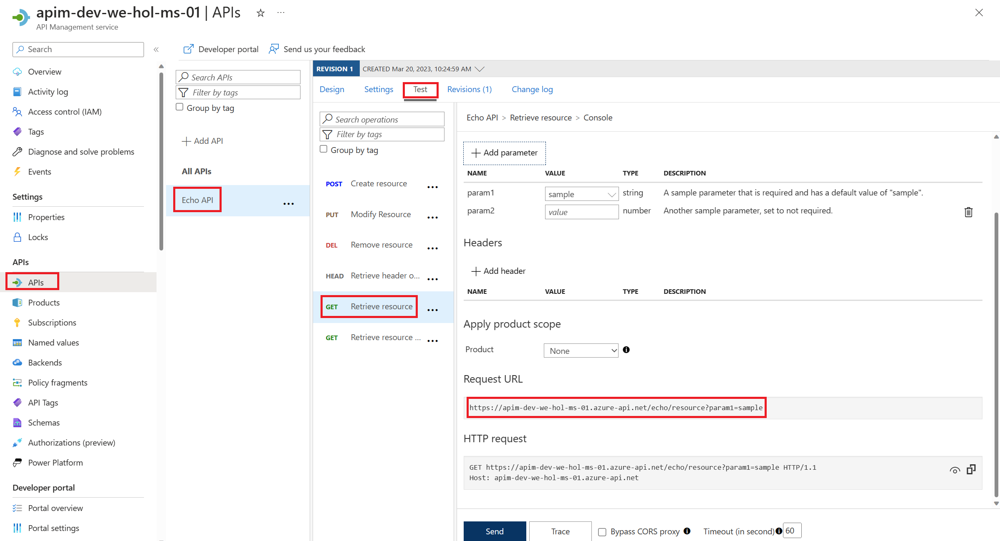
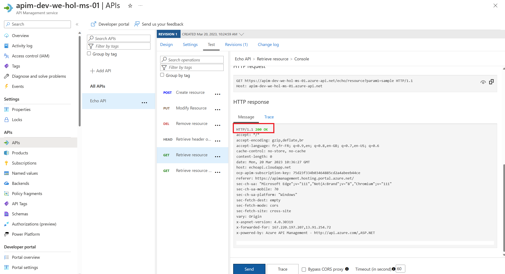
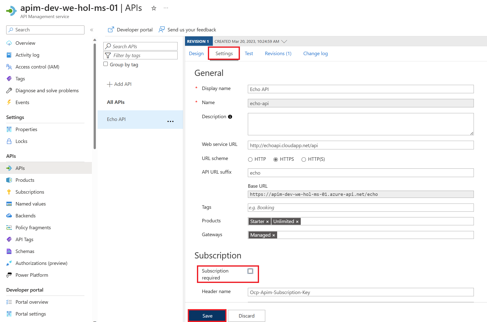
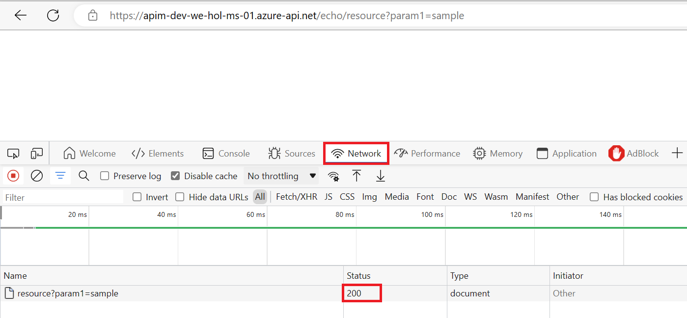

## Create an API Management instance

Due to the substantial infrastructure, an API Management instance can take some time to provision. Expect ~45-75 minutes. Therefore, **please create an instance prior to any demo.**

Using either your own or [Azure's common naming convention](https://docs.microsoft.com/en-us/azure/cloud-adoption-framework/ready/azure-best-practices/resource-naming), fill in each required field and press *Review + Create*, followed by *Create* to provision the service. 

> Please bear in mind that this APIM instance is entirely intended for the purposes of the lab, and the approach is simplified to provide every lab participant a common starting point. To that end, please do not modify any settings beyond the ones we ask for here as it may result in having to recreate the APIM instance later, which is costly with respect to time.

Once started, it is not necessary to remain on this page or in the Azure Portal. If you entered a valid email address, you will receive a provisioning completion email.

Please note that the **service name must be unique**. We recommend to include your initials and numeric date.

> Take note of APIM service name as you will need it for forming URLs in this lab.

Please use the **Developer** tier, which provides [all relevant features at the lowest cost](https://azure.microsoft.com/en-us/pricing/details/api-management/#pricing). 

Please do not modify other settings. Specifically, the *Virtual network* tab should remain as **None**. We will allude to best practices for securing access to APIM later on in this workshop.

## Verifying the API Management instance

Once the APIM instance has been created, please verify that it functions correctly by following these steps:

1) Navigate to the newly-created APIM instance in the Azure Portal.
2) Select the *APIs* blade, then select the *Echo API*. 
3) Press the *Test* tab, then select the *GET Retrieve resource* operation.
4) Press *Send* to issue a simple request.

    

5) Observe the `200` Success response.

    

At this time you have successfully verified that APIM is set up!

### Verification Failure (and Path to Success)

You may have noticed the *Request URL* and may be tempted to put it in your browser, issue a CURL statement, etc. If you do, you may see a `401` error and wonder what's happening.

The reason for this the unauthorized access status code is that the *Echo API* requires a subscription key to be set. Whereas tests originating in APIM account for this automatically, external callers cannot (and, naturally, should not).

Back in APIM, switch to the *Settings* tab and uncheck *Subscription required* and press *Save* at the bottom of the page.

> Subscriptions are important and useful, but in this case, we just want to quickly verify the APIM instance is working as intended.

Accessing the link in your browser should now show you no error message. In fact, in order to verify the 200, it's easiest to open your Developer Tools (F12), navigate to the *Network* tab, and look at *All* requests to see the 200.

Alternatively, you can issue a verbose (`-v`) CURL command against the *Echo API* and observe the `200` Success: `curl -v https://<your apim instance>.azure-api.net/echo/resource?param1=sample`

