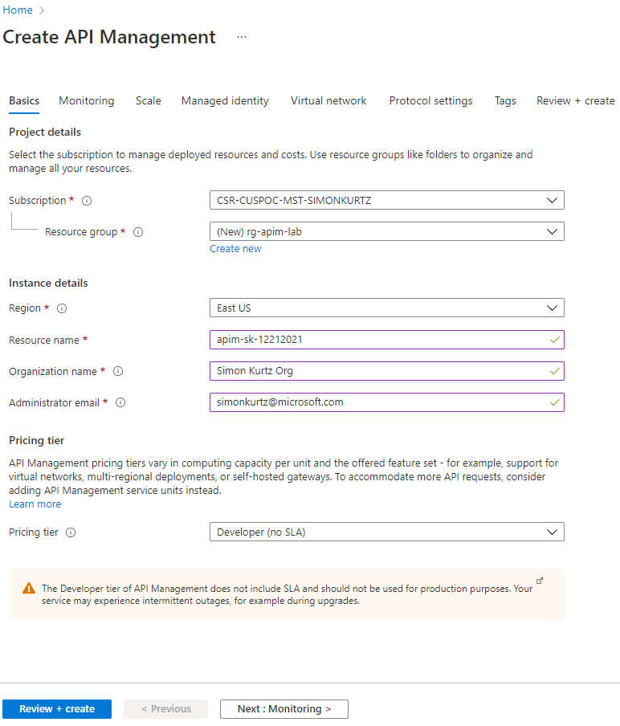

## Create an API Management instance

An instance can take some time to provision. Expect ~45-75 minutes. Therefore, please create an instance prior to any demo.

Use appropriate values and hit **Review + Create**, followed by **Create** to provision the service.

- The service name must be unique. Recommendations are to include your initials, numeric date, etc.
- For demo purposes, use the Developer tier.

Once the service has been provisioned, there will be:

- Publisher Administration
- Developer portal
- Gateway

The link to the Developer Portal is at the top of the Overview blade.

