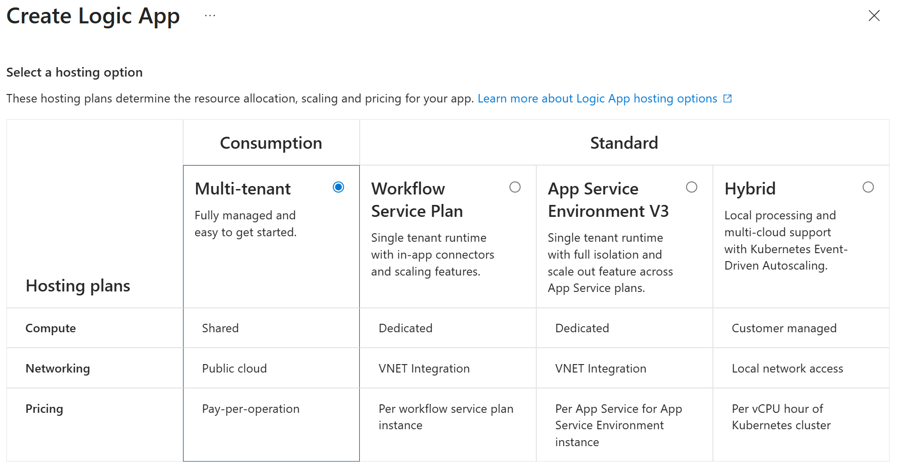
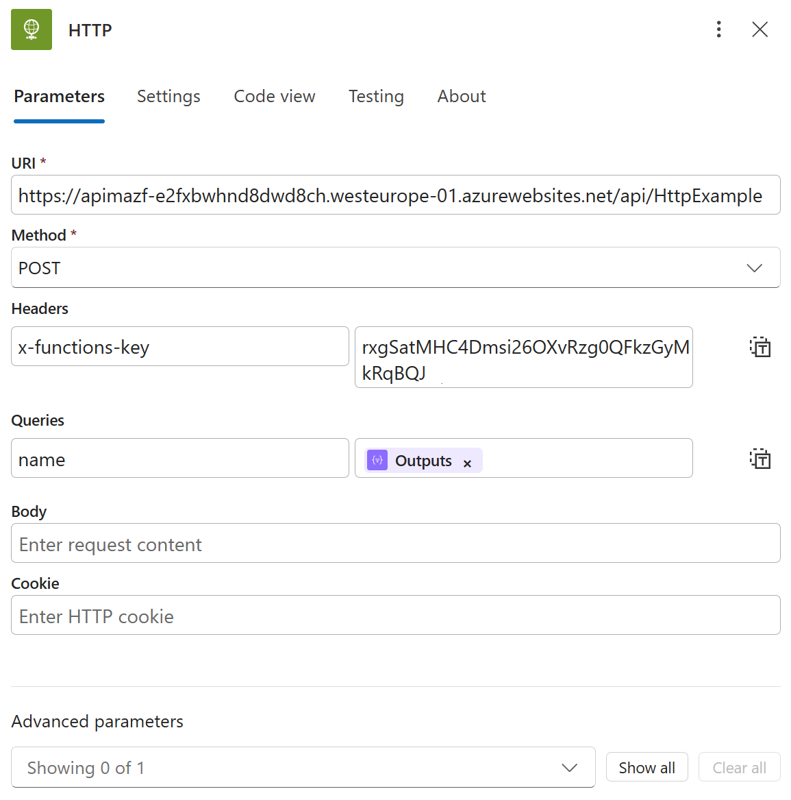
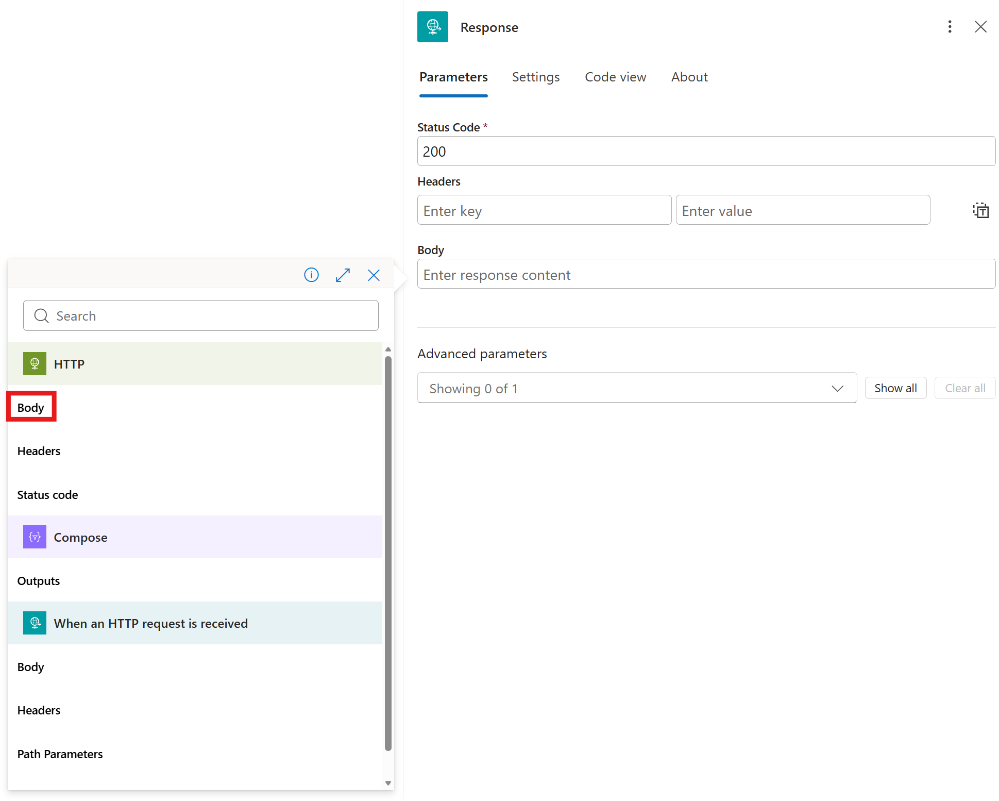
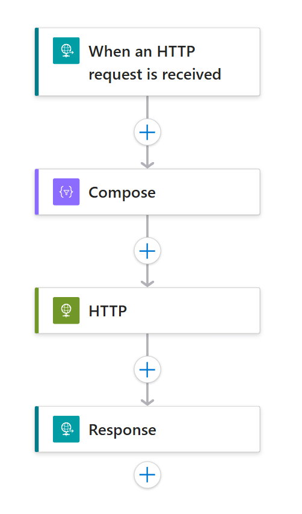
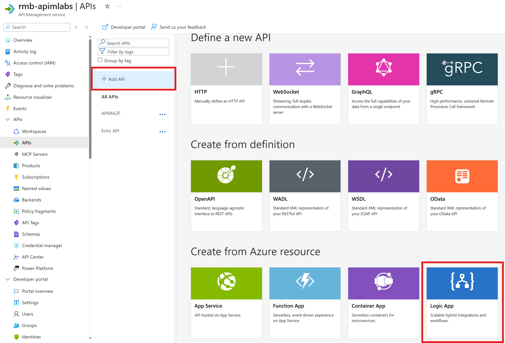
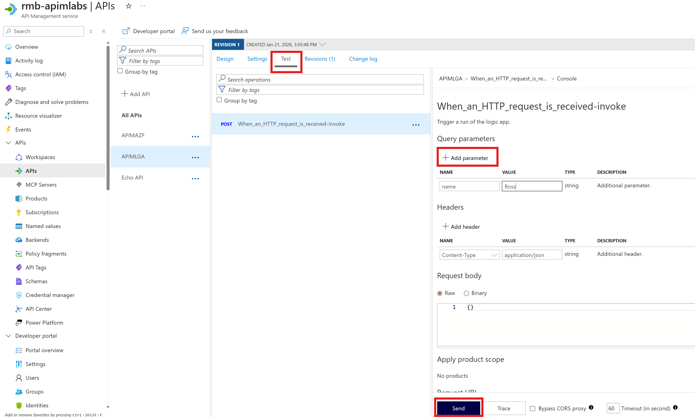

## API Proxy to Serverless

Azure Serverless (Functions and Logic Apps) can be configured to benefit from the advantages of Azure API Management.

### Azure Functions

In this section, we will create a simple HTTP Triggered Azure Function which runs on the [Flex Consumption](https://learn.microsoft.com/en-us/azure/azure-functions/flex-consumption-plan) plan. Flex Consumption is a Linux-based Azure Functions hosting plan that uses a serverless billing model and provides private networking, flexible memory size allocation and fast scale-out capabilities.

- Create a simple function that is Triggered by an HTTP Request. Navigate to the **Azure Functions** portal and click **Create**.

- In the **Create Azure Function** screen, select **Flex Consumption**.

- On the **Basics** properties screen, fill in the details as follows:

- **Resource Group (create new)**: `af-dev-we-apimazf-[your-initials]-01`
- **Function App Name**: `APIMAZF`
- **Region**: `West Europe`
- **Runtime stack**: `3.12`
- **Instance size**: `512MB`

- On the **Authentication** section, select **Managed Identities** for all of the options as shown below.

- Wait for the Azure Function to be created and deployed and then go to resource. You should see your new Azure Function App. It's empty at the moment, we'll need to add a function handler.

- You can add a function handler to your Azure Function in a variety of ways, through the command line, VS Code and so on. We'll keep it simple and use the CLI. Open a **Cloud Shell** (not Powershell) on this page. Run the following commands in this cloudshell. These commands will populate the directory with a simple Python function handler that is triggered by HTTP:
  - `func init --worker-runtime python`
  - `func new --name HttpExample --template "HTTP trigger" --authlevel "function"`

- Finally, run the following command to publish your local function to your Azure Function App:

  - `func azure functionapp publish APIMAZF`

- The function will take a while to deploy to your function app but once complete, you should see a green success message in the cloud shell terminal and a new **HTTPExample** function listed in the **Functions** section of the **Overview** blade.

- If you click on the **HTTPExample** Function, this will take you to the **Code + Test** console where you can inspect the **function_app.py** Python Code. As you can see below, the template HTTP Trigger code is very simple. It defines a single route which prints a successful message and a personalised message if a **name** is passed as a query parameter. Let's test that next with an API.

- Let's now create an API based on this Azure Function App and HTTPTrigger. Add the function to Azure API Management. In the API blade, select **+Add API** and the **Function App** tile.

- Select the **Browse** button.

- Select the Function App we created earlier and then **Select**.

- Select the **HTTPExample** Function Handler from the app and then **Select**.

- Accept the defaults and click **Create**

- Validate the function works in the APIM portal. Select the **APIMAZF** API, select **Test**, then select the **HTTExample** post route. Add a **Query Parameter** called **Name** with the value of your choice. Click **Send** to see the response. You can optionally test again but this time remove the **name** query parameter to see a different response.

Congratulations, you have successfully created an API from an Azure Function!

### Azure Logic Apps

In this section, we will create a simple Logic App that is Triggered by a HTTP Request and which will run our Azure Function from the previous step. We will then use this Logic App to create an API in APIM.

- Before we create a Logic App, we will need the **Function URL** from our Azure Function. In the **Azure Function portal**, find the Azure Function you created in the previous step. In **Overview**, click on **HTTPExample** from the **Functions** list and then **Get Function URL**. Copy the **default (Function key)** and keep this safe. This is the function URL with the default function key and we will need this for our Logic App to call the Azure Function.

- In the **Logic App portal**, click **Create** and then select **Consumption** to create a new Logic App on the Consumption plan.

- Add the following basic details:
  - **Name**: `APIMLGA`
  - **Resource Group (re-use Azure Function RG)**: `af-dev-we-apimazf-[your-initials]-01`

- After creation and in the **Logic app designer**, click on **Add a Trigger**, click on **Request**, and then select **When an HTTP request is received**.

- Click on the **+** to add an action after the **When an HTTP request is received** and select **Compose** within the **Data Operations** section. Paste the following into the **Inputs** textbox: `@{triggerOutputs()?['queries']?['name']}`. This retrieves the name from the query parameters that we will pass in to the Logic App and eventually pass in from APIM.

- Click on the **+** to add a **HTTP** action within the **built-in HTTP section**. In the *HTTP* details, enter the following and hit **Save** when complete:
  - **URI**: Add the first section of your function URL before the question mark e.g. `https://apimazf-e2fxbwhnd8dwd8ch.westeurope-01.azurewebsites.net/api/HttpExample`.
  - **Method**:  Select **POST**
  - **Headers**: Add a key **x-functions-key** and use the code value from the remainder of your function url as the value e.g code=**rxgSatMHC4Dmsi26OXvRzg0QFkzGyMkRqBQJrqhdszFuSueRvQ==**
  - **Queries**: Enter **name** for the name and for the value, select the lightenning bolt to select a **Dynamic Expression** and then selecting **Outputs** from the **Compose** action. This enables us to propogate the name query parameter from the input to Logic App through to the Azure Function.

- Click on the **+** below the **HTTP** action to add a **Response** action, which is under **Request** in the **By Connector** section. In the **Body** text box, click the lightenning bolt to add a dynamic expression and select **Body** from the HTTP action. This will return the response body from the Azure Function.

- Your final Logic App workflow should look like the image below:

- Hit **Save** at the top left of the workflow.

- Back in the **APIM Portal**, navigate to the **APIs** blade, click **Add API** and in the **Create from Azure resource** section, click on **Logic App**.

- In the **Create from Logic App** dialog, click **browse** to find the Logic App you just created. Click **Select**. Once the details from the Logic App you selected have been filled into boxes automatically in the **Create from Logic App** dialog, hit **Create**.

- This will create an API based on our Logic App and should automatically generate a single POST route entitled **When_an_HTTP_request_is_received-invoke**. Select that **POST** operation and click on **Test**. Add a Query Parameter using **name** as the name and a value of your choice. Finally, click **Send** to send the test request. You should see the same response as previously because the Logic App will output the response from the Azure Function. As before, you can send another test without a name query parameter to get a generic and non-personalised response.

**This completes our exercise into creating APIs in APIM from Azure Functions and Logic Apps!**

