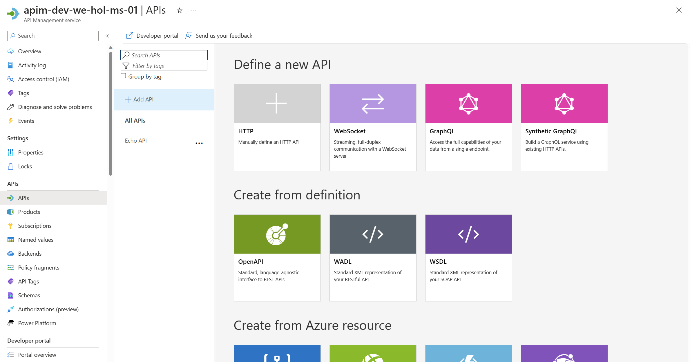

## APIs

- On the left menu, open the *APIs* blade. You will see all APIs, the possibility to add new ones, but also to customize existing ones.

  

### Add API from Scratch

Instead of developing an API, for this lab you will use the existing [*Star Wars* API](https://swapi.dev):

1) Click on **Add API**.  
2) Click on **HTTP - Manually define an HTTP API**.  
3) Select the **Full** option in the **Create an HTTP API** dialog.  
4) Enter **Display name** `Star Wars`, **Name** `star-wars`, and, optionally, **Description**.  
5) Assign `https://swapi.dev/api` to the **Web service URL**.  
6) Keep the **URL scheme** at `HTTPS` as we strive to enforce HTTPS only.  
7) Set the **API URL suffix** to `sw`. This allows us to compartmentalize the Azure API Management URLs for distinct APIs.  
8) Assign **Starter** and **Unlimited** products.  
9) Press **Create**.  
