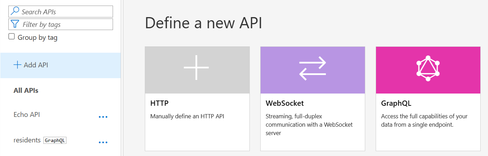
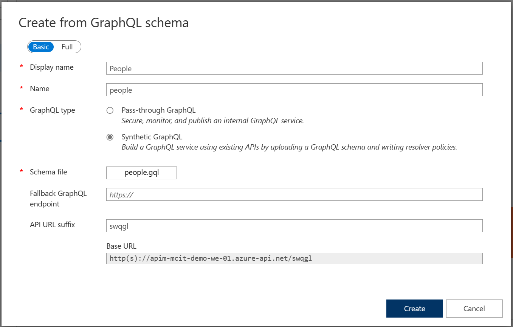
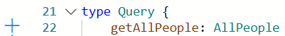
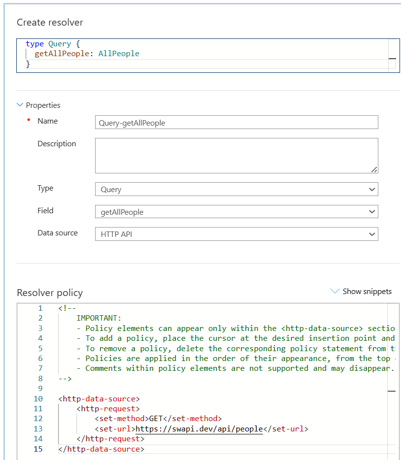
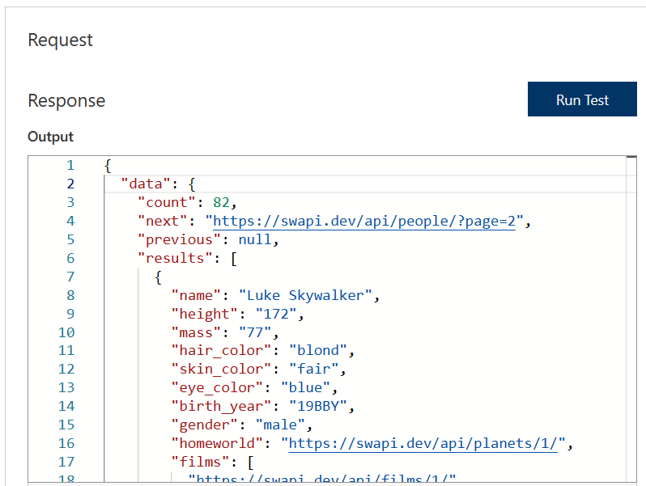
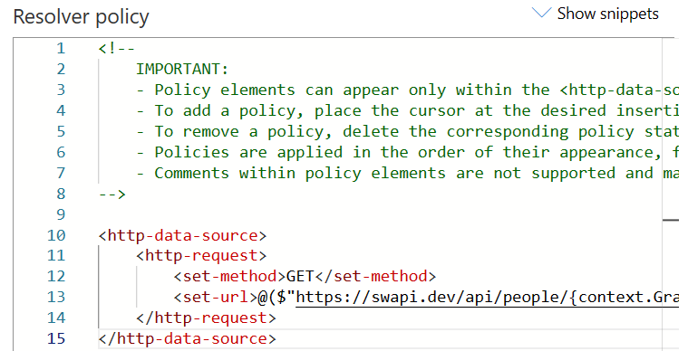
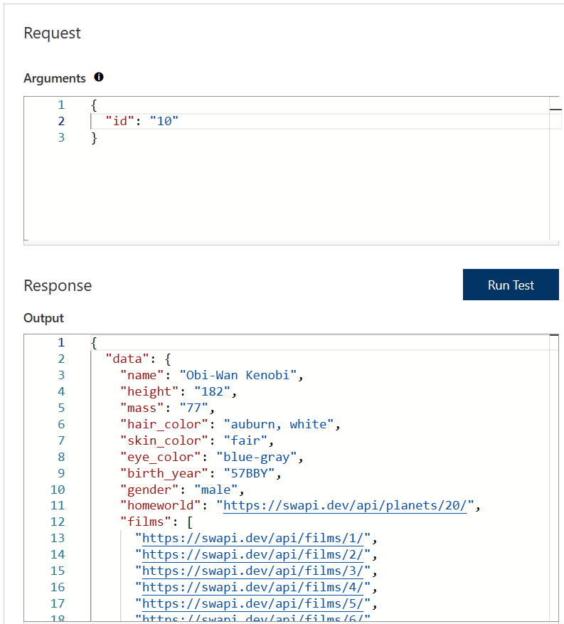

## Adding a Synthetic GraphQL API

For this lab you will use the existing [*Star Wars* API](https://swapi.dev) as the HTTP backend for your GraphQL APIs. 

Copy the following contents to a new file (People.gql) on any folder on your machine. 
```
type Person {
    name:       String!
    mass:       Int
    height:     Int
    hair_color: String
    skin_color: String 
    eye_color:  String 
    birth_year: String 
    gender:     String
    homeworld:  String
    url:        String 
}

type AllPeople {
    count:      Int!
    next:       String
    previous:   String
    results:    [Person]
}

type Query {
    getAllPeople: AllPeople
    getPerson(id: String): Person
}
```


- On the left menu, open the *APIs* blade. You will see all APIs, In the "Add API" screen select "GraphQL".

  

### Add GraphQL API

1) Click on **Add API**.  
2) Enter **Display name** `People`, **Name** `people`.  
3) For the GraphQL type, select **Synthetic GraphQL**.  
4) For the schema file, browse and upload the GraphQL schema (`People.gql`).  
5) Set the **API URL suffix** to `swgql`. This allows us to compartmentalize the Azure API Management URLs for distinct APIs.  
6) Press **Create**.

  

### Add Resolvers 

1) In the Schema tab, click on **+ sign** on the left side of the line `people: [AllPeople]` in `type Query {` section.
   
2) This opens the create resolver page. Scroll down to the resolver policy section.
3) Edit the `<set-method>` field in the resolver policy to `<set-method>GET</set-method>`
4) Edit the `<set-url>` field in the resolver policy to `<set-url>https://swapi.dev/api/people</set-url>`
   
5) On the right side of the screen, click on **Run Test** button to validate the backend HTTP data source URL.
   
6) Click the **Create** button on the bottom of the page to create HTTP resolver.
7) Let us add a second resolver, for finding a person by ID. In the Schema tab, click on the **+ sign** on the left side of the line `person(id: String!): Person` in the `type Query {` section.
8) This opens the create resolver page. Scroll down to the resolver policy section.
9) Edit the <set-method> field in the resolver policy to `<set-method>GET</set-method>`
10) Edit the <set-url> field in the resolver policy to `<set-url>@($"https://swapi.dev/api/people/{context.GraphQL.Arguments["id"]}")</set-url>`
    
12) On **Run Test** section, in the **Arguments** section, change {"id": "null"} to {"id": "10"} and click **Run Test**.
    
13) Click the **Create** button on the bottom of the page to create the second HTTP resolver. 
   
