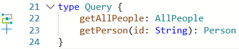
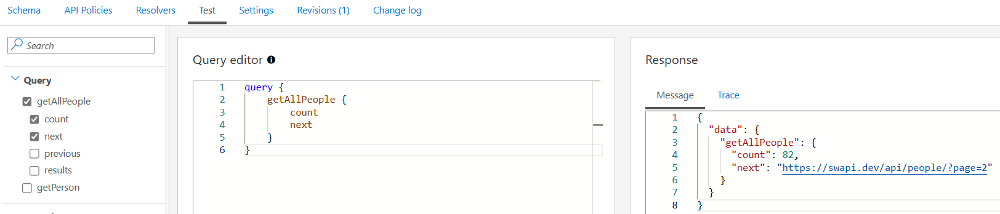
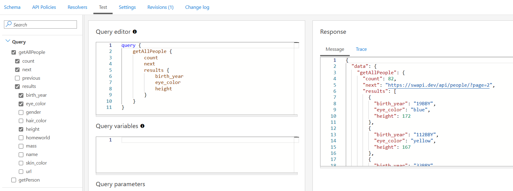
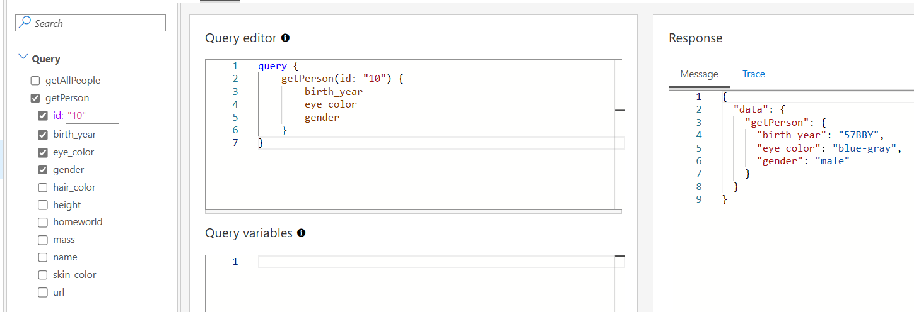
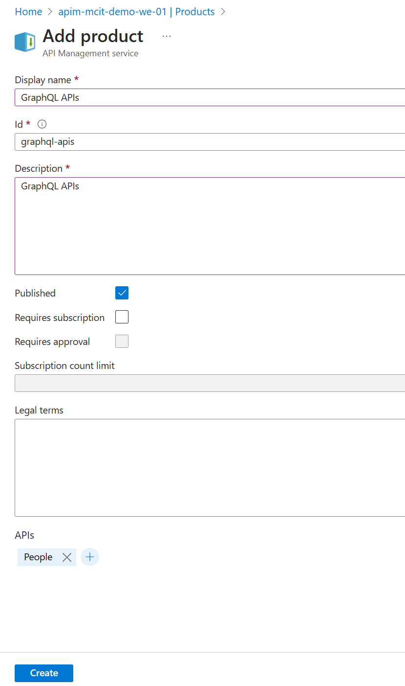
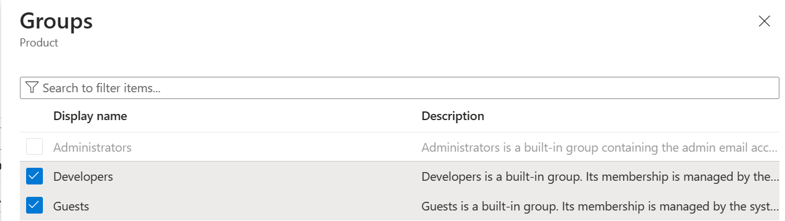
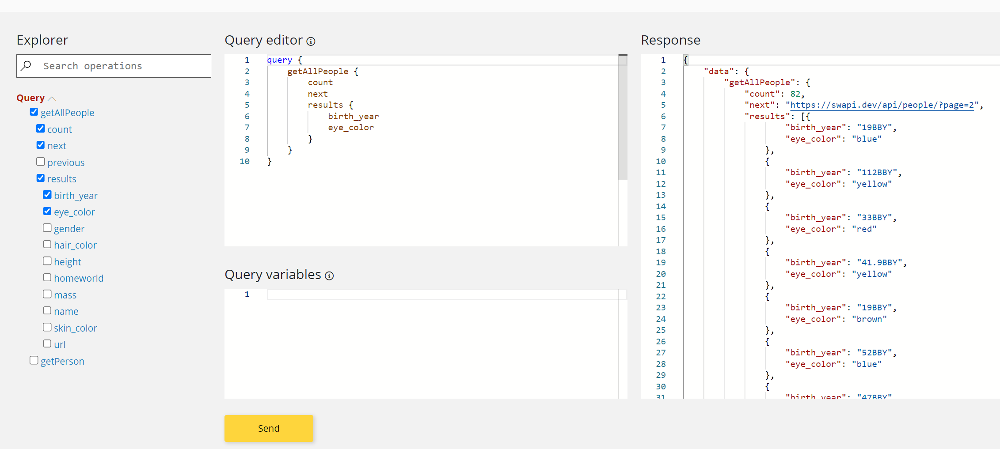

## Adding a Synthetic GraphQL API

For this lab you will use the existing [*Star Wars* API](https://swapi.dev) as the HTTP backend for your GraphQL APIs. 

Copy the following contents to a new file (People.gql) on any folder on your machine. 
```
type Person {
    name:       String!
    mass:       Int
    height:     Int
    hair_color: String
    skin_color: String 
    eye_color:  String 
    birth_year: String 
    gender:     String
    homeworld:  String
    url:        String 
}

type AllPeople {
    count:      Int!
    next:       String
    previous:   String
    results:    [Person]
}

type Query {
    getAllPeople: AllPeople
    getPerson(id: String): Person
}
```


- On the left menu, open the *APIs* blade. You will see all APIs, In the "Add API" screen select "GraphQL".

  

### Add GraphQL API

1) Enter **Display name** `People`, **Name** `people`.  
2) For the GraphQL type, select **Synthetic GraphQL**.  
3) For the schema file, browse and upload the GraphQL schema (`People.gql`).  
4) Set the **API URL suffix** to `swgql`. This allows us to compartmentalize the Azure API Management URLs for distinct APIs.  
5) Press **Create**.

  

### Add Resolvers 

1) In the Schema tab, click on **+ sign** on the left side of the line `getAllPeople: AllPeople` in `type Query {` section.
   
   
   
2) This opens the create resolver page. Scroll down to the resolver policy section.
3) Edit the `<set-method>` field in the resolver policy to `<set-method>GET</set-method>`
4) Edit the `<set-url>` field in the resolver policy to `<set-url>https://swapi.dev/api/people</set-url>`
   
   
   
5) On the right side of the screen, click on **Run Test** button to validate the backend HTTP data source URL.
   
   
   
6) Click the **Create** button on the bottom of the page to create HTTP resolver.
7) Let us add a second resolver, for finding a person by ID. In the Schema tab, click on the **+ sign** on the left side of the line `person(id: String!): Person` in the `type Query {` section.
   
  
  
8) This opens the create resolver page. Scroll down to the resolver policy section.
9) Edit the <set-method> field in the resolver policy to `<set-method>GET</set-method>`
10) Edit the <set-url> field in the resolver policy to `<set-url>@($"https://swapi.dev/api/people/{context.GraphQL.Arguments["id"]}")</set-url>`
    
    
    
11) On **Run Test** section, in the **Arguments** section, change {"id": "null"} to {"id": "10"} and click **Run Test**.
    
    
    
12) Click the **Create** button on the bottom of the page to create the second HTTP resolver. 

## Test GraphQL API

1) In the Test tab, click on Query -> getAllPeople.
2) Select a few fields (such as count, next). Click the "Send" button on bottom of page to test the GraphQL API.

   

3) Select the results field, and select a few more fields in the results field. Click the "Send" button on the bottom of page to test the GraphQL API.

   

4) In the Test tab, click Query -> getPerson
5) Select the `id` field. Change `id: "string"`  to `id: "10"`
6) Select a few more fields. Click "Send" to test the GraphQL API.

   

## Test GraphQL APIs using Developer Portal

1) On the left menu, select `Products` and create a new product.
2) Enter the display name as `GraphQL APIs`
3) Provide a description for the product.
4) Select the check mark for `Published'.
5) In the APIs, add the People API.

   

6) Click on "Create" to create the product.
7) Open the product, and in the Product menu, select "Access Control".
8) Add "Developers" and "Guests" groups to the access control list.

   

9) Make sure that CORS is enabled in Developer Portal (API Management -> Portal Overview -> Enable CORS).
 
   

10) Open the Developer Portal in a private window.
11) Click on APIs
12) Select the People API
13) Click on "Try it" next to the getAllPeople
14) Select a few fields, and test the API.

    
