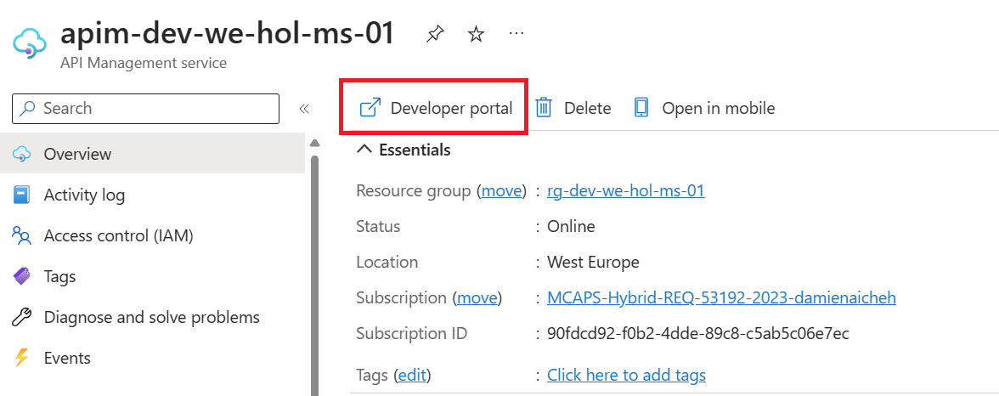
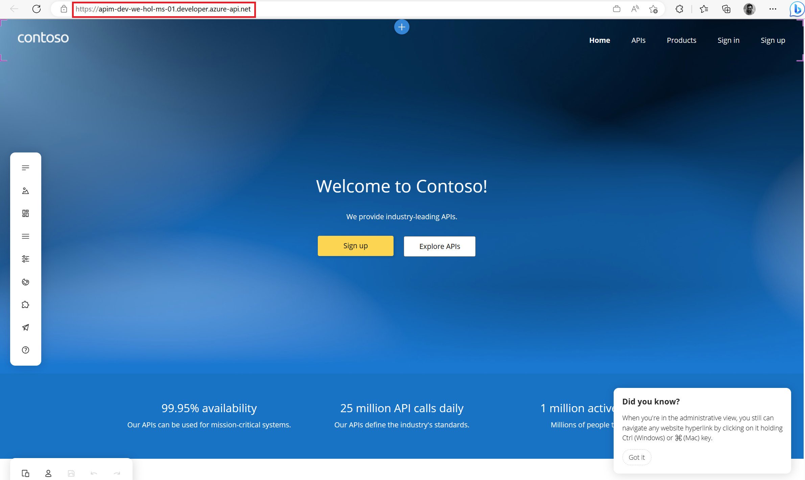
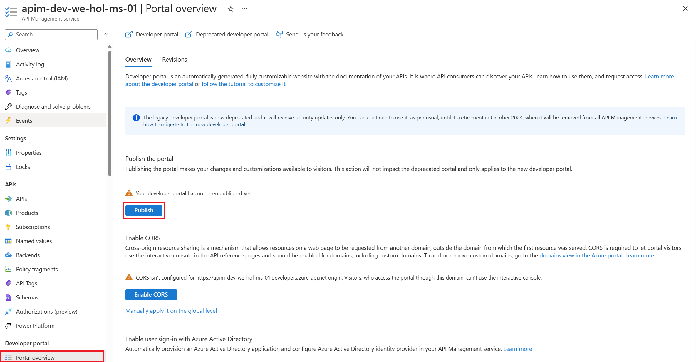
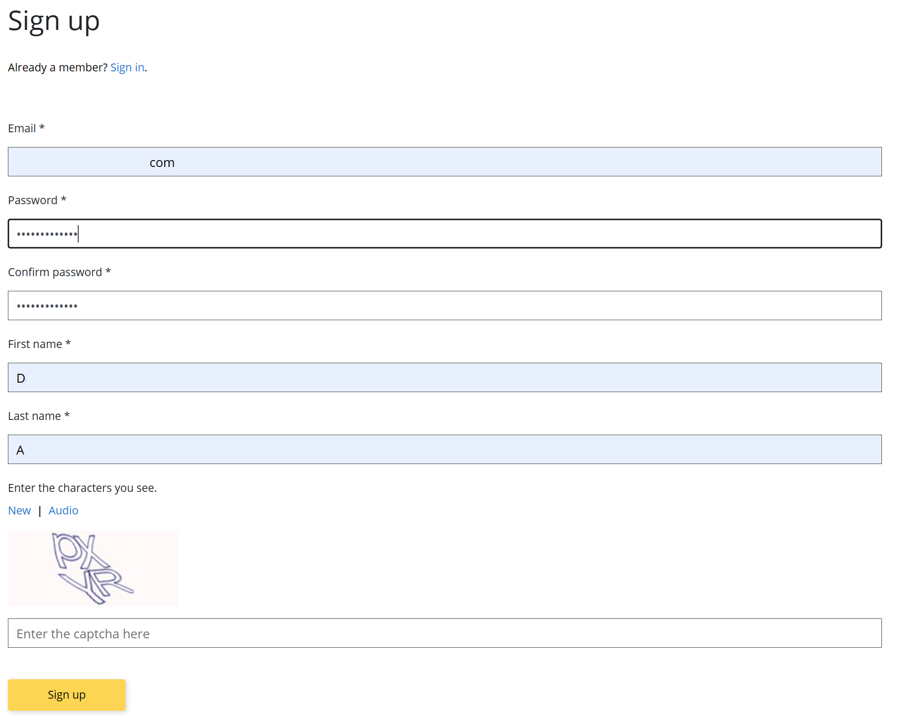
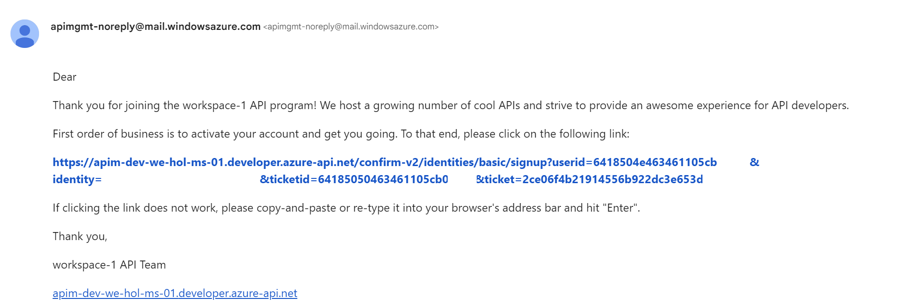
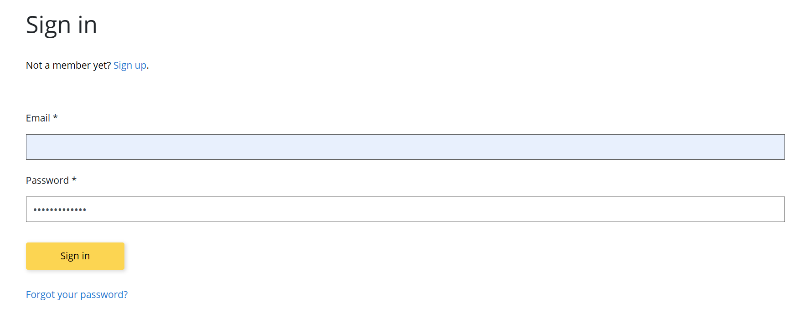
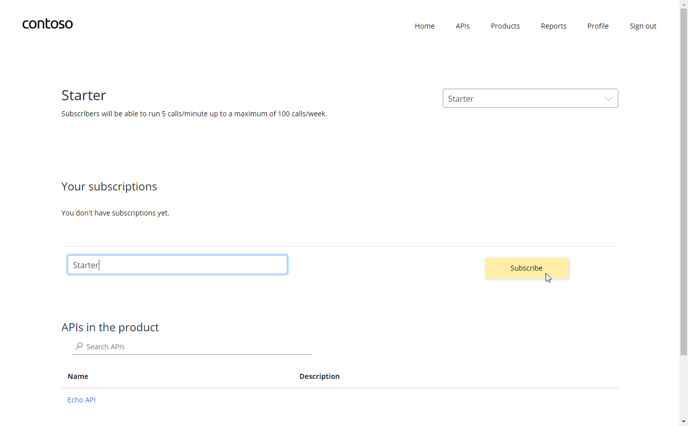
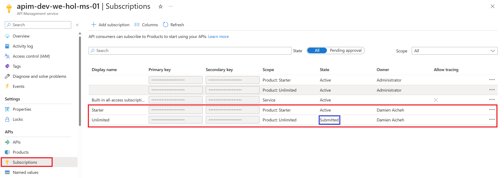
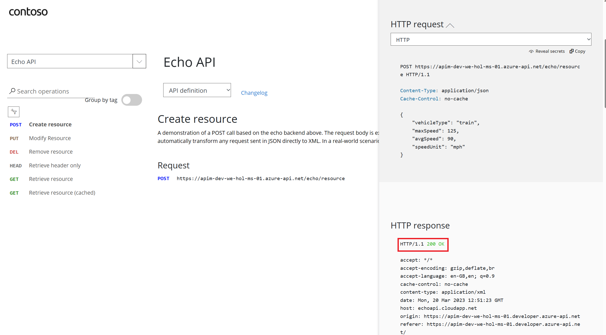

## Publishing the Developer Portal

The APIM Developer Portal uses role-based access control (RBAC). After creating the APIM instance, you need to first **access the Developer Portal using the admin role**, which will trigger its activation.

- Click the **Developer portal** link in the **Overview** blade of the APIM instance:

  

  

- You can now proceed with publishing the Developer Portal to allow anonymous and authenticated roles. Back in the Azure Portal, locate **_Developer Portal_** in the left-hand resource menu, then click on **Portal overview**. Press the **Publish** button and confirm with **Yes** in the popup. The portal will then be available for users to access.

  

- You will see confirmation once the Developer Portal has been published.

  

---

## Enabling CORS for the Developer Portal

Cross-origin resource sharing (CORS) is a mechanism that allows resources on a web page to be requested from another domain, outside the domain from which the first resource was served. CORS is required to let portal visitors use the interactive console in the API reference pages and should be enabled for domains, including custom domains.

- CORS is enabled by using policies. We will go deeper on this topic in part 4. For now we will enable this using a built-in UI by pressing the **Enable CORS** button.

  

  

---

## User Experience

Let's experience how your users will navigate through your portal. In order to do this, **we recommend opening a private tab in your browser or using another browser to avoid seeing the admin/edit version of the portal.** 

- Navigate to `https://{apim-service-name}.developer.azure-api.net`.

  > Keep this browser session open as we will use it frequently throughout our labs.

  

### Anonymous User

- As an unauthenticated user, have a look around the portal by checking out the APIs and products.

  > Notice the difference between the Starter & Unlimited products.

  

- Check out the APIs. As you can see, all operations exposed are described and can also be tested directly within the portal.

  

### Register for an account

- Let's sign up for an account by pressing the **Sign up** link in the upper right-hand corner. The email can be your personal or a work email for this lab, but please be sure to use an email other than the one associated with your Azure subscription. 

  

- Check your inbox for the acceptance email and confirm to activate your account.

  

### Sign into account

- Back in the private browser, sign in with your new credentials.

  

- Click on **Products**, then **Starter**.
- Enter `Starter` as the subscription name, then press **Subscribe**. You should receive a confirmation email shortly.

  

- Next, click back on **Products**, then **Unlimited**.
- Enter `Unlimited` as the subscription name, then press **Subscribe**.
  > Note that the `Unlimited` subscription requires admin approval.
- You should receive an email confirming your subscription request.

### Approving Subscriptions

- Back in the Azure Portal, navigate to the **Subscriptions** blade to see the two new subscriptions that were just added.

  

- Enter the menu for the submitted **Unlimited** subscription, then press **Activate subscription**. - Provide additional comments, if you like, then confirm the activation. By default, this will send an activation confirmation email to the user.

  

- Back in the private browser, refresh the profile page to see the activated **Unlimited** subscription.

  

### Try an API

It's now time to test one of the published APIs. 

- Open the **APIs** page and look at the **Echo API**:
  - Notice the developer information
  - Test the Echo API using the POST verb by pressing **Try it**, using the defaults, then pressing **Send** at the bottom. You should see a successful `200` response.

  

  
