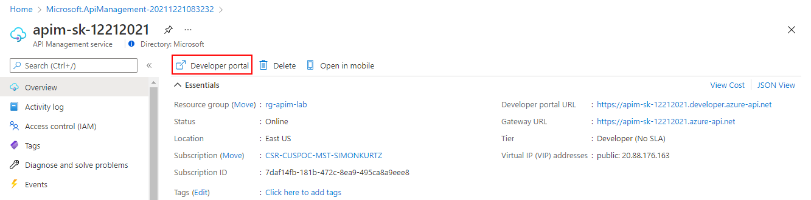
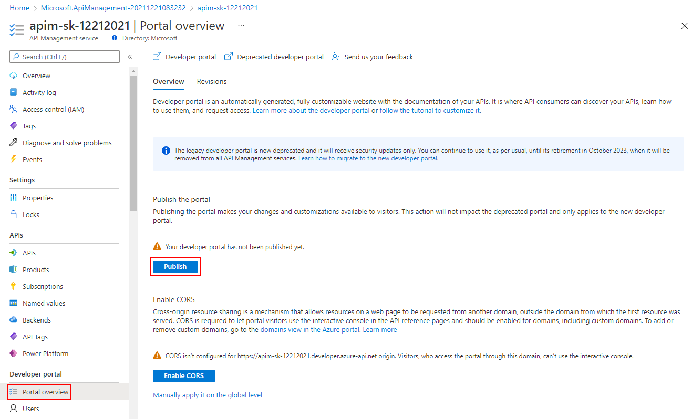
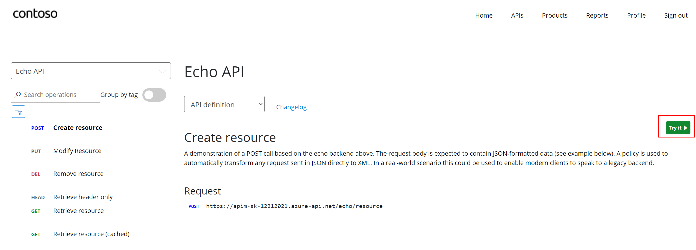

### Publishing the developer portal

The developer portal uses role based access, **when deploying Azure APIM for the first time, you need to first access the developer portal using the admin role, this will trigger its activation**, and can be done with the following link in the `Overview` blade of the apim instance:

After having accessed the dev portal in admin mode, you can now proceed with publishing to allow for anonymous and authenticated roles. Using the left-side menu `Portal Overview` Icon - select the `Publish` button.  It will then be available for users to access.

### Enabling CORS for the developer portal

Cross-origin resource sharing is a mechanism that allows resources on a web page to be requested from another domain, outside the domain from which the first resource was served. CORS is required to let portal visitors use the interactive console in the API reference pages and should be enabled for domains, including custom domains.

CORS is enabled by using policies, we will go deep on this topic in part 4. For now we will enable this using a builtin UI. To do this, using the left-side menu `Portal Overview` Icon - select the `Enable CORS` button.

After publishing the portal and enabling CORS, we should access the developer portal located at: {apim-service-name}.developer.azure-api.net

### User Experience

Let's experience how your users will navigate through your portal, in order to do this, **we recommend opening a private tab in your browser or using another browser, to avoid seeing the admin/edit version of the portal.** 

#### Anonymous User

As an unauthenticated user (=open URL in a new browser), look around the developer portal, and check the Products.

> Notice the difference between the Starter & Unlimited products

You can also check the APIs. As you can see, all operations exposed are described and can also be tested directly within the portal.

#### Register for an account

Let's sign up for an account (If logged in as Administrator - log out)

Check acceptance email and confirm to activate account

Sign into account

Select Starter Product and subscribe to a "Starter" subscription
  - Check email - subscription has been accepted and some key information are provided

Select Unlimited Product and subscribe to an "Unlimited" subscription
  - Check email - the subscription requires approval 

Check the user profile page - see products and keys
  - Note that the Unlimited subscription is not yet *Active* as this request has not yet been approved (status=submitted)

The "Unlimited" being in "submitted" state (=needs approval), you can, in Azure Portal, go in the `subcriptions` blade to approve it.

#### Try an API

It's now time to test one of the published APIs. Open the APIs page and look at the Echo API
  - Notice the developer information
  - Test the Echo API using the POST verb 

