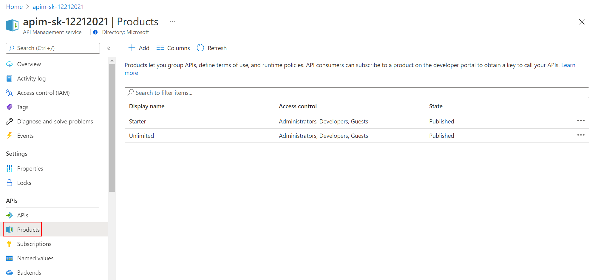
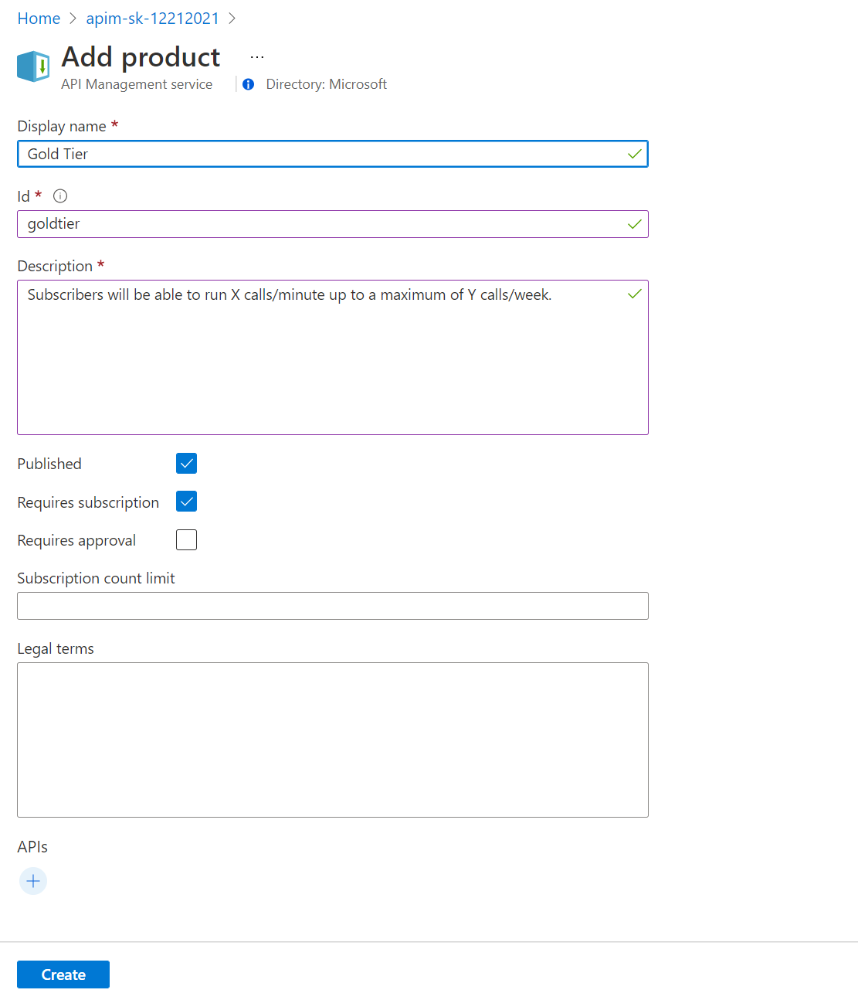
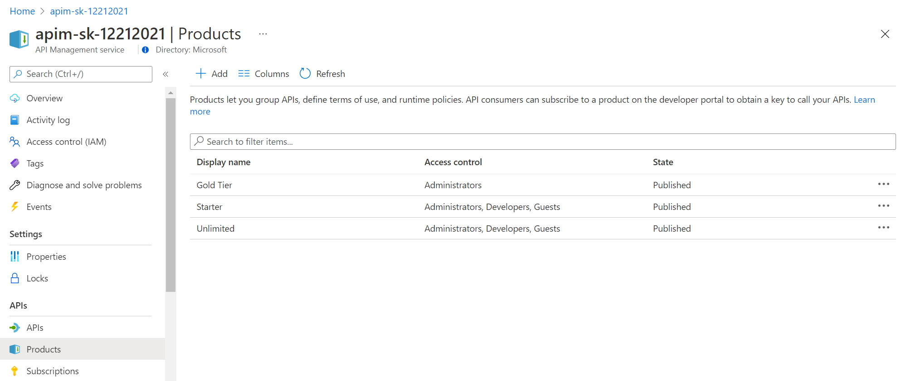
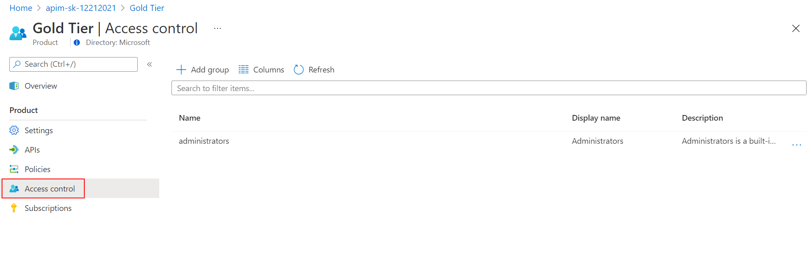

### Product Management

A product contains one or more APIs as well as a usage quota and the terms of use. Once a product is published, developers can subscribe to the product and begin to use the product's APIs.

#### Product definition

Again in the Azure Management portal, open the left menu `Products `

Add a new product - for example a Gold tier - change its visibility (Published) and click on the [Create] button

Set Access Controls to allow access to developers and guests

Once saved, see the new Gold Tier product in the Developer portal

