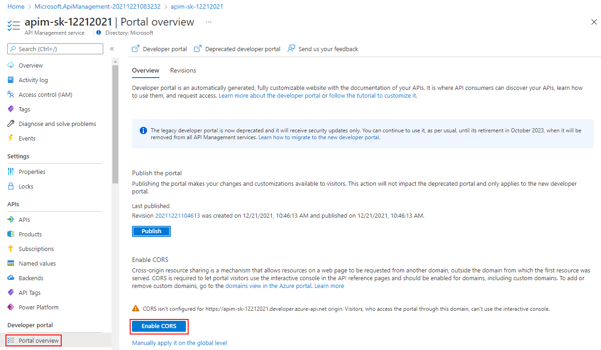
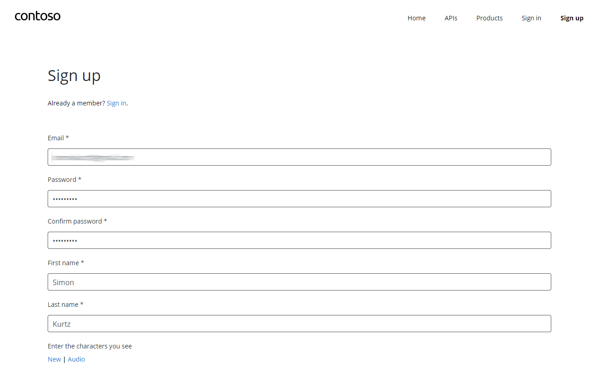
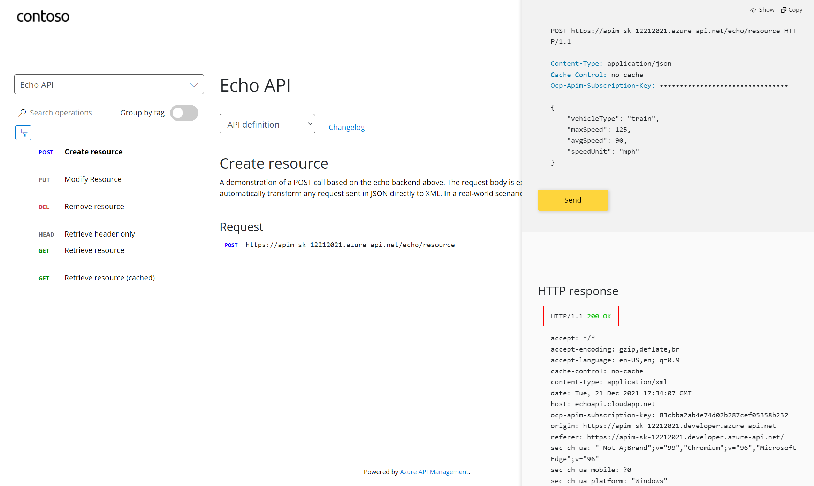
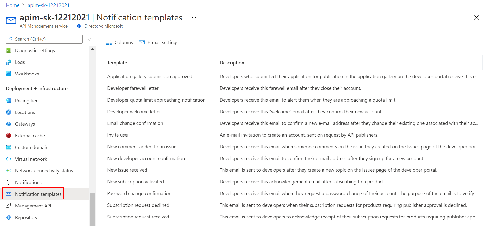
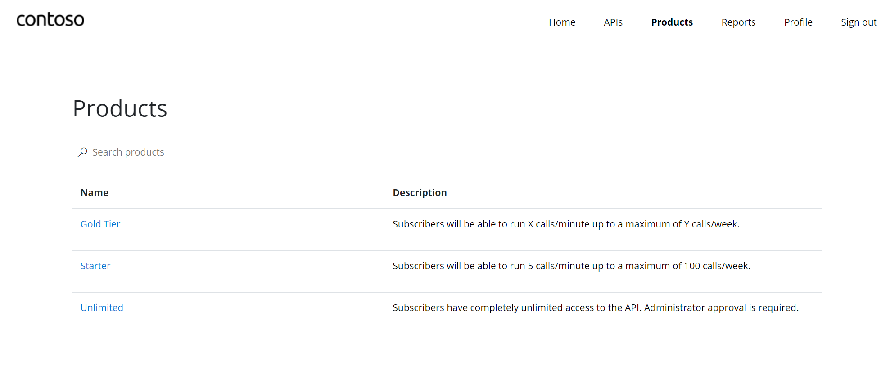

## Developer Portal

The developer portal is an automatically generated, fully customizable website with the documentation of your APIs. It is where API consumers can discover your APIs, learn how to use them, request access, and try them out. 

### Publishing the developer portal

Accessing from the link in the Overview blade of the Azure Management Portal, will display the developer portal in admin / edit mode and you can customize it.
Using the left-side menu `Portal Overview` Icon - select the `Publish` button.  It will then be available for users to access.

### Enabling CORS for the developer portal

Cross-origin resource sharing is a mechanism that allows resources on a web page to be requested from another domain, outside the domain from which the first resource was served. CORS is required to let portal visitors use the interactive console in the API reference pages and should be enabled for domains, including custom domains.

CORS is enabled by using policies, we will go deep on this topic in part 4. For now we will enable this using a builtin UI. To do this, using the left-side menu `Portal Overview` Icon - select the `Enable CORS` button.

After publishing the portal and enabling CORS, we should access the developer portal located at: {apim-service-name}.developer.azure-api.net

### User Experience

Let's experience how your users will navigate through your portal

#### Anonymous User

As an unauthenticated user (=open URL in a new browser), look around the developer portal, and check the Products.

> Notice the difference between the Starter & Unlimited products

You can also check the APIs. As you can see, all operations exposed are described and can also be tested directly within the portal.

#### Register for an account

Let's sign up for an account (If logged in as Administrator - log out)

Check acceptance email and confirm to activate account

Sign into account

Select Starter Product and subscribe to a "Starter" subscription
  - Check email - subscription has been accepted and some key information are provided

Select Unlimited Product and subscribe to an "Unlimited" subscription
  - Check email - the subscription requires approval 

Check the user profile page - see products and keys
  - Note that the Unlimited subscription is not yet *Active* as this request has not yet been approved (status=submitted)

The "Unlimited" being in "submitted" state (=needs approval), you can, in Azure Portal, go in the `subcriptions` blade to approve it.

#### Try an API

It's now time to test one of the published APIs. Open the APIs page and look at the Echo API
  - Notice the developer information
  - Test the Echo API using the GET verb 

### Customising the Developer Portal

#### Site Configuration

The developer portal is based on a fork of the Paperbits Web framework <https://paperbits.io/>, and is enriched with API Management-specific features.  The fork resides at <https://github.com/Azure/api-management-developer-portal>.

It is possible to self-host, and manage your own developer portal outside of an API Management instance. It's an advanced option, which allows you to edit the portal's codebase and extend the provided core functionality. This is documented at <https://github.com/Azure/api-management-developer-portal/wiki>/ and <https://docs.microsoft.com/en-us/azure/api-management/api-management-howto-developer-portal>.

Before you make your portal available to the visitors, you should personalize the automatically generated content. Recommended changes include the layouts, styles, and the content of the home page. This is documented at <https://docs.microsoft.com/en-us/azure/api-management/api-management-howto-developer-portal-customize>

Video on customization is available at <https://www.youtube.com/watch?v=5mMtUSmfUlw>

#### Email Configuration

The templates for the email notifications are managed from the Azure Management Portal, directly on the blade's side menu.
Look at the available notifications and notifications templates which are customizable

### Product Management

A product contains one or more APIs as well as a usage quota and the terms of use. Once a product is published, developers can subscribe to the product and begin to use the product's APIs.

#### Product definition

Again in the Azure Management portal, open the left menu `Products `

Add a new product - for example a Gold tier - change its visibility (Published) and click on the [Create] button

Set Access Controls to allow access to developers and guests

Once saved, see the new Gold Tier product in the Developer portal

