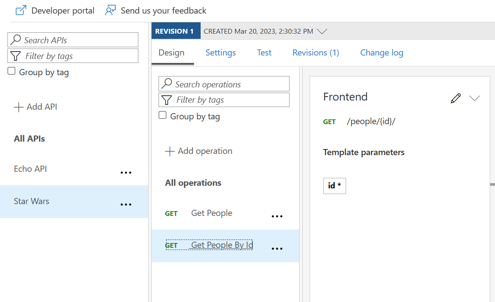
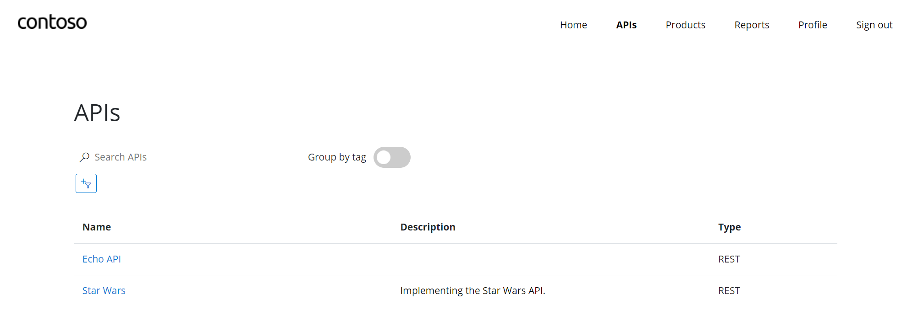
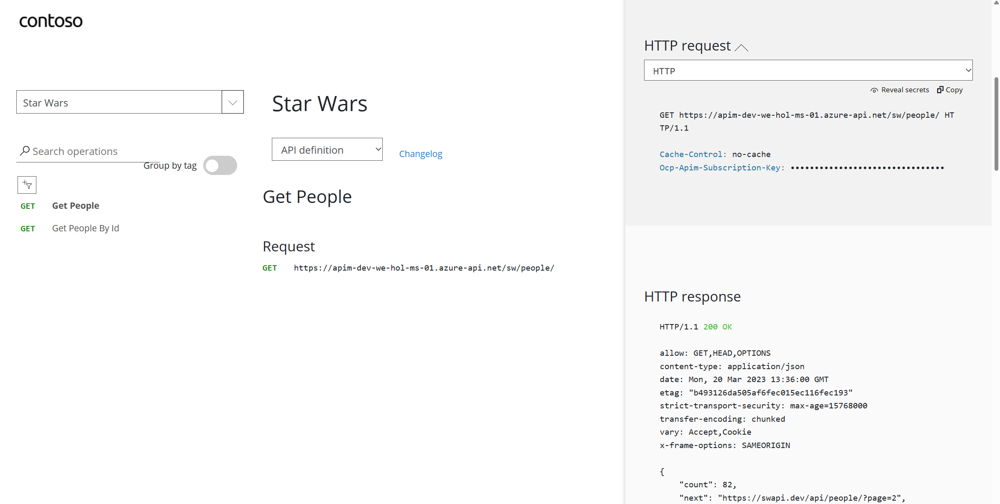
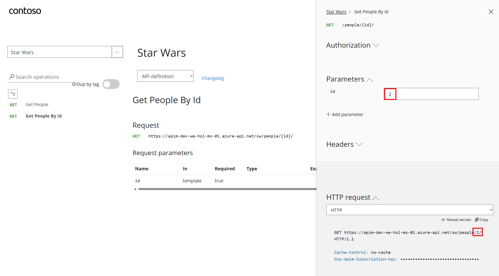

## APIs

- On the left menu, open the *APIs* blade. You will see all APIs, the possibility to add new ones, but also to customize existing ones.

  

### Add API from Scratch

Instead of developing an API, for this lab you will use the existing [*Star Wars* API](https://swapi.tech):

1) Click on **Add API**.  
2) Click on **HTTP - Manually define an HTTP API**.  
3) Select the **Full** option in the **Create an HTTP API** dialog.  
4) Enter **Display name** `Star Wars`, **Name** `star-wars`, and, optionally, **Description**.  
5) Assign `https://swapi.tech/api` to the **Web service URL**.  
6) Keep the **URL scheme** at `HTTPS` as we strive to enforce HTTPS only.  
7) Set the **API URL suffix** to `sw`. This allows us to compartmentalize the Azure API Management URLs for distinct APIs.  
8) Assign **Starter** and **Unlimited** products.  
9) Press **Create**.  

  > While it is conventionally a good idea to version APIs from the onset, we are omitting this step here for brevity of the labs.

  

- Once created, inside the *Star Wars* API press **+ Add operation** to declare two new operations:

  1) **Get People**  
    - Display name: **Get People**  
    - Name will be populate with: **get-people**  
    - URL: **GET /people/**  

  2) **Get People By Id**  
    - Display name: **Get People By Id**  
    - Name will be populate with: **get-people-by-id**  
    - URL: **GET /people/{id}/**  

  

### Access Star Wars API from Developer Portal

- Switch now to the Developer Portal and sign in as a developer with a subscription. 
- Select **Explore APIs**. You should see both **Echo API** and **Star Wars**.

  

- Click on **Star Wars**. Try the **Get People** operation. Observe a successful `200` response.

  

- Now try the **Get People By Id** operation with `id = 2`

  

- Examine the successful `200` response with `C-3PO`'s details in the response body payload.
  
  
