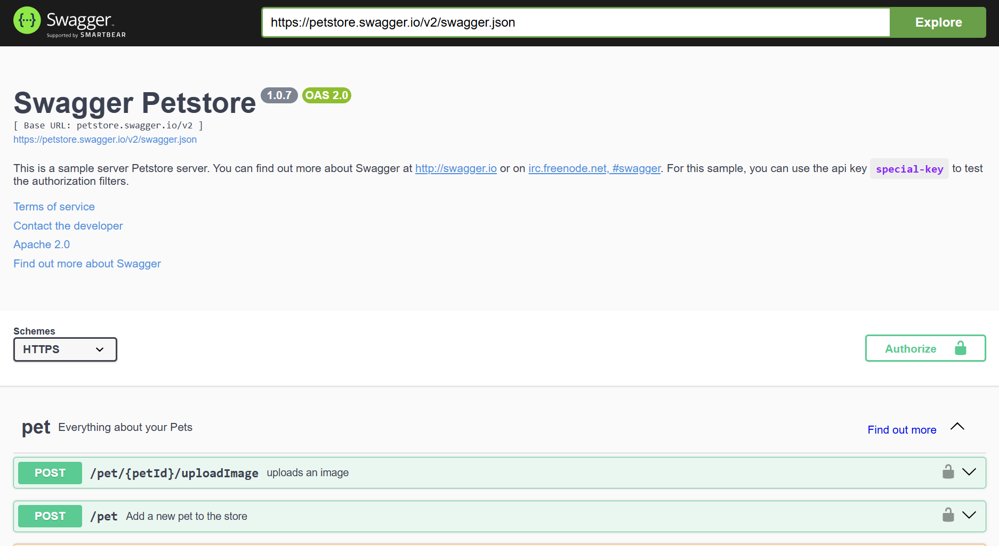
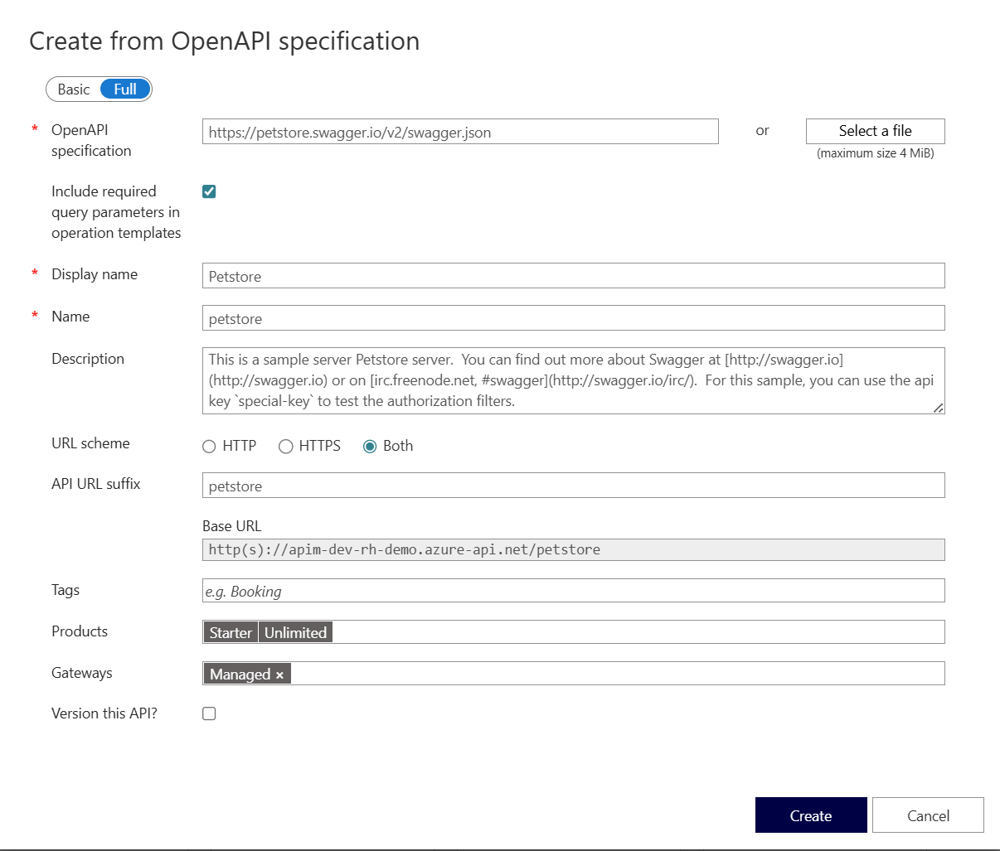
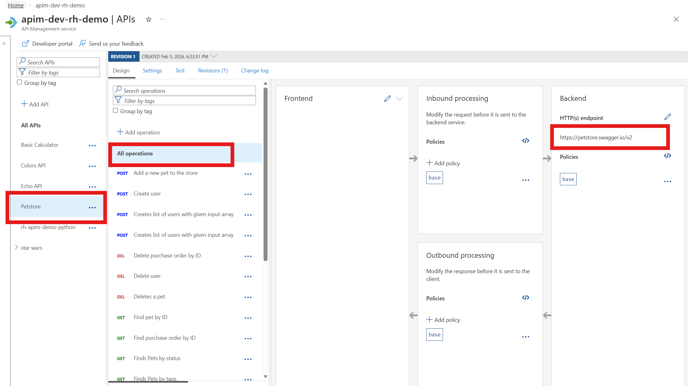
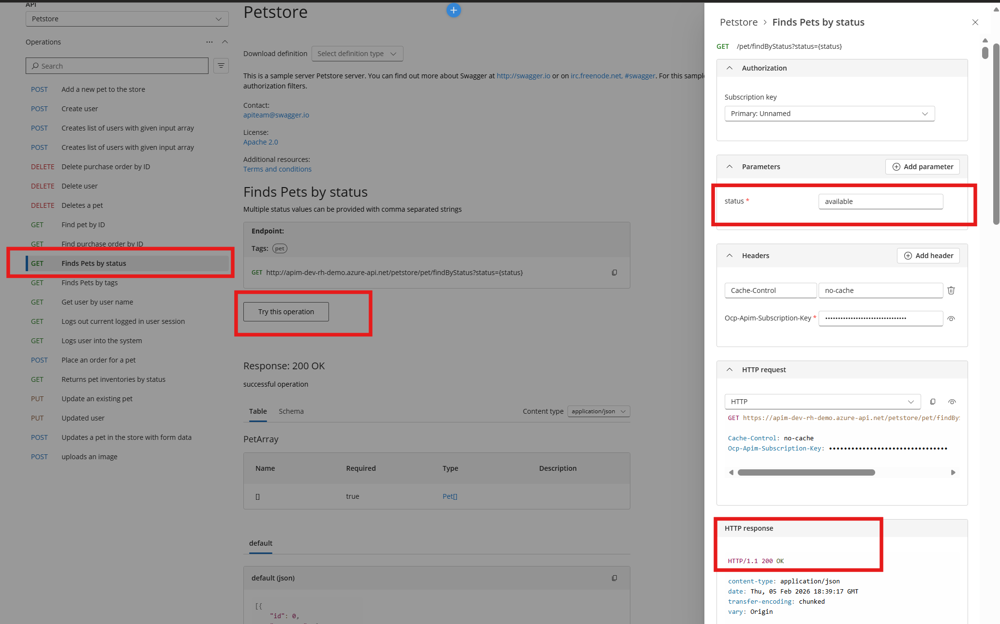
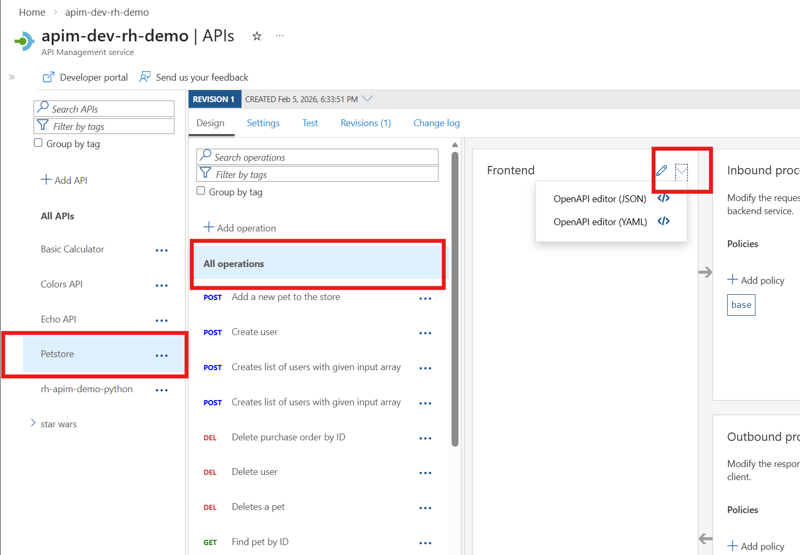
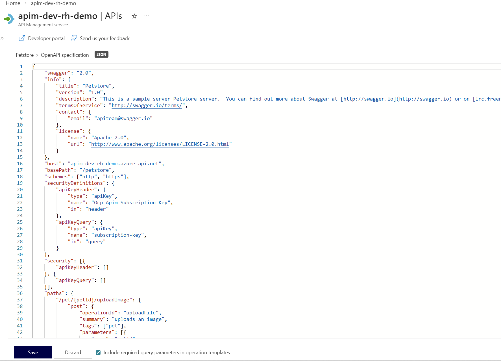

## Import API using OpenAPI

Instead of importing operations one-by-one, you can also import a full API. The [OpenAPI specification](https://www.openapis.org/) (aka [Swagger](https://swagger.io)) is a definition format to describe RESTful APIs. The specification creates a RESTful interface for easily developing and consuming an API by effectively mapping all the resources and operations associated with it.

As a demo we will use an API that offers a sample pet store service: [Swagger Petstore](https://petstore.swagger.io)

1) On the left menu, open the **APIs** blade.  
2) Click on **Add API**.  
3) Under **Create from definition** select **OpenAPI**.  
4) Select the **Full** option in the **Create from OpenAPI specification** dialog.  
5) Enter `https://petstore.swagger.io/v2/swagger.json` as the **OpenAPI specification** value. You should subsequently see **Display name**, **Name**, and **Description** populate. For simplicity, change **Display name** and **Name** to just `Petstore`.  
6) The **URL scheme** defaults to `HTTPS` since the backend supports HTTPS - no change needed.  
7) Set the **API URL suffix** to `petstore`.  
8) Assign **Starter** and **Unlimited** products.  
9) Press **Create**.  

- Once the API is created, it will show in the list of APIs along with all of its operations.

  

- Back in the Developer Portal, try out the Swagger Petstore API via the **Find pets by status** GET method, then examine the response.  

> Select `available` as the status parameter value.

- Back in the Azure API Management Portal, we can inspect / edit the OpenAPI definition by selecting the *Edit* icon from the Frontend block:

---

## Troubleshooting

### Unable to complete the request

If you encounter a CORS error when testing from the Developer Portal, ensure that CORS policies are properly configured for your API. You can add a CORS policy in the **Inbound processing** section. See the [CORS policy lab](../4-policy-expressions/policy-expressions-4-1-cors.md) for more details.