## Calling API and testing Subscription Keys

Let's add another API, the [Colors API](https://colors-api.azurewebsites.net/swagger/v1/swagger.json).

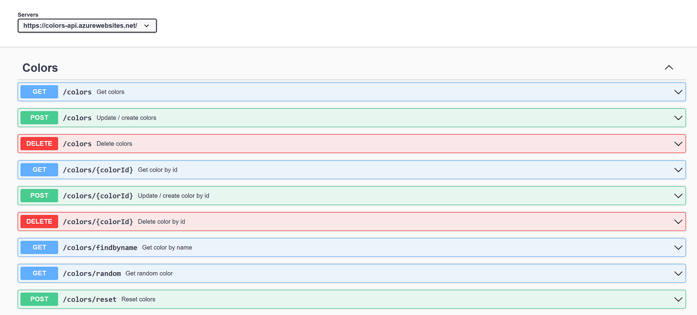

- Create a new API with OpenAPI specification and import swagger from <https://colors-api.azurewebsites.net/swagger/v1/swagger.json>. 
- This time we will choose to not provide API URL suffix. Without API URL suffix, there could be endpoint conflicts, you can always leverage [rewrite-uri](https://learn.microsoft.com/en-us/azure/api-management/api-management-transformation-policies#RewriteURL) policy to convert a request URL form to the form expected by the backend web service. 

  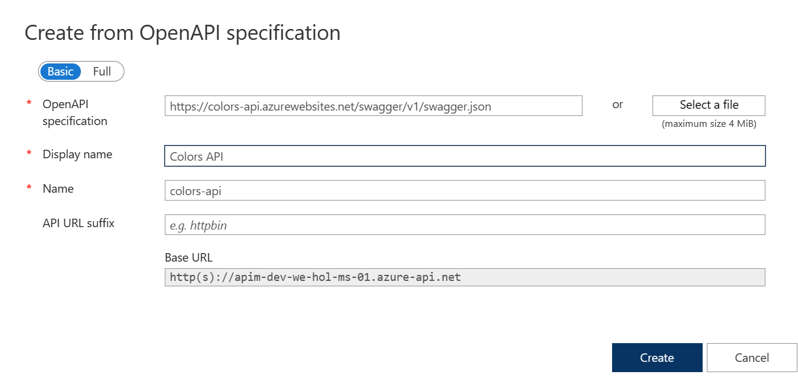

  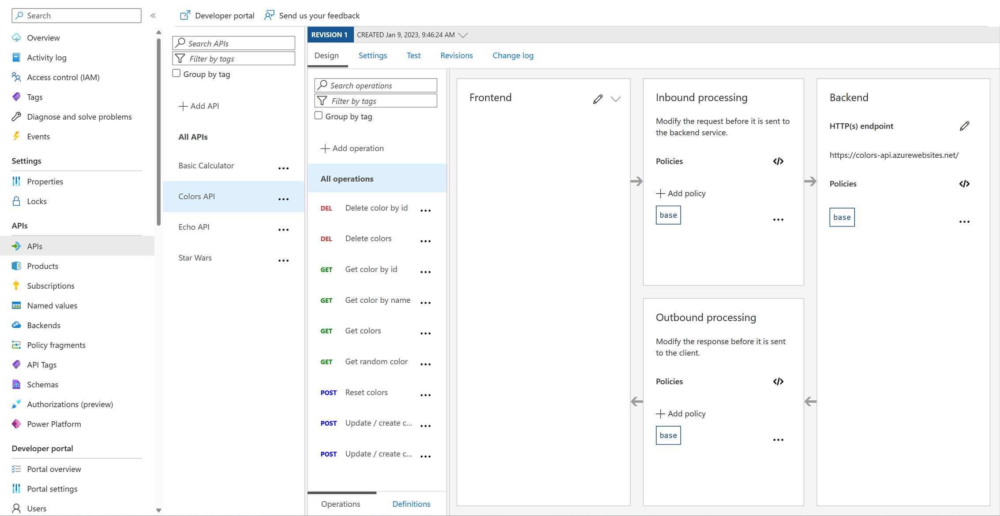

- We can test the newly-added API from the **Test** tab. Note the successful `200` response.

  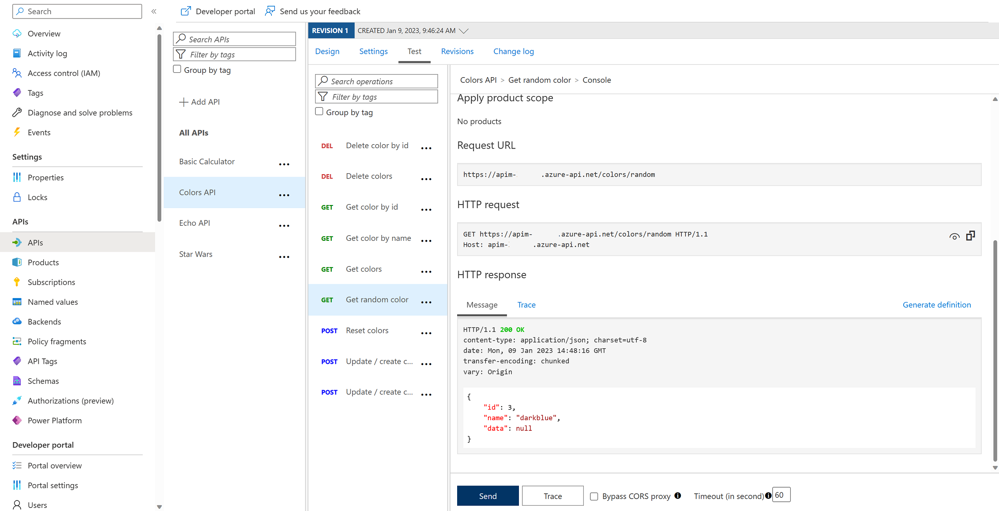

- Products can be configured after the API is initially created as well. On the **Settings** tab, set **Products** to include **Starter** and **Unlimited**, then press **Save**.

  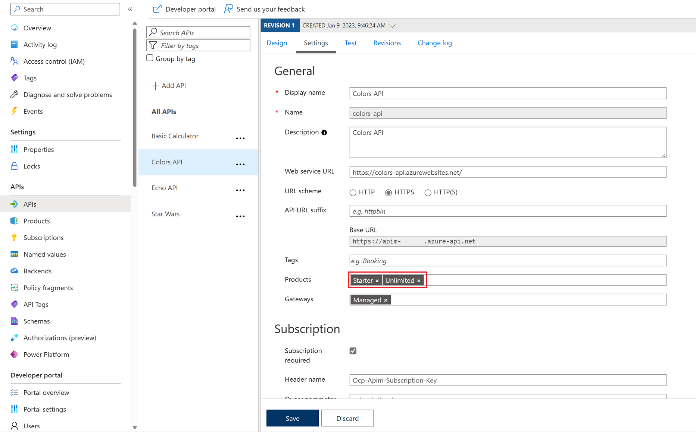

- Switch to the Developer portal and look at the **Colors API**.
- Try the **Get random color** operation.
- Notice the successful `200` response and the returned random color.

  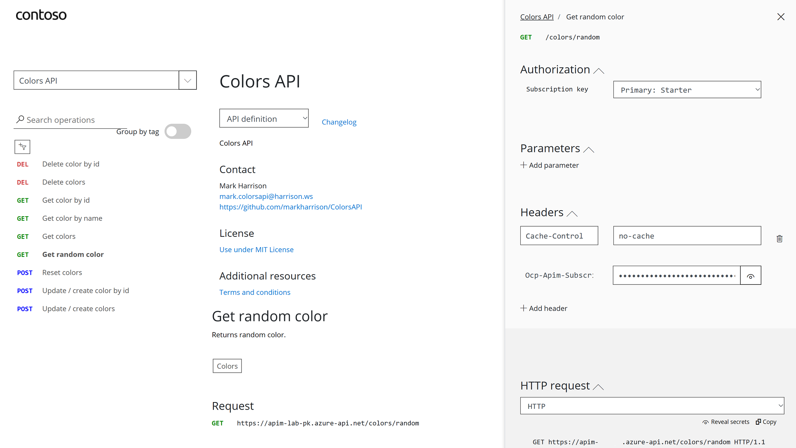

  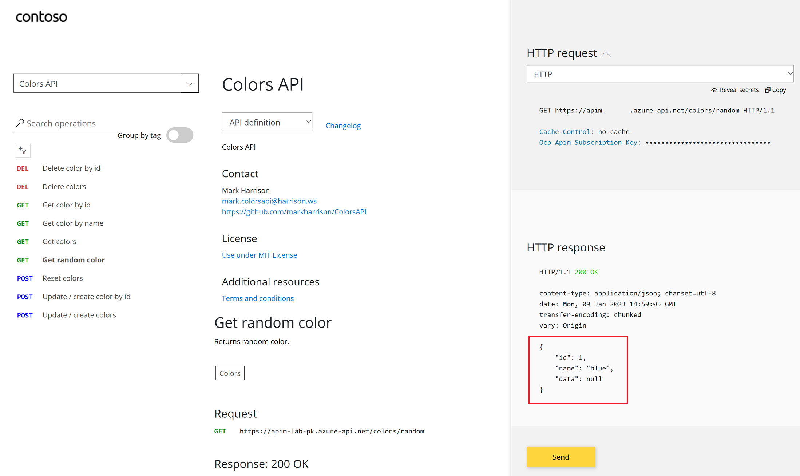

### Rate limit

API Management uses rate limiting to protect APIs from being overwhelmed and helps prevent exposure to DDoS attacks. As APIM sits in between your API and their callers, it effectively governs access to your APIs.  

We are going to use the [Colors](https://colors-web.azurewebsites.net) website to demonstrate how rate limiting is applied. The website displays 500 lights. Each light will randomly make a call to the Get random color API and then apply the returned color to the lights.

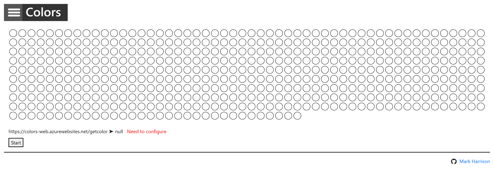

First, we need to enable CORS for the domain name of the frontend. To achieve this we have to do the following in APIM:

- On the sidemenu, click on `APIs`, then select the `All APIs` option.
- Inside the `Inbound processing` area you will see the `cors` policy, which we added in part 2 by pressing the `Enable Cors` button.
- Click on the **pencil icon** next to that policy to edit it.

  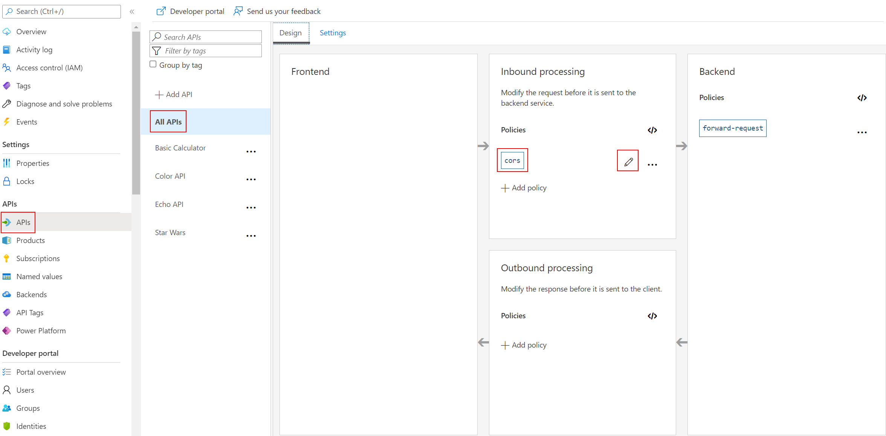  

- Here we will see this form where we can add the domain name of our frontend `https://colors-web.azurewebsites.net` or the `*` for all domains. Press **Add allowed origin**, enter the URL, then press **Save**.

  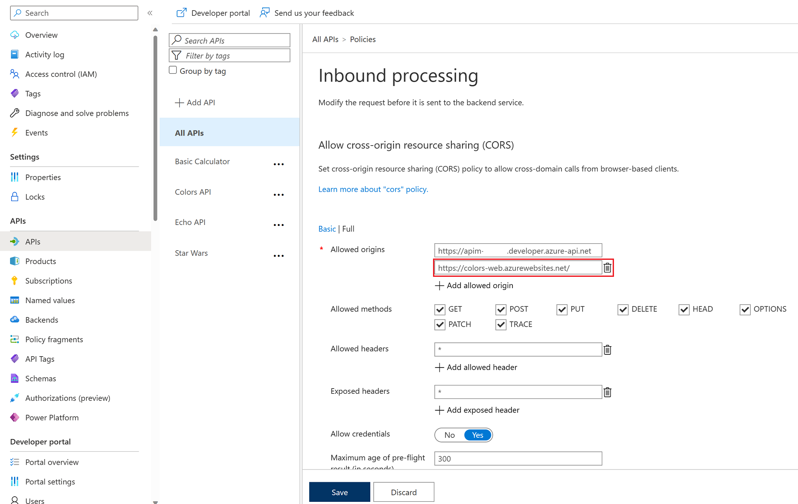

- After enabling CORS in APIM let's go back to our frontend <https://colors-web.azurewebsites.net> and follow these steps:

- Click on the hamburger menu next to *Colors* in the top left corner.
- Click on **Config**.
- Replace the **API URL** according to this format: <https://<your-apim>.azure-api.net/colors/random> (e.g. https://apim-lab-pk.azure-api.net/colors/random).
- After setting the API URL correctly, press the hamburger menu again and go to **Home**. 
- Press **Start** to see how the frontend is calling the api. You should see a **401** response, indicating an auth error. This happens as our API requires a subscription, but we have not yet entered a subscription key.

  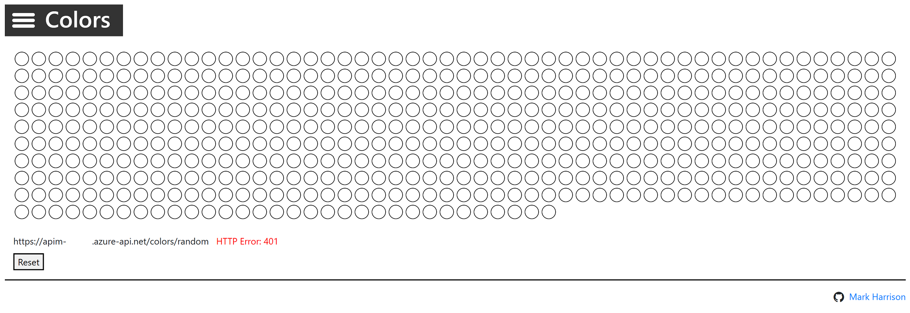

- The subscription keys can be fetched from the Developer Portal. Open the main Developer Portal page, then click on *Profile* in the top menu. 
- Copy the following URL into Notepad, modify your APIM instance, then copy the URL, so that you have two of the same URLs. We will use them for the *Starter* and *Unlimited* pathways into APIM.
  - `https://YOURAPIM.azure-api.net/colors/random?key=`
- Append the primary keys for both subscriptions - one key per URL - to get unique URLs for *Starter* and *Unlimited*.
  
  

- To see that *Unlimited* product has no rate limits:
  - Configure the Colors website to use the Unlimited URL.
  - Select [Start].
  - Notice there is no rate limit - every light is randomly and continuously updated. 

    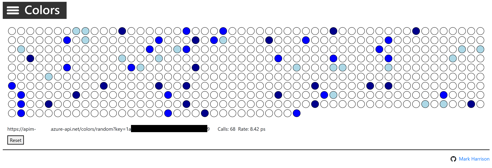

- To see that *Starter* product is limited to 5 calls per minute:
  - Configure the Colors website to use the Starter URL.
  - Select [Start].
  - Notice that only 5 lights get colored.

    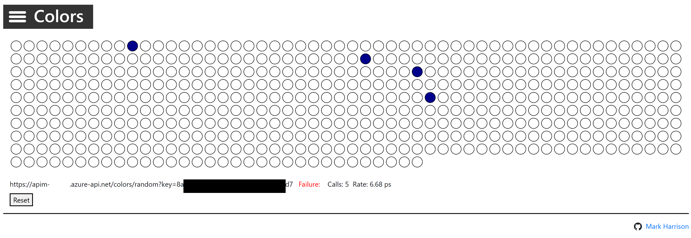

- Try the same *Starter* URL directly in your web browser:
  - Notice the error status / message returned. For example: `{ "statusCode": 429, "message": "Rate limit is exceeded. Try again in 53 seconds." }`

    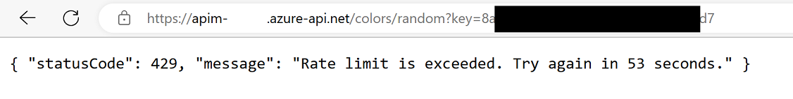
