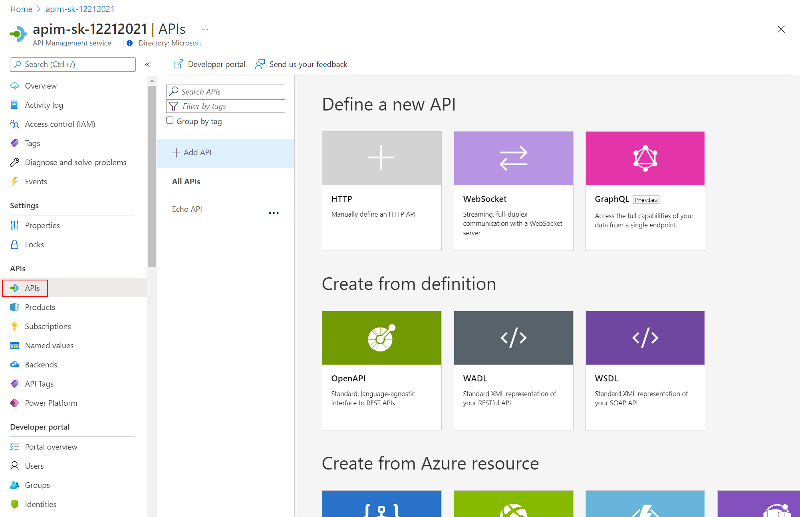

## APIs

- On the left menu, open the *APIs* blade. You will see all APIs, the possibility to add new ones, but also to customize existing ones.

  

### Add API from Scratch

Instead of developing an API, for this lab you will use the existing [*Star Wars API*](https://swapi.dev):

1) Click on *Add API*.  
2) Click on *HTTP - Manually define an HTTP API*.  
3) Select the *Full* option in the *Create an HTTP API* dialog.  
4) Enter *Display name*, *Name*, and *Description*.  
5) Assign `https://swapi.dev/api` to the *Web service URL*.  
6) Keep the *URL scheme* at `HTTPS` as we strive to enforce HTTPS only.  
7) Set the *API URL suffix* to `sw`. This allows us to compartmentalize the APIM URLs for distinct APIs.  
8) Assign *Starter* and *Unlimited* products.  
9) Press **Create**.  

  > While it is conventionally a good idea to version APIs from the onset, we are omitting this step here for brevity of the labs.

  

- Once created, inside the *Star Wars* API press **+ Add operation** to declare two new operations:

1) **GetPeople**
    - Display name: **GetPeople**
    - Name: **getpeople**
    - URL: **GET /people/**
2) **GetPeopleById**
    - Display name: **GetPeopleById**
    - Name: **getpeoplebyid**
    - URL: **GET /people/{id}/**

  

### Access Star Wars API from Developer Portal

- Switch now to the Developer Portal and sign in as a developer with a subscription. 
- Select *Explore APIs*. You should see both *Echo API* and *Star Wars*.

  

- Click on *Star Wars*. Try the *GetPeople* operation. Observe a successful `200` response.

  

- Now try the *GetPeopleById* operation with `id = 2`

  

- Examine the successful `200` response with `C-3PO`'s details in the response body payload.
  
  
