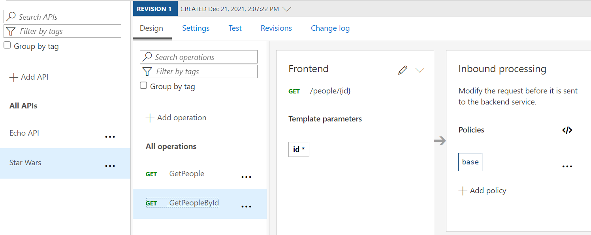
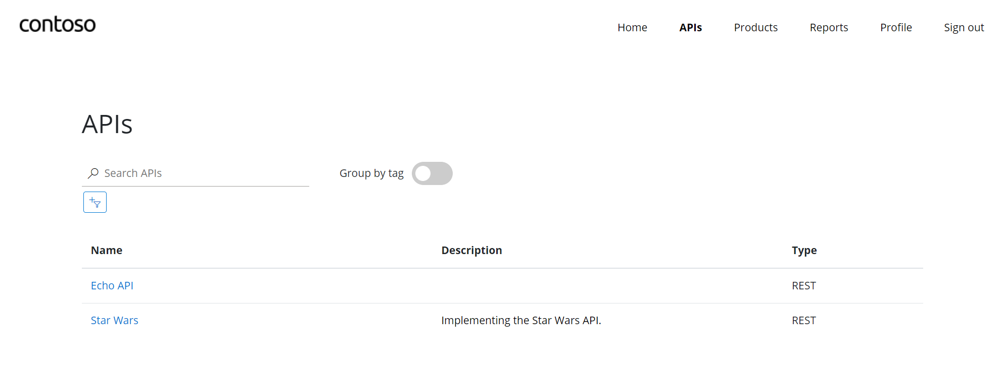
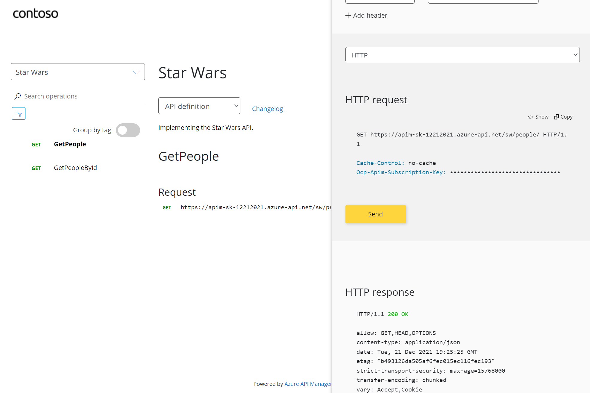
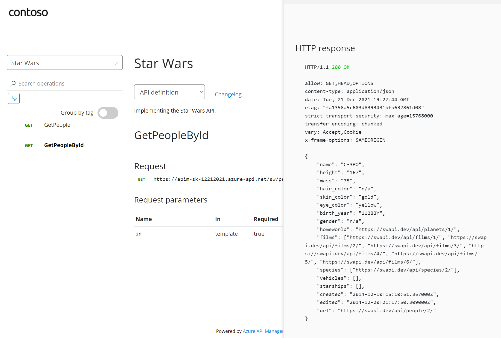

## APIs

On the left menu, open the `APIs` blade. You will see all APIs, the possibility to add new ones, but also to customize existing ones.

### Add API from Scratch

Instead of developing an API, for this lab you will use the existing [*Star Wars API*](https://swapi.dev):

1) Click on _Add API_.
1) Click on _HTTP - Manually define an HTTP API_.
1) Select the _Full option in the _Create an HTTP API_ dialog.
1) Enter _Display name_, _Name_, and _Description_.
1) Assign `https://swapi.dev/api` to the _Web service URL_.
1) Keep the _URL scheme_ at `HTTPS` as we strive to enforce HTTPS only.
1) Set the _API URL suffix_ to `sw`. This allows us to compartmentalize the APIM URLs for distinct APIs.
1) Assign `Starter` and `Unlimited` products.
1) Press **Create**.

**A note about API versioning**: While it is conventionally a good idea to version APIs from the onset, we are omitting this step here for brevity.

Once created, inside the _Star Wars_ API press **+ Add operation** to declare two new operations:

1) **GetPeople**
    - Display name: **GetPeople**
    - Name: **getpeople**
    - URL: **GET /people/**
2) **GetPeopleById**
    - Display name: **GetPeopleById**
    - Name: **getpeoplebyid**
    - URL: **GET /people/{id}/**

## Access Star Wars API from Developer Portal

Switch now to the Developer Portal and sign in as a developer with a subscription. Select _Explore APIs_. You should see both _Echo API_ and _Star Wars_.

Click on _Star Wars_. Try the `GetPeople` operation. Observe a successful `200` response.

Now try the `GetPeopleById` operation with `id = 2`

Examine the successful `200` response with `C-3PO`'s details in the response body payload.
  

