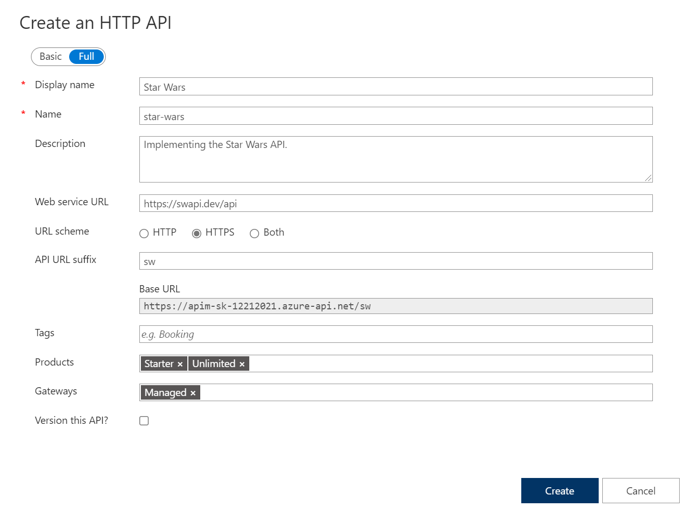
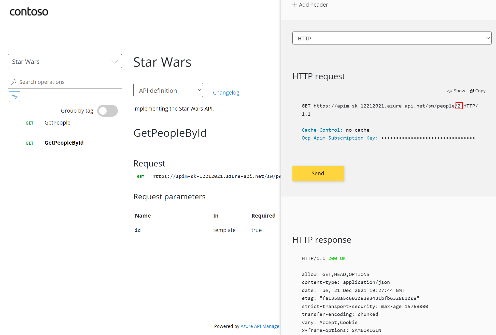

#### APIs

On the left menu, open the [APIs] blade. You will see all APIs, the possibility to add new ones but also to customize existing ones

#### Add API from scratch

Instead of coding an API, for this lab you will use the existing *Star Wars API* <https://swapi.dev>. 

- Click on [Add API]
  - Select [Add Blank API]
  - Select the [Full] option at the top of the dialog
  - Enter Display name, name and description
  - Enter back end Web Service - this is <https://swapi.dev/api>
  - Set API URL suffice to "sw"
  - Assign Products - Starter and Unlimited
  - Create

Once created, select [Start Wars API]

Lets declare two operations
  - **GetPeople** GET /people/  ... use lowercase
  - **GetPeopleById** GET /people/{id}/  ... use lowercase

Switch now to the Developer Portal
  - Sign in as a developer with a subscription
  - Select [Start Wars API]

- Try the "GetPeople" operation
- Try the "GetPeopleById" operation ... with id = 2

Examine Response and more detailed Trace information
  - Response 200 successful
  - Information about C-3PO in the Response body payload.

