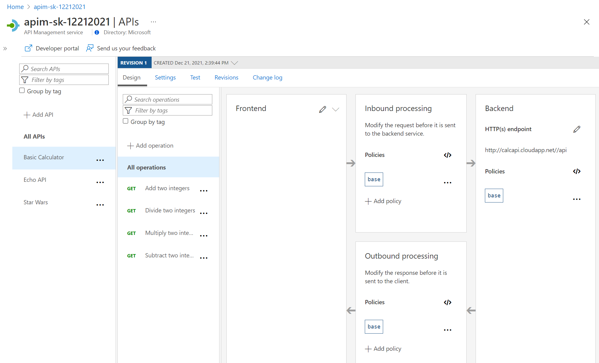
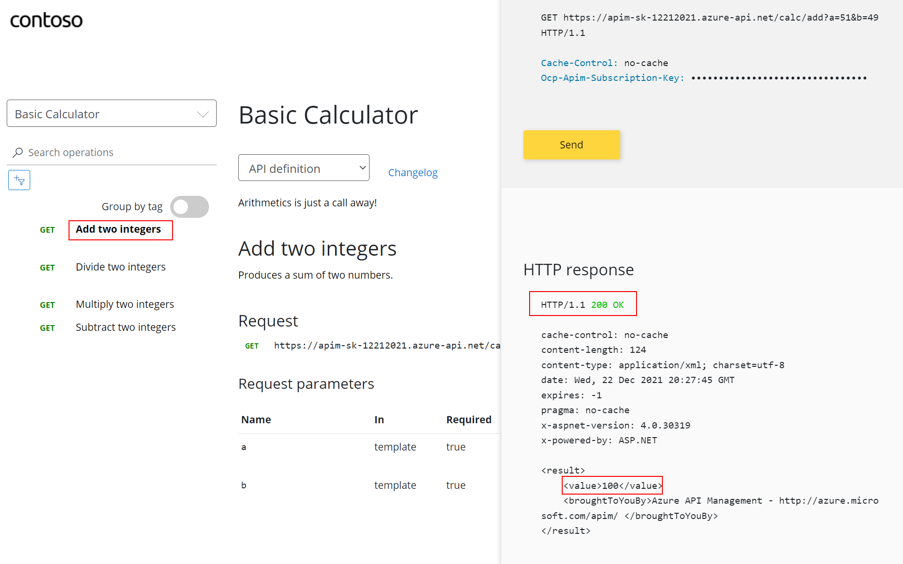
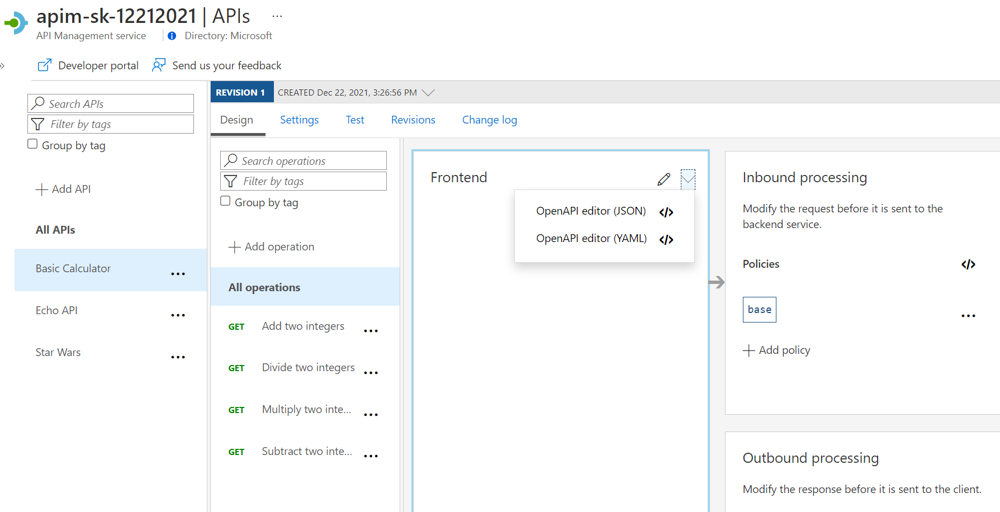
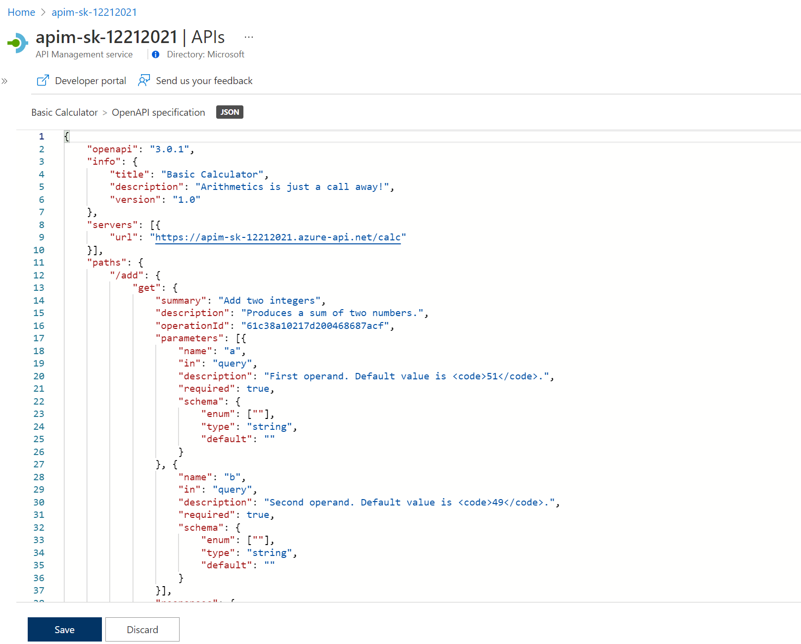

## Import API using OpenAPI

Instead of importing operations one-by-one, you can also import a full API. The [OpenAPI specification](https://www.openapis.org/) (aka [Swagger](https://swagger.io)) is a definition format to describe RESTful APIs. The specification creates a RESTful interface for easily developing and consuming an API by effectively mapping all the resources and operations associated with it.

As a demo we will use an API that offers a simple calculator service : [Calc API](http://calcapi.cloudapp.net/)

1) On the left menu, open the `APIs` blade. 
1) Under _Create from definition_ select `OpenAPI`.
1) Select the _Full_ option in the _Create from OpenAPI specification_ dialog.
1) Enter `http://calcapi.cloudapp.net/calcapi.json` as the _OpenAPI specification_ value. You should subsequently see _Display name_, _Name_, and _Description_ populate.
1) The backend service only runs on `HTTP`, but we need to **set URL scheme to `Both`** to allow for APIM ingress to be on HTTPS for callers such as the Developer Portal.
1) Set the _API URL suffix_ to `calc`.
1) Assign `Starter` and `Unlimited` products.
1) Press **Create**.

Once the API is created, it will show in the list of APIs along with all of its operations.

Back in the Developer Portal, try out the Calculator API via the _Add two integers_ GET method, then examine the response.  s
Note: Accepting the defaults of `49` and `51` suffices. There's presently an issue where defaults are shown in a dropdown. If you wanted to change the values, add new `a` and `b` parameters and values, then remove the dropdown values.

We can inspect / edit the Open API definition by selecting the `Edit` icon from the Frontend block:

---

## Troubleshooting

### Unable to complete the request

This is likely a mixed-content CORS error in which you are attempting a call to an APIM endpoint that is only set up for `HTTP`. It fails as the Developer Portal runs on `HTTPS`. Please check the setup steps above for the _URL scheme_.

