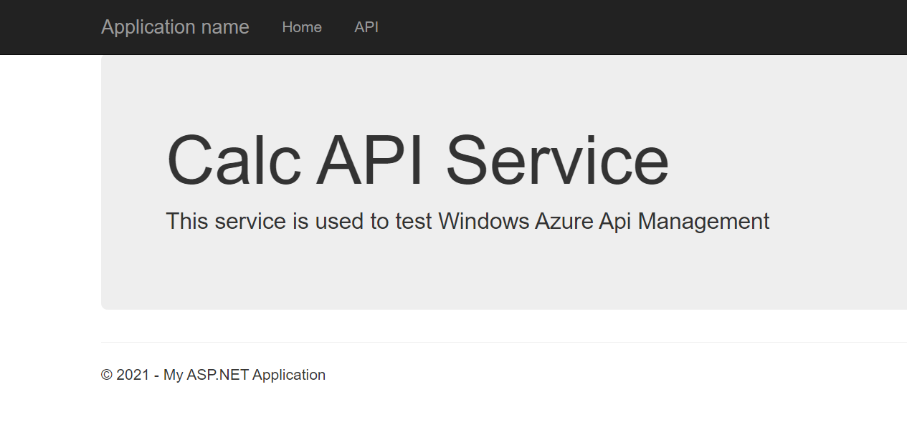
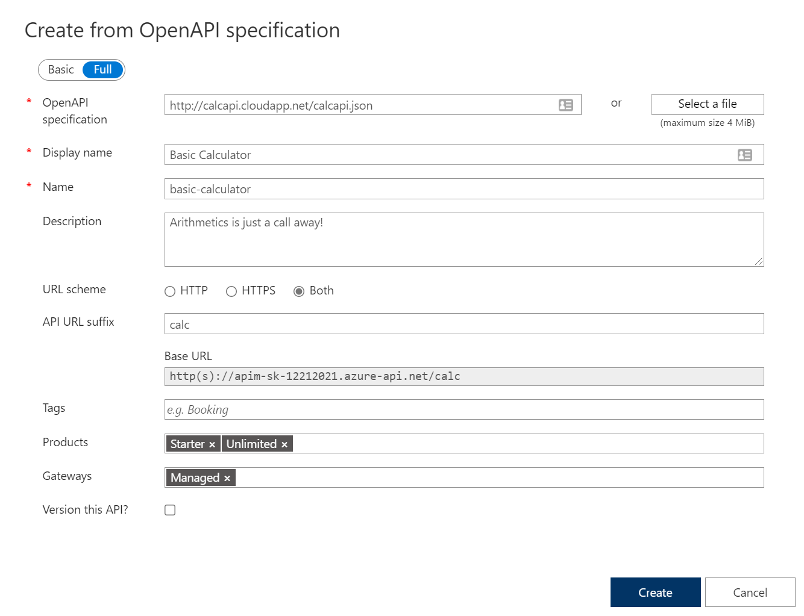

#### Import API using swagger

Instead of importing operations one by one, you can also import a full API. The [OpenAPI specification](https://www.openapis.org/) (aka [Swagger](https://swagger.io)) is a definition format to describe RESTful APIs. The specification creates a RESTful interface for easily developing and consuming an API by effectively mapping all the resources and operations associated with it.

As a demo we will use an API that offers a simple calculator service : [Calc API](http://calcapi.cloudapp.net/)

Go to APIs blade and select [Add OpenAPI Specification]
- Specify swagger URL <http://calcapi.cloudapp.net/calcapi.json>
  - Some of the fields will be populated from the swagger definition
  - Use "calc" in URL for API suffix
  - Add products Starter and Unlimited

- Look at Calculator API in the Developer portal
  - Try the Add Two Integers operation
- Look at Response / Trace

We can inspect / edit the Open API definition by selecting the `Edit` icon from the Frontend block:

