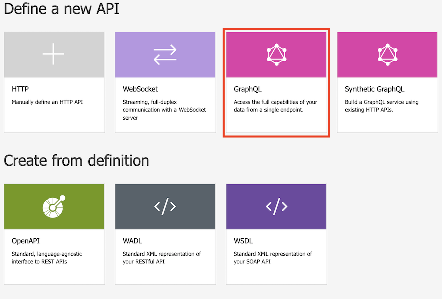
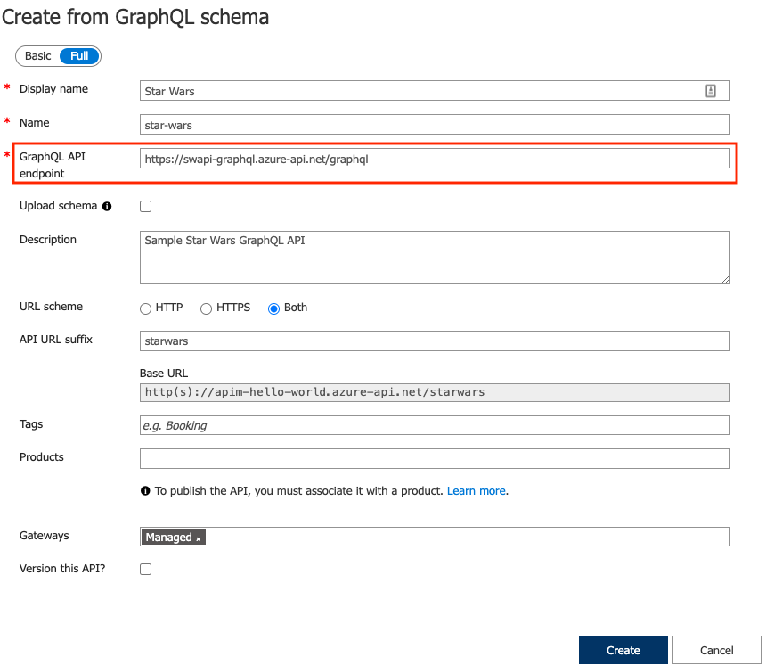
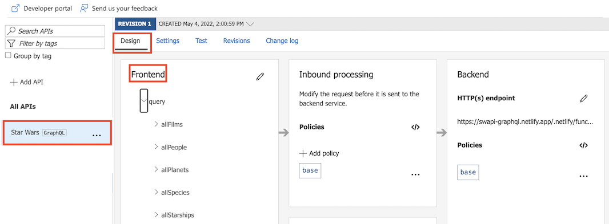
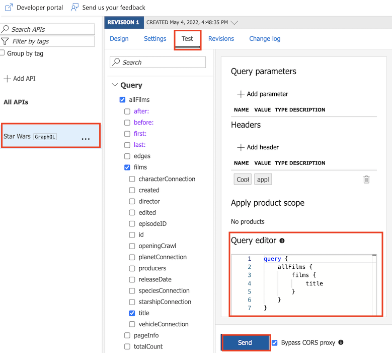
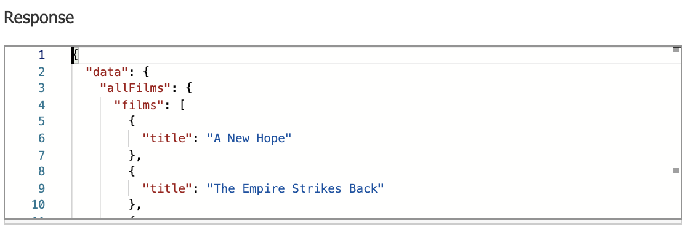
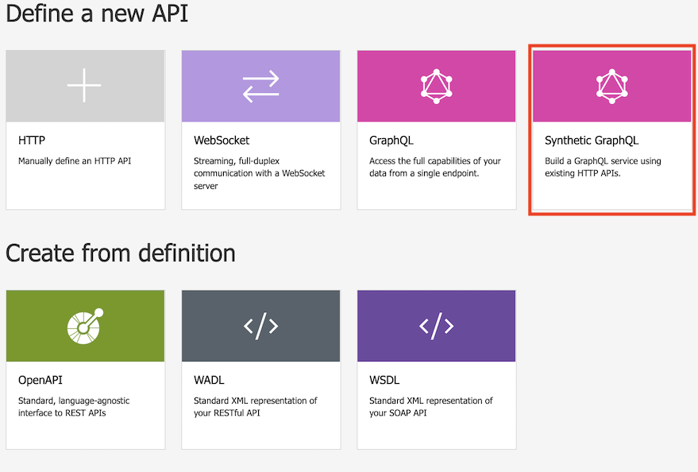
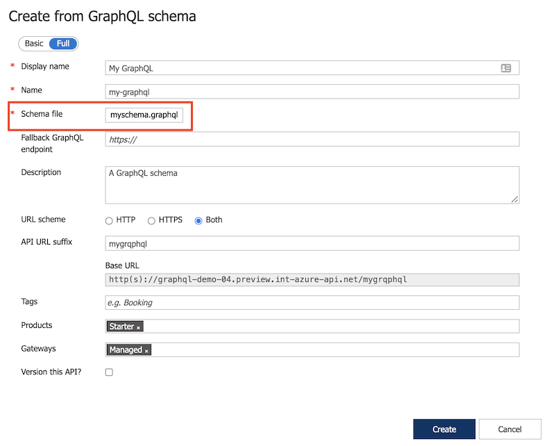

## Import and test an existing GraphQL API

Let's import a new GraphQL API, using the [Star Wars GraphQL API](https://graphql.org/swapi-graphql).

- Select **Add API**, under **define a new API**, select the **GraphQL** icon.

  

- In the dialog box, select **Full** and complete the required form field.

  


    | Field | Description |
    |----------------|-------|
    | **Display name** | The name by which your GraphQL API will be displayed. |
    | **Name** | Raw name of the GraphQL API. Automatically populates as you type the display name. |
    | **GraphQL API endpoint** | The base URL with your GraphQL API endpoint name. <br /> For example: *`https://example.com/your-GraphQL-name`*. You can also use a common "Star Wars" GraphQL endpoint such as `https://graphql.org/swapi-graphql` as a demo. |
    | **Upload schema** | Optionally select to browse and upload your schema file to replace the schema retrieved from the GraphQL endpoint (if available).  |
    | **Description** | Add a description of your API. |
    | **URL scheme** | Select **HTTP**, **HTTPS**, or **Both**. Default selection: *Both*. |
    | **API URL suffix**| Add a URL suffix to identify this specific API in this API Management instance. It has to be unique in this API Management instance. |
    | **Base URL** | Uneditable field displaying your API base URL |
    | **Tags** | Associate your GraphQL API with new or existing tags. |
    | **Products** | Associate your GraphQL API with a product to publish it. |
    | **Gateways** | Associate your GraphQL API with existing gateways. Default gateway selection: *Managed*. |
    | **Version this API?** | Select to apply a versioning scheme to your GraphQL API. |

- Select **Create**
- After the API is created, browse the schema on the **Design** tab, in the **Frontend** section.

  

-  Under **Query Editor**:
    - Select at least one field or subfield from the list in the side menu. The fields and subfields you select appear in the query editor.

    - Start typing in the query editor to compose a query.

    

- Select Send and view the generated response

  

## Define GraphQL API based on resolvers mapped to HTTP endpoints

- Select **Add API**, under **define a new API**, select the **Synthetic GraphQL** icon.

  

- Copy the following schema in a new file named myschema.graphql
  ```typescript
  type Query {
      users: [User]
  }

  type User {
      name: String!
      hair_color: String!
  }
  ```

- In the dialog box, select **Full** and complete the required form field. Use the myschema.graphql file generated previously.

  

- Select **Create**

- After the API is created, browse the schema on the **Design tab**, in the **Frontend** section.

- In the **Backend** processing policy, configure the set-graphql-resolver policy to map a field in the schema to an existing HTTP endpoint. Namevalue can also be used for variables such as the backend url.

  ```xml
  <backend>
      <set-graphql-resolver parent-type="Query" field="users">
          <http-data-source>
              <http-request>
                  <set-method>GET</set-method>
                  <set-url>https://swapi.dev/api/people/</set-url>
              </http-request>
              <http-response>
                <set-body template="liquid">
                  [ 
                        
                            {
                                "hair_color": "{{elem.hair_color}}",
                                "name": "{{elem.name}}"
                            }
                        
                  ] 
                </set-body>
              </http-response>
          </http-data-source>
      </set-graphql-resolver>
      <base />
  </backend>
  ```
- We can see the user entities has been resolved.

## Supported capabilities

Using API Management to expose your GraphQL APIs, you can :

- Add a GraphQL endpoint or GraphQL schema as an API via the Azure portal, the Azure CLI, or other Azure tools.
- Augment or design a GraphQL API using information from REST or SOAP APIs, using HTTP resolvers for fields defined in a GraphQL schema.
- Secure GraphQL APIs by applying both existing access control policies and a GraphQL validation policy to secure and protect against GraphQL-specific attacks.
- Explore the schema and run test queries against the GraphQL APIs in the Azure and developer portals.