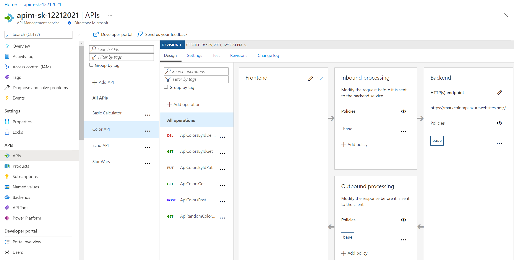
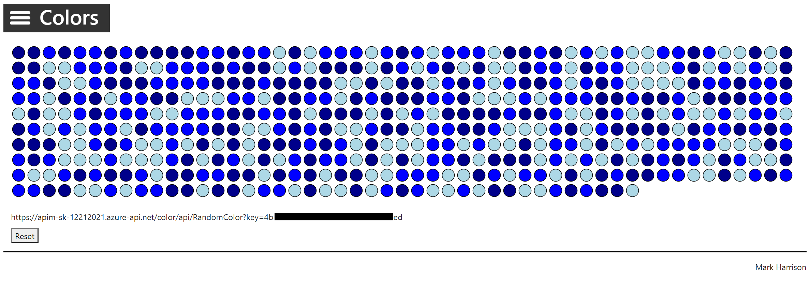

#### Calling API and testing Subscription Keys

Let's add another api - the [Colors API](https://markcolorapi.azurewebsites.net/swagger/)

- Create a new API with OpenAPI specification and import swagger from > <https://markcolorapi.azurewebsites.net/swagger/v1/swagger.json>
  - Use "color" in URL for API

The swagger file did not contain the name of the host so you need to update it manually

- Select [Settings]
- Amend Web Service URL to <https://markcolorapi.azurewebsites.net>

We can test this from the [Test] tab

Switch to the Developer portal and look at Color API
  - Try the RandomColor operation
- Look at Response / Trace ... see the random color returned

#### Rate limit

Use [Colors website](https://markcolorweb.azurewebsites.net) which displays 500 lights.  Each light will at random intervals make a call to the RandomColor API - and then display the color returned.

First we will need to enable CORS for the domain name of the frontend. To achieve this we have to do the following:

- On the left Menu, click on `APIs`
- Then select the `All APIs` option
- Then go to the `Inbound Processing` area
- There you will find a `cors` policy(this was added in part 2, when we used the "Enable Cors" button)
- Click on the `edit` icon

  

Here we will se this form, where we can add the domain name of our frontend `https://markcolorweb.azurewebsites.net` or the `*` for all domains:

  

After enabling CORS in APIM lets go back to our frontend `https://markcolorweb.azurewebsites.net` . Here lets do the following:

- Click on the hamburger menu, in the top left corner
- Click on the config menu item
- You will see a text box for the API URL , you need to set up your own APIM URL which contains the key in the following format:
  - <https://YOURAPIM.azure-api.net/color/api/RandomColor?key=> *Starter-Key*
  - <https://YOURAPIM.azure-api.net/color/api/RandomColor?key=> *Unlimited-Key*
- After setting the API URL correctly, we can go back to the homepage and click `start` to see how the frontend is calling the api 

The subscription keys can be fetched from the Developer Portal,  Open Developer portal, go in the Profile page and get API keys for Starter and Unlimited products

- Open Notepad - make note of URLs
  - <https://YOURAPIM.azure-api.net/color/api/RandomColor?key=> *Starter-Key*
  - <https://YOURAPIM.azure-api.net/color/api/RandomColor?key=> *Unlimited-Key*

- To see that Unlimited product has no rate limits
  - Configure Color Website to use Unlimited URL
  - Select [Start]
  - Notice there is no Rate Limit - every light is randomly updated

- To see that Starter product is limited to 5 calls per minute
  - Configure Color Website to use Starter URL
  - Select [Start]
  - Notice that only 5 lights get colored
- Try URL with the Starter key, directly in the web browser address bar
  - Notice the error status / message returned
  - Example: *{ "statusCode": 429, "message": "Rate limit is exceeded. Try again in 54 seconds." }*

