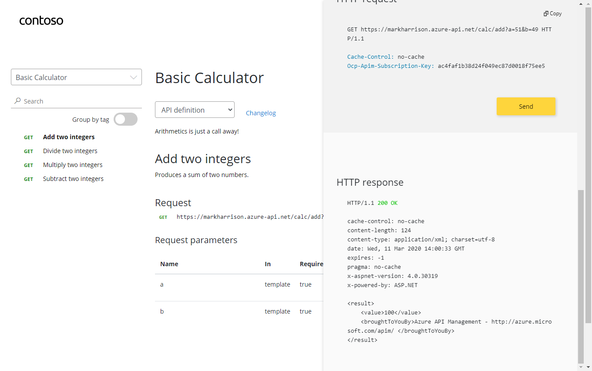

### API Management

An API represents a set of operations that can be invoked. New APIs are defined and then the desired operations are added. An API is added to a product and can be published; it may then be subscribed to and used by developers.

#### APIs

On the left menu, open the [APIs] blade. You will see all APIs, the possibility to add new ones but also to customize existing ones

#### Add API from scratch

Instead of coding an API, for this lab you will use the existing *Star Wars API* <https://swapi.dev>. 

- Click on [Add API]
  - Select [Add Blank API]
  - Select the [Full] option at the top of the dialog
  - Enter Display name, name and description
  - Enter back end Web Service - this is <https://swapi.dev/api>
  - Set API URL suffice to "sw"
  - Assign Products - Starter and Unlimited
  - Create

Once created, select [Start Wars API]

Lets declare two operations
  - **GetPeople** GET /people/  ... use lowercase
  - **GetPeopleById** GET /people/{id}/  ... use lowercase

Switch now to the Developer Portal
  - Sign in as a developer with a subscription
  - Select [Start Wars API]

- Try the "GetPeople" operation
- Try the "GetPeopleById" operation ... with id = 2

Examine Response and more detailed Trace information
  - Response 200 successful
  - Information about C-3PO in the Response body payload.

#### Import API using swagger

Instead of importing operations one by one, you can also import a full API. The [OpenAPI specification](https://www.openapis.org/) (aka [Swagger](https://swagger.io)) is a definition format to describe RESTful APIs. The specification creates a RESTful interface for easily developing and consuming an API by effectively mapping all the resources and operations associated with it.

As a demo we will use an API that offers a simple calculator service : [Calc API](http://calcapi.cloudapp.net/)

Go to APIs blade and select [Add OpenAPI Specification]
- Specify swagger URL <http://calcapi.cloudapp.net/calcapi.json>
  - Some of the fields will be populated from the swagger definition
  - Use "calc" in URL for API suffix
  - Add products Starter and Unlimited

- Look at Calculator API in the Developer portal
  - Try the Add Two Integers operation
- Look at Response / Trace

We can inspect / edit the Open API definition by selecting the `Edit` icon from the Frontend block:

Let's use another example - the [Colors API](https://markcolorapi.azurewebsites.net/swagger/)

- Create a new API with OpenAPI specification and import swagger from > <https://markcolorapi.azurewebsites.net/swagger/v1/swagger.json>
  - Use "color" in URL for API

The swagger file did not contain the name of the host so you need to update it manually

- Select [Settings]
- Amend Web Service URL to <https://markcolorapi.azurewebsites.net>

We can test this from the [Test] tab

Switch to the Developer portal and look at Color API
  - Try the RandomColor operation
- Look at Response / Trace ... see the random color returned

#### Rate limit

Use [Colors website](https://markcolorweb.azurewebsites.net) which displays 500 lights.  Each light will at random intervals make a call to the RandomColor API - and then display the color returned.

First we will need to enable CORS for the domain name of the frontend. To achieve this we have to do the following:

- On the left Menu, click on `APIs`
- Then select the `All APIs` option
- Then go to the `Inbound Processing` area
- There you will find a `cors` policy(this was added in part 2, when we used the "Enable Cors" button)
- Click on the `edit` icon

  

Here we will se this form, where we can add the domain name of our frontend `https://markcolorweb.azurewebsites.net` or the `*` for all domains:

  

Via the menu - there is a configuration page to specify the API endpoint

Open Developer portal, go in the Profile page and get API keys for Starter and Unlimited products
- Open Notepad - make note of URLs
  - <https://YOURAPIM.azure-api.net/color/api/RandomColor?key=> *Starter-Key*
  - <https://YOURAPIM.azure-api.net/color/api/RandomColor?key=> *Unlimited-Key*

- To see that Unlimited product has no rate limits
  - Configure Color Website to use Unlimited URL
  - Select [Start]
  - Notice there is no Rate Limit - every light is randomly updated

- To see that Starter product is limited to 5 calls per minute
  - Configure Color Website to use Starter URL
  - Select [Start]
  - Notice that only 5 lights get colored
- Try URL with the Starter key, directly in the web browser address bar
  - Notice the error status / message returned
  - Example: *{ "statusCode": 429, "message": "Rate limit is exceeded. Try again in 54 seconds." }*

