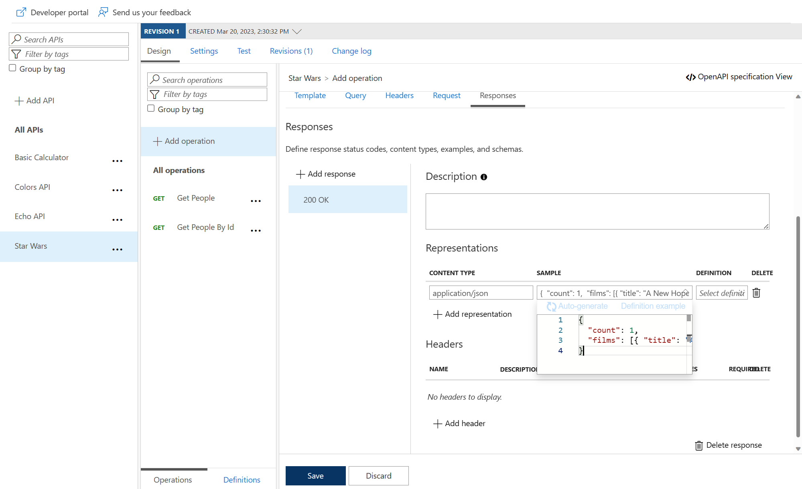
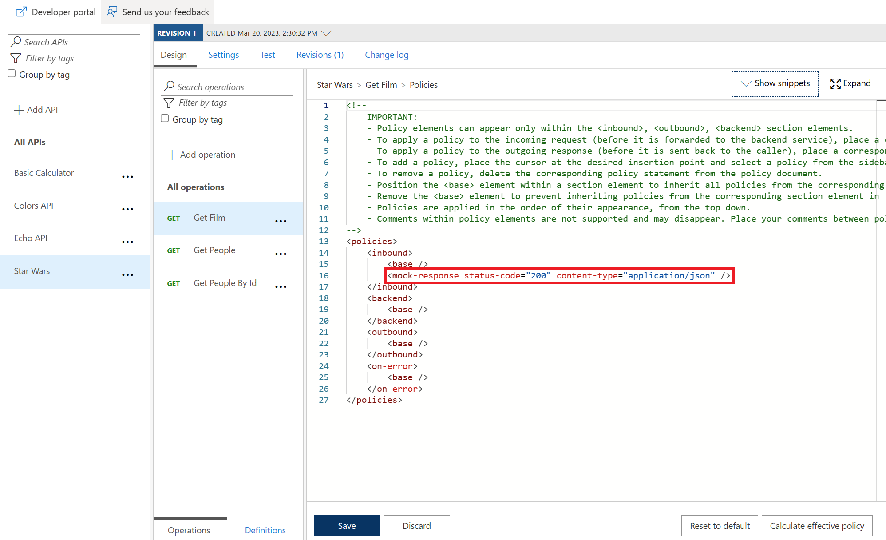
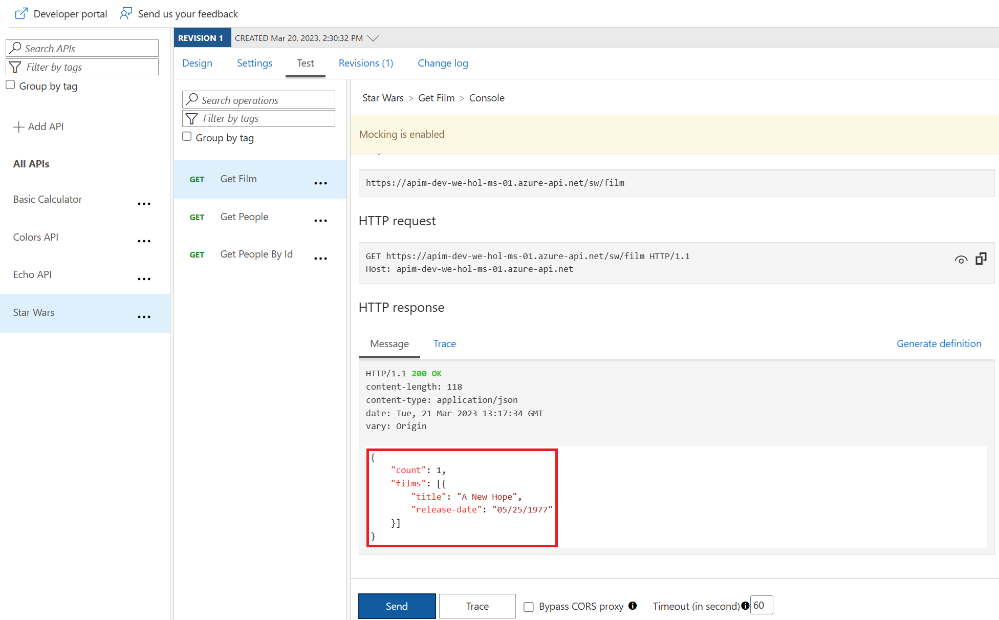

## Mock policy

### Mock responses

Mocking in APIM is a useful mechanism for API consumers to interact with APIs without waiting for the backend to be ready. 

- Open the **Star Wars** API and select **+ Add Operation**
- Create a new GET operation:
  - Display name: **Get Film**
  - Name: **get-film**
  - URL: **/film**
- In the *Responses* configuration tab, press **+ Add response**, return `200 OK` with a representation with content type `application/json` and this sample data:

  ```json
  {
    "count": 1,
    "films": [{ "title": "A New Hope", "release-date": "05/25/1977" }]
  }
  ```
  
  

- Press **Save**.
- Open the Inbound processing **Code View**
- Add **Mock Response** under **Other policies** after the `<base />` tag.

  ```xml    
  <inbound>
      <base />
      <mock-response status-code="200" content-type="application/json" />
  </inbound>
  ```

  

- Invoke the API to receive a `200` success with the mocked film data.

  
