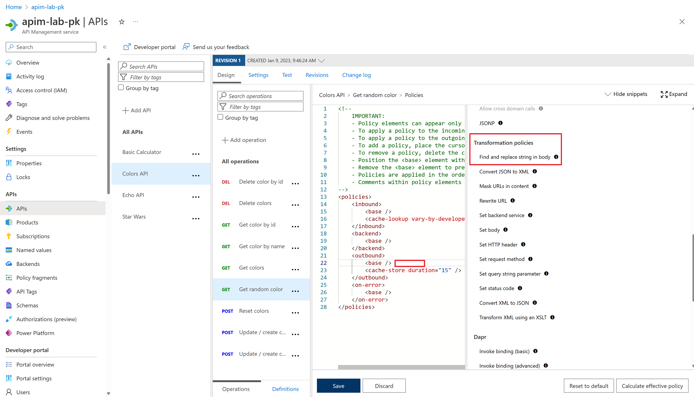
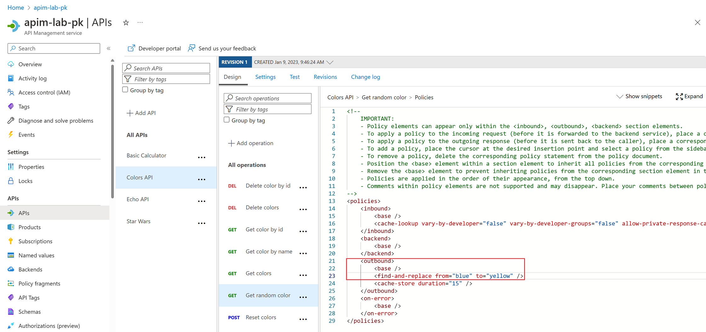
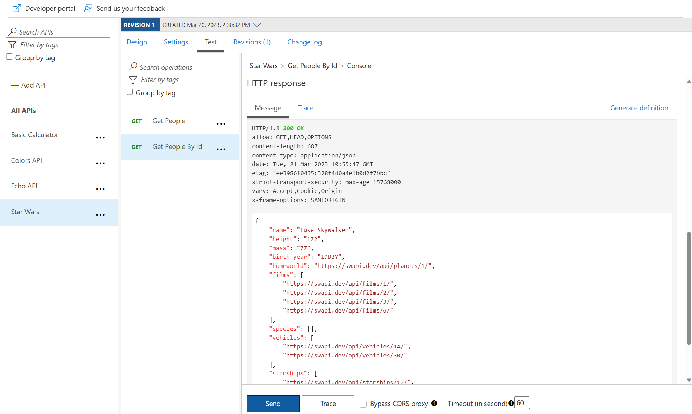
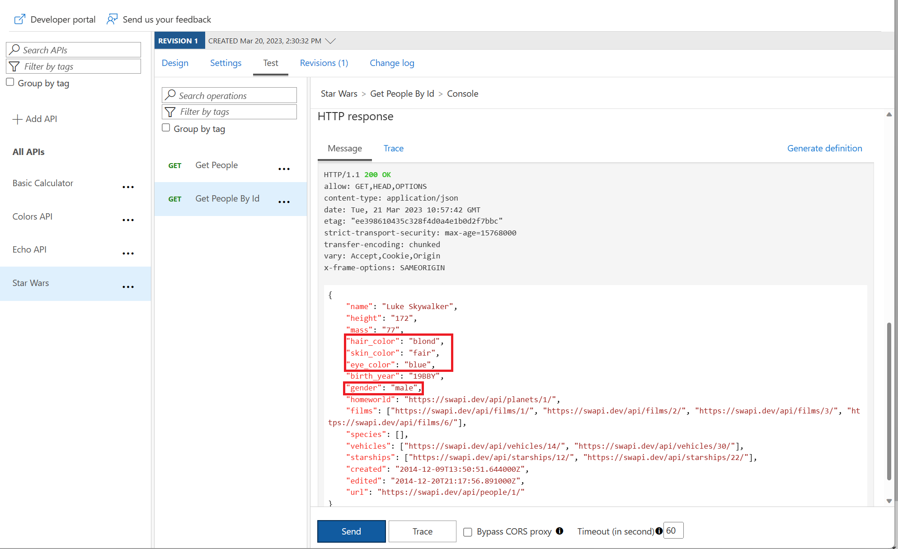
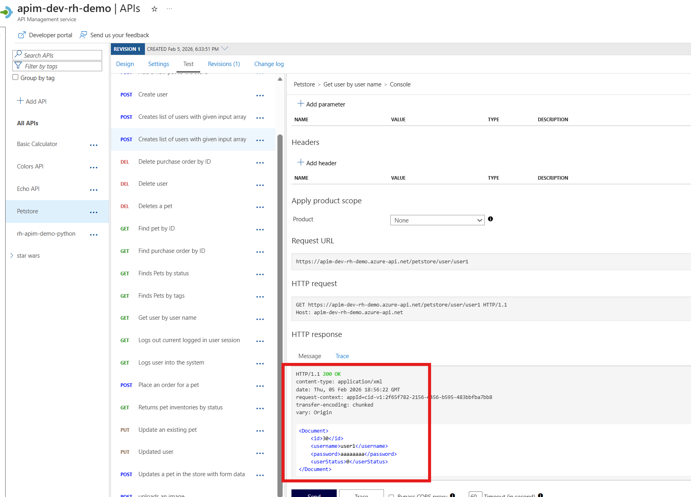
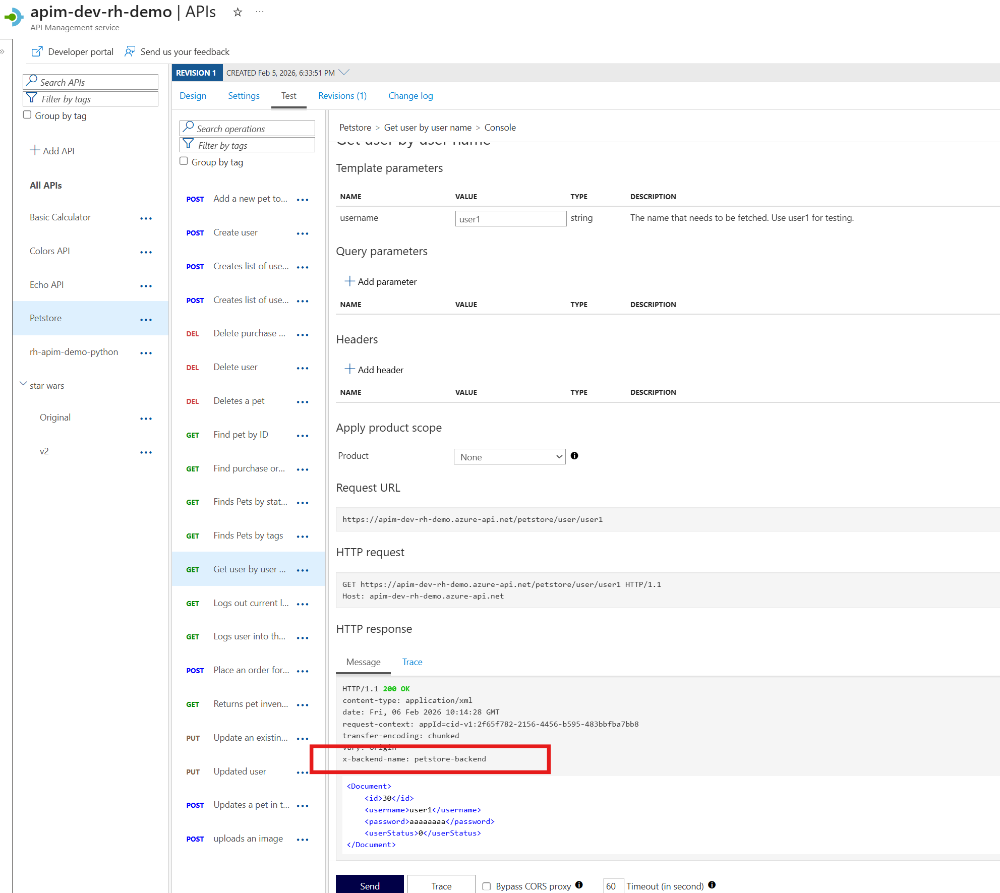
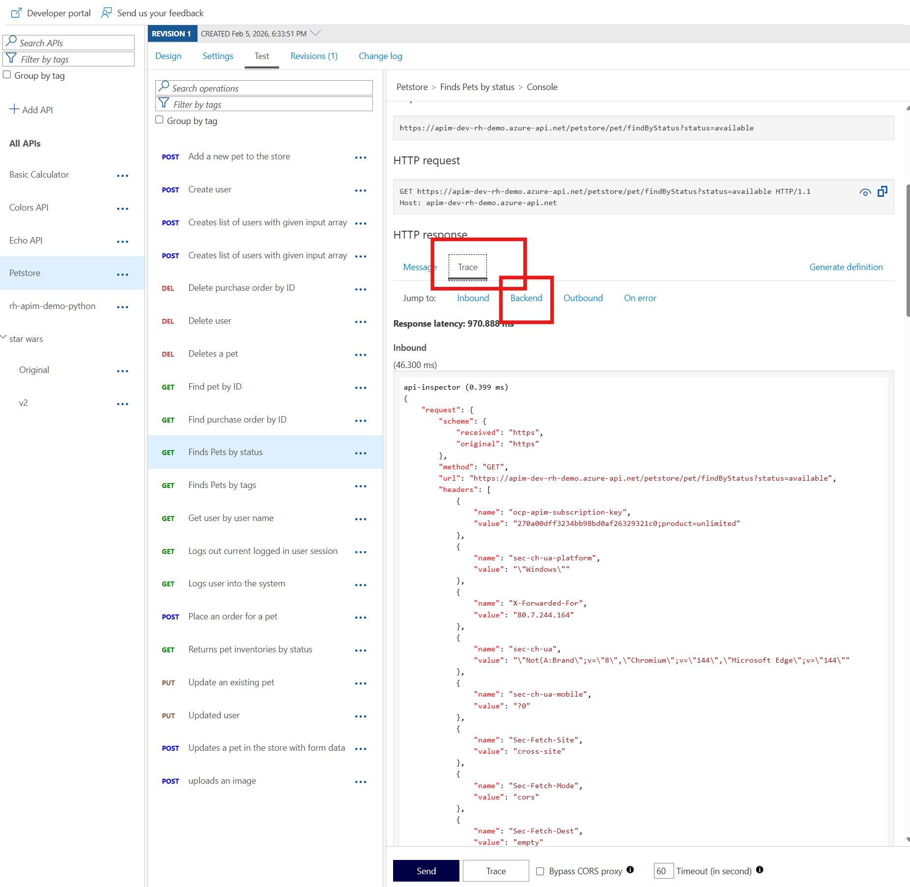
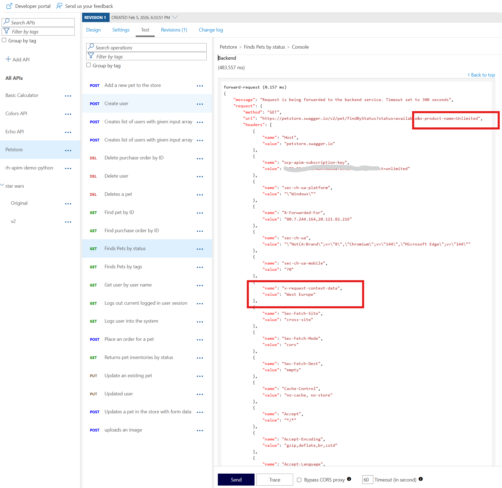

## Transformation policies

### Transformation - replace string

The **find-and-replace** policy finds a substring in a request or response and replaces it with a different string.

- Open the **Colors** API, then open the `Get random color` operation.
- Enter the **Policy code editor** in the **Outbound processing** section.
- Place the cursor after the `<base />` element in the `<outbound>` section.
- Press **Show snippets**, then select the **Find and replace string in body** transformation policy.  

  

- Fill in the `from` and `to` values accordingly:

```xml  
<outbound>
    <base />
    <find-and-replace from="blue" to="yellow" />
    <cache-store duration="15" />
</outbound>
```

  

- Save the policy, then invoke the API using the Unlimited subscription key.

  

---

### Transformation - conditional

Policies can be applied very granularly. In this example, you are modifying the **Star Wars** API to return a limited set of information if the caller is using the **Starter** subscription. Other products, such as the **Unlimited** subscription, will receive the full response.  

The [context variable](https://docs.microsoft.com/en-us/azure/api-management/api-management-policy-expressions#ContextVariables) that is implicitly available in every policy expression provides access to the `Response` and `Product` below. 

- Open the **Star Wars** API, then open the **Get People By Id** operation.
- Similarly to the **Colors** API, we will add the outbound policy to conditionally change the response body. Replace the existing entries in the operation with the entire `<policies>` code below.  
Note that the inbound `Accept-Encoding` header is set to `deflate` to ensure that the response body is not encoded as that causes the JSON parsing to fail.  

  ```xml
  <policies>
      <inbound>
          <base />
          <set-header name="Accept-Encoding" exists-action="override">
              <value>deflate</value>
          </set-header>
      </inbound>
      <backend>
          <base />
      </backend>
      <outbound>
          <base />
          <choose>
              <when condition="@(context.Response.StatusCode == 200 && context.Product?.Name != "Unlimited")">
                  <set-body>@{
                        var response = context.Response.Body.As<JObject>();
                        var props = response["result"]?["properties"] as JObject;
                        
                        if (props != null)
                        {
                            foreach (var key in new [] {"hair_color", "skin_color", "eye_color", "gender"}) {
                            props.Property(key)?.Remove(); 
                            }
                        }
                        
                        return response.ToString();
                      }
                  </set-body>
              </when>
          </choose>
      </outbound>
      <on-error>
          <base />
      </on-error>
  </policies>
  ```

- Test the API on the **Test** tab with **id** 1 and apply the appropriate **Starter** or **Unlimited** product scope. Examine the different responses.

- With **Starter** or **None** product scope:

  

- With **Unlimited** product scope. Notice the four properties in red that are not included in the **Starter** scope response.

  

---

### Transformation - JSON to XML

A frequent requirement is to transform content to maintain compatibility with legacy applications. In this lab, the modern **Swagger Petstore** API returns JSON, but imagine you have a legacy identity system that expects user profile data in XML format. Use APIM's transformation policy to convert the JSON response to XML.

- Open the **Get user by user name** operation on the **Swagger Petstore** API.
- Add an outbound policy to transform the response body to XML.

  ```xml
  <outbound>
      <base />
      <json-to-xml apply="always" consider-accept-header="false" />
  </outbound>
  ```

- Test the API with username `user1` and examine the response. Note that it's now XML.

  

### Transformation - Delete response headers

A frequent requirement is to remove headers, especially ones that return security-related or superfluous information. To demonstrate this pattern, we'll first add a custom header to simulate sensitive backend info, then remove it.

- Continue with the **Get user by user name** operation on the **Swagger Petstore** API.
- First, add an outbound policy to add a custom header to the response.

  ```xml
  <outbound>
      <base />
      <json-to-xml apply="always" consider-accept-header="false" />
      <set-header name="x-backend-name" exists-action="override">
          <value>petstore-backend</value>
      </set-header>
  </outbound>
  ```

- Test the API with username `user1` and verify the `x-backend-name` header appears in the response.

  

- Now update the policy to also delete the header, demonstrating how you would remove sensitive headers:

  ```xml
  <outbound>
      <base />
      <json-to-xml apply="always" consider-accept-header="false" />
      <set-header name="x-backend-name" exists-action="override">
          <value>petstore-backend</value>
      </set-header>
      <set-header name="x-backend-name" exists-action="delete" />
  </outbound>
  ```

- Test again and verify the `x-backend-name` header is no longer in the response.

### Transformation - Amend what's passed to the backend

Query string parameters and headers can be easily modified prior to sending the request on to the backend. 

- Open the **Find pets by status** operation in the **Swagger Petstore** API and add inbound policies to modify the query string and headers. 

  ```xml
  <inbound>
      <base />
      <set-query-parameter name="x-product-name" exists-action="override">
          <value>@(context.Product?.Name ?? "none")</value>
      </set-query-parameter>
      <set-header name="x-request-context-data" exists-action="override">
          <value>@(context.Deployment.Region)</value>
      </set-header>
  </inbound>
  ```

- Test the call by using either the **Starter** or **Unlimited** product, status of 'available'. Click on Trace button and then inspect the result on the **Trace** tab. If Tracing is not enabled, press **Enable Tracing**.

  

  
