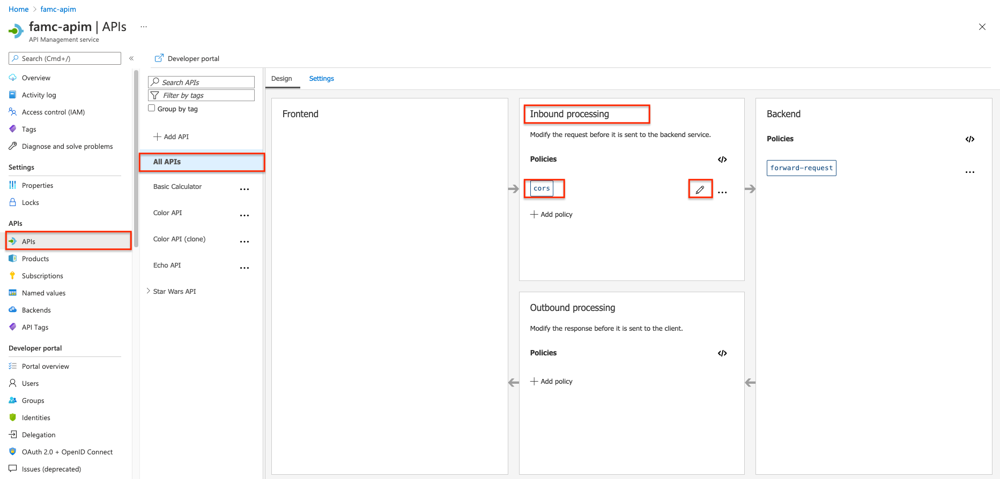

### Cross-origin resource sharing (CORS)

The [cors policy](<https://docs.microsoft.com/en-us/azure/api-management/api-management-cross-domain-policies#CORS>) adds cross-origin resource sharing (CORS) support to an operation or an API to allow cross-domain calls from browser-based clients.

We have already configured the `cors` policy for our APIs in labs 2 & 3. Below is the resulting XML:

  

```xml
<!-- Inbound -->
<cors allow-credentials="true">
    <allowed-origins>
        <origin>https://apim-sk-12212021.developer.azure-api.net</origin>
        <origin>https://markcolorweb.azurewebsites.net</origin>
    </allowed-origins>
    <allowed-methods preflight-result-max-age="300">
        <method>*</method>
    </allowed-methods>
    <allowed-headers>
        <header>*</header>
    </allowed-headers>
    <expose-headers>
        <header>*</header>
    </expose-headers>
</cors>
```