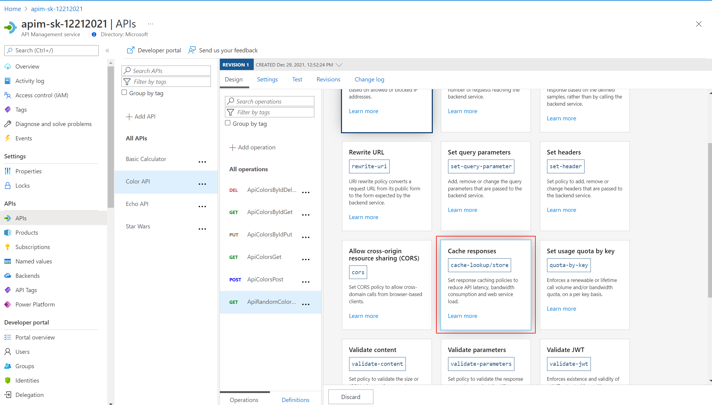
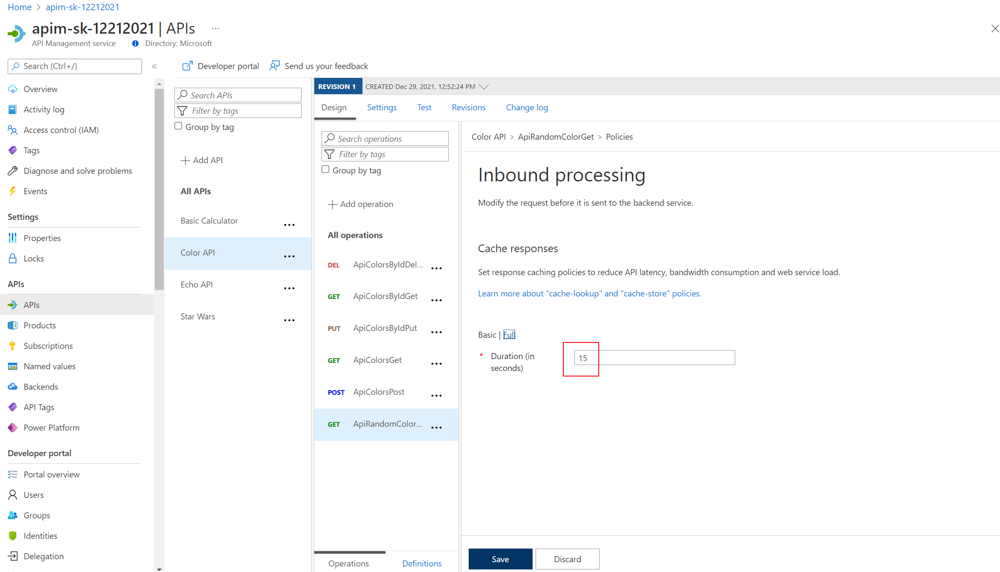

### Caching

API Management can be configured for response caching - this can significantly reduce API latency, bandwidth consumption, and web service load for data that does not change frequently.

Using the Azure Management portal - set a caching Policy on the RandomColor API call
  - Set a caching duration of 15 seconds
  - Simple caching configuration is not yet implemented in the Azure Management portal - we see shall see later how it can be done using policy expressions






- Configure Color Website to use Unlimited URL
- Select [Start]
- Notice that for each 15 seconds period - the same color is set


Look at RandomColor API, switch to 'Code View' and check the caching policies (set from earlier)

```xml
<!-- Inbound -->
<cache-lookup vary-by-developer="false"
              vary-by-developer-groups="false"
              downstream-caching-type="none" />

<!-- Outbound -->
<cache-store duration="15" />
```