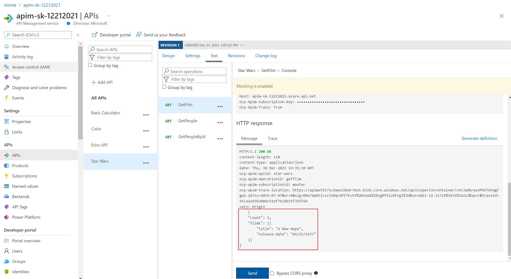

## Star Wars API

### Mock responses

Mocking provides a way to return sample responses even when the backend is not available. This enables app developers to not be help up if the backend is under development.

- Open the Star Wars API and select [Add Operation]
- Create a new operation called GetFilm
- In the Response configuration tab, set Sample data as below


```json
{
  "count": 1,
  "films": [   { "title": "A New Hope",  "blah": "xxx"    }   ]
}
```

- Open the Inbound processing 'Code View'
- Enable mocking and specify a 200 OK response status code


- Select the 200 OK response ... Save


- Mocking is now enabled


- Invoke the API ... should get a 200 success with the mocked data


