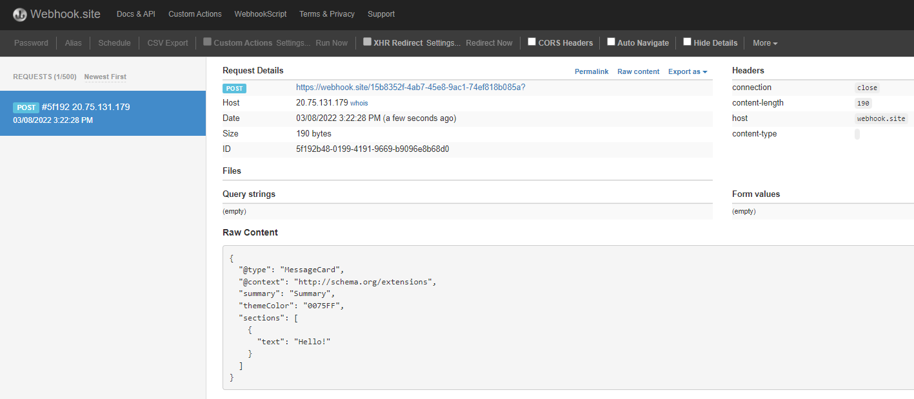

## Calculator API

APIM integrates well with [external services](https://docs.microsoft.com/en-us/azure/api-management/api-management-sample-send-request) via HTTP-based interaction.

This example shows a fire-and-forget [send-one-way-request](https://docs.microsoft.com/en-us/azure/api-management/api-management-sample-send-request#send-one-way-request) policy, which does not await a response. Alternatively, you can use a [send-request](https://docs.microsoft.com/en-us/azure/api-management/api-management-sample-send-request#send-request) policy to send a request and await a return. Some complex in-flight processing logic may also be better handled by using Logic Apps.

### Send-One-Way-Request Setup

The following policy and payload applies for both examples in this lab. **Please ensure that you replace the value in `<set-url>` with your webhook target URL.** You will identify the URL in either example below.

- Open the *Add two integers* operation in the Calculator API.
- Open the 'Code View'.
- Add the `send-one-way-request` policy to *Outbound processing* and replace the webhook and payload as required. For demo purposes we are going to use the payload for a Teams message (even for Webhook.site) and also send the message on every successful request.

  ```xml
  <outbound>
      <base />
      <xml-to-json kind="direct" apply="always" consider-accept-header="false" />
      <set-header name="x-aspnet-version" exists-action="delete" />
      <set-header name="x-powered-by" exists-action="delete" />
      <choose>
          <when condition="@(context.Response.StatusCode == 200)">
              <send-one-way-request mode="new">
                  <set-url>https://enter-your-webhook-url</set-url>
                  <set-method>POST</set-method>
                  <set-body>@{
        return new JObject(
          new JProperty("@type","MessageCard"),
          new JProperty("@context", "http://schema.org/extensions"),
          new JProperty("summary","Summary"),
          new JProperty("themeColor", "0075FF"),
          new JProperty("sections",
            new JArray (
              new JObject (
                new JProperty("text", "Hello!")
              )
            )
          )
        ).ToString();
      }</set-body>
              </send-one-way-request>
          </when>
      </choose>
  </outbound>
  ```

### Send a message to Webhook.site

[Webhook.site](https://webhook.site) is a simple recipient to test webhook messages and requires no setup overhead, making this an ideal component in this lab, especially as we are not sending any sensitive information in our payload from our test APIM instance.

- Go to [Webhook.site](https://webhook.site) and copy the value for **Your unique URL**.

    

- Use this URL as the value in the `<set-url>` property in the `send-one-way-request` policy.

- Invoke the API from the APIM _Test_ tab and observe the `200` success response.

- Check the _Trace_ for the _Outbound_ one-way message.

    

- Observe the success in the Webhook site.

    

### Send a message to Microsoft Teams channel

An optional lab, for Microsoft Teams, please review [Create an Incoming Webhook](https://docs.microsoft.com/en-us/microsoftteams/platform/webhooks-and-connectors/how-to/add-incoming-webhook#create-an-incoming-webhook-1).

- First, open Teams and enable a Webhook connector for your team.
  - Get the URL of the webhook.

    

    

    

    

- Format the required payload. The payload sent to a Teams channel uses the [MessageCard](https://docs.microsoft.com/en-us/microsoftteams/platform/task-modules-and-cards/cards/cards-reference) JSON schema. You can experiment with different cards in the [MessageCard Playground](https://messagecardplayground.azurewebsites.net/).

- Invoke the API from the _Test_ tab and observe the `200` success response.

- Look for a received message in your Teams channel:

  
