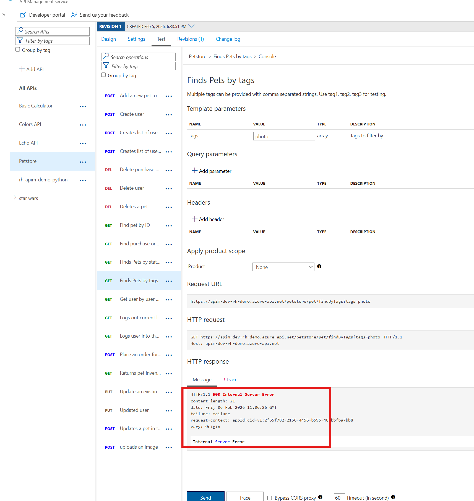

## Calculator API

### Aborting the processing

The ability to terminate a response gracefully is of importance in a number of cases such as error handling or business logic. Using the `return-response` policies short-circuits the request and yields a response that often does not originate from the backend. Consider what general situations may make sense without shifting too much business logic into APIM.

- Open the *Add two integers* operation in the Calculator API.
- Open the 'Code View'.
- Add the inbound policy to test for a condition (just `true` for our example) and return an error.
- Invoke the API with the Authorization header as before. 
- Observe the 500 error.

  ```xml
  <inbound>
      <base />
      <choose>
          <when condition="@(true)">
              <return-response response-variable-name="existing response variable">
                  <set-status code="500" reason="Internal Server Error" />
                  <set-header name="failure" exists-action="override">
                      <value>failure</value>
                  </set-header>
                  <set-body>Internal Server Error</set-body>
              </return-response>
          </when>
      </choose>
  </inbound>
  ```

  

  ### Clean Up

  Now that you have seen how to gracefully terminate a request with a response, it is time to clean up the code to prevent a downstream impact in subsequent labs. **Please remove the `<choose>` logic above to let all requests flow again, then save the changes.**