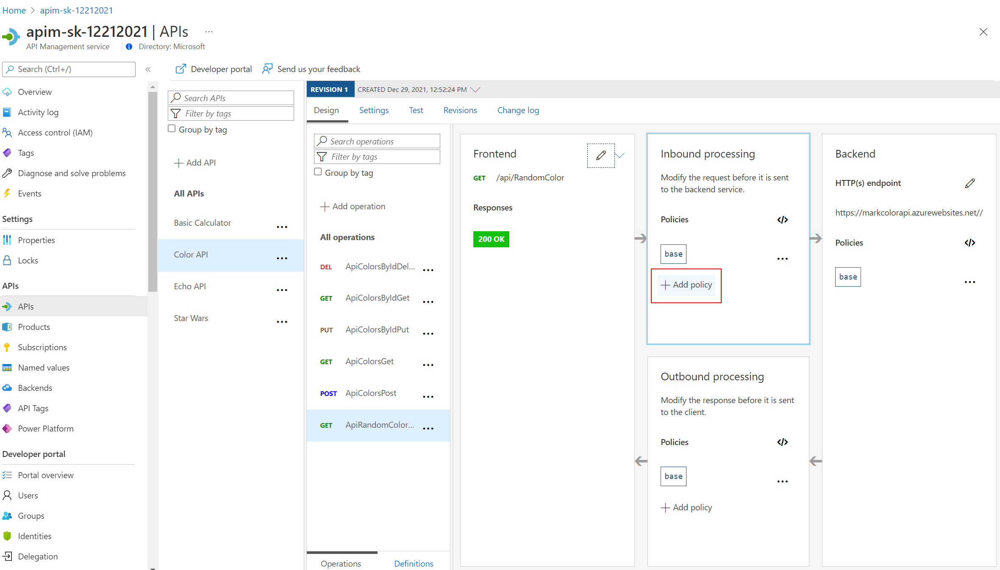
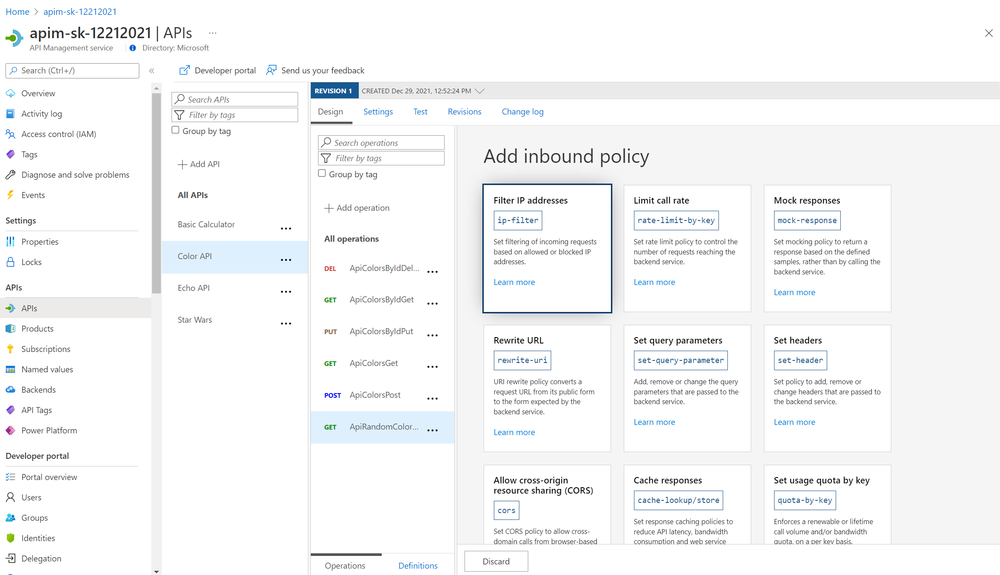
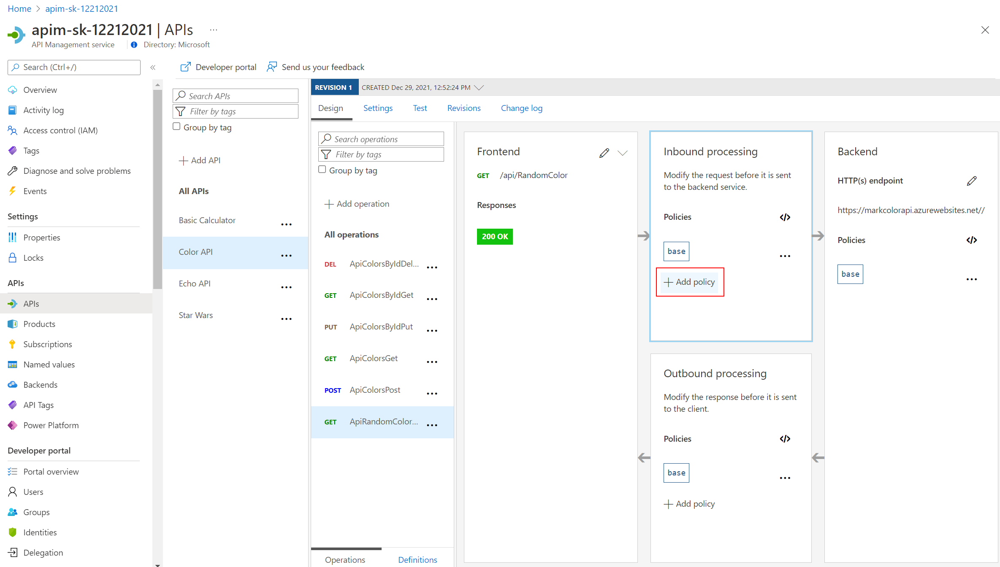
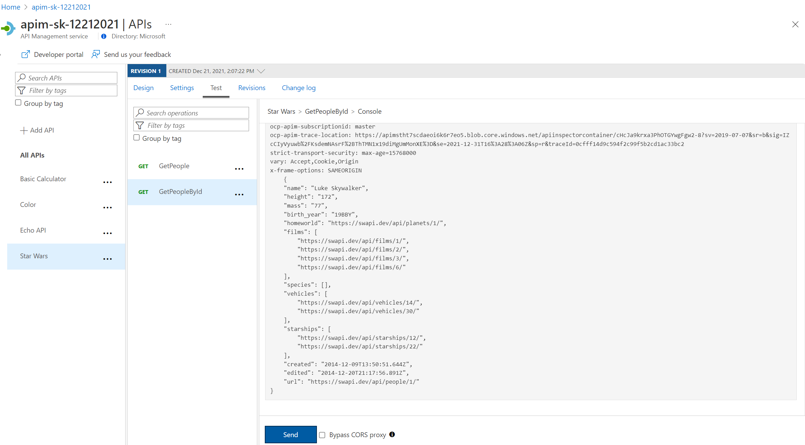
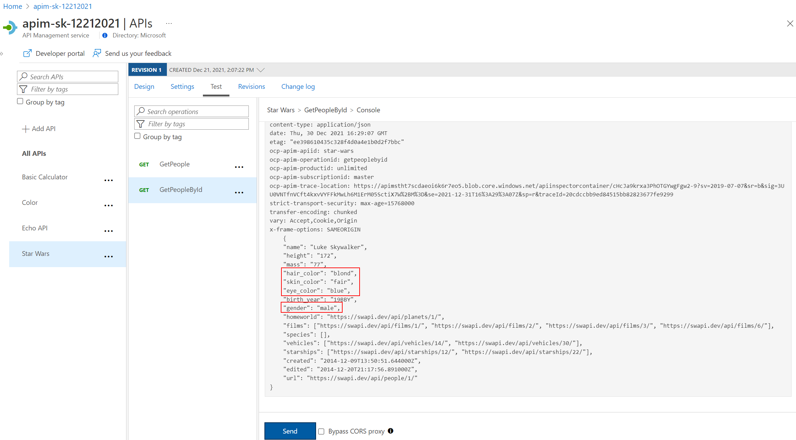
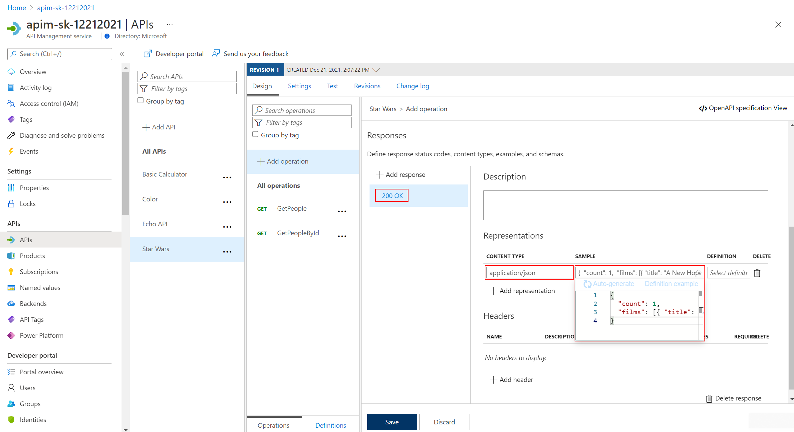
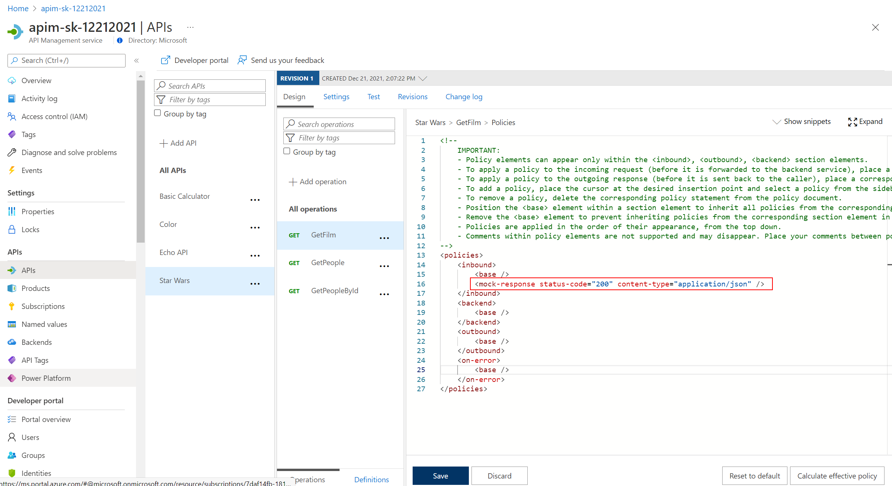
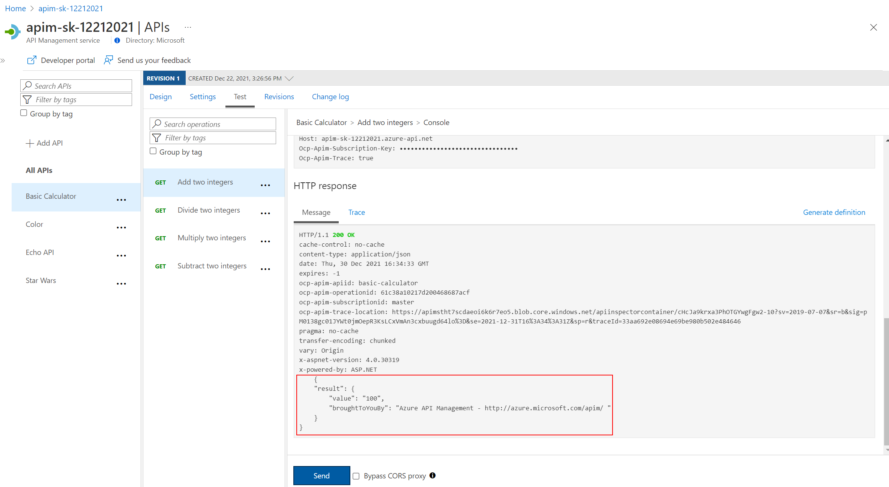
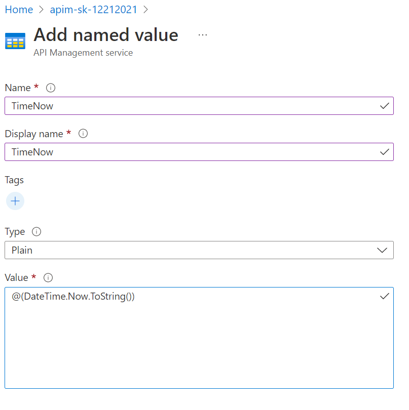
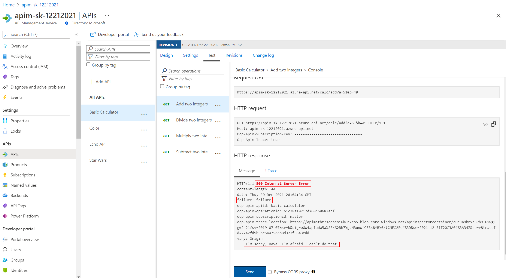

## Policy Expressions

Policy Expressions are used to control traffic to and modify the behavior of the Backend API. Using C# statements and an ability to access the API context, as well as your API Management service configuration, Policy Expressions are a powerful way to modify the behavior of the API at runtime.

Don't hesitate to read the [documentation](https://docs.microsoft.com/en-us/azure/api-management/api-management-policies)

We had a brief look earlier at setting CORS policies.  Lets dive in a bit deeper.

Policies can be applied at multiple scopes and follow this hierarchy:


## All API - Policies examples

### Cross-origin resource sharing (CORS)

The cors policy adds cross-origin resource sharing (CORS) support to an operation or an API to allow cross-domain calls from browser-based clients.

<https://docs.microsoft.com/en-us/azure/api-management/api-management-cross-domain-policies#CORS>

If you go to the global scope located in ´All APIs´you should find something like this:

- On the left Menu, click on `APIs`
- Then select the `All APIs` option
- Then go to the `Inbound Processing` area
- Click on the `cors` policy

  

```xml
<!-- Inbound -->
    <cors allow-credentials="true">
            <allowed-origins>
                <origin>https://famc-apim.developer.azure-api.net</origin>
                <origin>https://markcolorweb.azurewebsites.net</origin>
            </allowed-origins>
            <allowed-methods preflight-result-max-age="300">
                <method>*</method>
            </allowed-methods>
            <allowed-headers>
                <header>*</header>
            </allowed-headers>
            <expose-headers>
                <header>*</header>
            </expose-headers>
        </cors>
```

## Color API - Policies examples

### Getting Started - Frontend/Inbound/Outbound/Backend

Select an API e.g. Color API
- Notice you can configure the Frontend, Inbound processing, Outbound processing, Backend
  - Just select the Pencil icon to edit each part
- Also notice, the configuration can be scoped to the API (All operations) or to an individual operation


Edit the Frontend ...
  - If editing an Operation - this gives a choice of the 'Code View' editor or Forms-based editor
  - If editing an API - the only option is the 'Code View' editor
  - The 'Code View' editor allows amendments to the Swagger (OpenAPI) definition


- Edit Inbound processing / Outbound processing / Backend
  - Have a choice of the 'Code View' editor or selecting an [Add Policy] Form






### Caching

API Management can be configured for response caching - this can significantly reduce API latency, bandwidth consumption, and web service load for data that does not change frequently.

Using the Azure Management portal - set a caching Policy on the RandomColor API call
  - Set a caching duration of 15 seconds
  - Simple caching configuration is not yet implemented in the Azure Management portal - we see shall see later how it can be done using policy expressions




- Configure Color Website to use Unlimited URL
- Select [Start]
- Notice that for each 15 seconds period - the same color is set


Look at RandomColor API, switch to 'Code View' and check the caching policies (set from earlier)

```xml
<!-- Inbound -->
<cache-lookup vary-by-developer="false"
              vary-by-developer-groups="false"
              downstream-caching-type="none" />

<!-- Outbound -->
<cache-store duration="15" />
```

### Transformation - replace string

The find-and-replace policy finds a request or response substring and replaces it with a different substring.

- Open the Colors API, then open the ApiRandomColor operation 'Code View'
- Add the outbound policy to change from "blue" to "yellow"
- Invoke the API using the Starter product key and examine the response
- Invoke the API using the Unlimited product key and examine the response


```xml
<find-and-replace from="blue" to="yellow" />

```

With Starter key and Unlimited key:


## Star Wars API - Policies examples

### Transformation - conditional

Another C# example to manipulate the response body, depending on the product - with this expression a subscriber of the Starter product will only get back a subset of the information.  Other products will get the full information.

- Open the Star Wars API, then open the GetPeopleById operation 'Code View'
- Add the outbound policy to conditionally change the response body
- Invoke the API using the Starter product key and examine the response
- Invoke the API using the Unlimited product key and examine the response

Not the inbound header is set to ensure that the Response Body is not encoded as that causes the JSON parsing to fail.

```xml
<!-- Inbound -->
        <set-header name="Accept-Encoding" exists-action="override">
            <value>deflate</value>
        </set-header>
<!-- Outbound -->
<choose>
    <when condition="@(context.Response.StatusCode == 200 && context.Product.Name.Equals("Starter"))">
        <set-body>@{
                var response = context.Response.Body.As<JObject>();
                foreach (var key in new [] {"hair_color", "skin_color", "eye_color", "gender"}) {
                    response.Property(key).Remove();
                }
                return response.ToString();
            }
        </set-body>
    </when>
</choose>

```

With Starter key:



With Unlimited key:




### Mock responses

Mocking provides a way to return sample responses even when the backend is not available. This enables app developers to not be help up if the backend is under development.

- Open the Star Wars API and select [Add Operation]
- Create a new operation called GetFilm
- In the Response configuration tab, set Sample data as below




```json
{
  "count": 1,
  "films": [   { "title": "A New Hope",  "blah": "xxx"    }   ]
}
```

- Open the Inbound processing 'Code View'
- Enable mocking and specify a 200 OK response status code



- Select the 200 OK response ... Save


- Mocking is now enabled


- Invoke the API ... should get a 200 success with the mocked data


## Calculator API - Policies examples

### Transformation - XML to JSON

A frequent requirement is to transform content, especially with legacy APIs

Remember the Calc API that returned XML
- Open the Calculator API 'Code View'
- Add the outbound policy to transform the response's body to JSON
- Invoke the API and examine the response - note that its now JSON

```xml
<!-- Outbound -->
<xml-to-json kind="direct" apply="always" consider-accept-header="false" />
```



### Named Values collection

Named Values (aka Properties) are a collection of key/value pairs that are global to the service instance. These properties can be used to manage constant string values across all API configurations and policies.  Values can be expressions or secrets (never displayed).

- Set a property called `TimeNow`
  - e.g. `@(DateTime.Now.ToString())`



- Open the Calculator API 'Code View'
- Add the inbound policy to add the header
- Test the API within the Azure Management portal
  - Add a Header called [Ocp-Apim-Trace] set to true
  - Examine the response and the [Trace] tab

```xml
<!-- Inbound -->
<set-header name="timeheader" exists-action="override">
    <value>{{"{{TimeNow"}}}}</value>
</set-header>
```


- Go to the URL specified in the HTTP Response - [ocp-apim-trace-location]
  - Note that the [timeheader] field has been sent to the backend API


### Delete response headers

A frequent requirement is to remove headers - example those that might leak potential security information

- Open the Calculator API 'Code View'
- Add the outbound policy to delete the response headers
- Invoke the API and examine the response

```xml
<!-- Outbound -->
<set-header name="x-aspnet-version" exists-action="delete" />
<set-header name="x-powered-by" exists-action="delete" />
```

Before:


After policy applied:


### Amend what's passed to the backend

Policy expressions can include C# code. Can access a number of .NET Framework types and their members .NET Framework type.  A variable named `context` is implicitly available and its members provide information pertinent to the API request.

More info <https://docs.microsoft.com/en-us/azure/api-management/api-management-policy-expressions>

- Open the Calculator API 'Code View'
- Add the inbound policy to amend the query string and header
- Invoke the API - use the Trace function to examine what was passed to the backend

```xml
<!-- Inbound -->
<set-query-parameter name="x-product-name" exists-action="override">
    <value>@(context.Product.Name)</value>
</set-query-parameter>
<set-header name="x-request-context-data" exists-action="override">
    <value>@(context.User.Id)</value>
    <value>@(context.Deployment.Region)</value>
</set-header>
```

Note - this trace below was from the Developer portal.  I got errors when testing from the Azure Management portal, as the [User Id] is unable to be evaluated.


### Send a message to Microsoft Teams channel

> It can also be done with Slack

This example shows 'Send one-way request' ... sends a request to the specified URL without waiting for a response.  Another option is to [Send request] and Wait.  Complex in-flight processing logic is better handled by using Logic Apps.

For Microsoft Teams

- First need to go into Teams and enable a Web hook connector.
  - Get the URL of the webhook.


- Format the required payload ... the payload sent to a Teams channel is of the MessageCard JSON schema format
  - <https://docs.microsoft.com/en-us/microsoftteams/platform/task-modules-and-cards/cards/cards-reference>
  - <https://messagecardplayground.azurewebsites.net/>

- Open the Calculator API 'Code View'
- Add the outbound policy
  - replace the webhook and payload as required

```xml
<!-- Outbound -->
<choose>
    <when condition="@(context.Response.StatusCode >= 299)">
        <send-one-way-request mode="new">
            <set-url>https://outlook.office.com/webhook/78f54a63-f217-451a-b263-f1f5c0e866f0@72f988bf-86f1-41af-91ab-2d7cd011db47/IncomingWebh00k/34228a8ccbe94e368d3ac4782adda9b2/4e01c743-d419-49b7-88c6-245e5e31664a</set-url>
            <set-method>POST</set-method>
            <set-body>@{
                    return new JObject(
                        new JProperty("@type","MessageCard"),
                        new JProperty("@context", "http://schema.org/extensions"),
                        new JProperty("summary","Summary"),
                        new JProperty("themeColor", "0075FF"),
                        new JProperty("sections",
                            new JArray (
                                new JObject (
                                    new JProperty("text","Error - details: [link](http://azure1.org)")
                                    )
                                )
                            )
                        ).ToString();
            }</set-body>
        </send-one-way-request>
    </when>
</choose>

```

- for demo purposes, amend the condition so it always fires i.e. `StatusCode = 200`
- Invoke the API ... should get a 200 success
- Look for a message in the Teams channel

```xml
    <when condition="@(context.Response.StatusCode == 200)">
```

Received notification in the Teams channel:


### Aborting the processing

- Open the Calculator API 'Code View'
- Add the inbound policy to test for a condition and return an error
- Invoke the API - with Authorization header as above ... should get a 599 error
- Replace the condition with some more meaningful code

```xml
<!-- Inbound -->
<choose>
    <when condition="@(true)">
        <return-response response-variable-name="existing response variable">
            <set-status code="599" reason="failure" />
            <set-header name="failure" exists-action="override">
                <value>failure</value>
            </set-header>
            <set-body>blah</set-body>
        </return-response>
    </when>
</choose>
```




