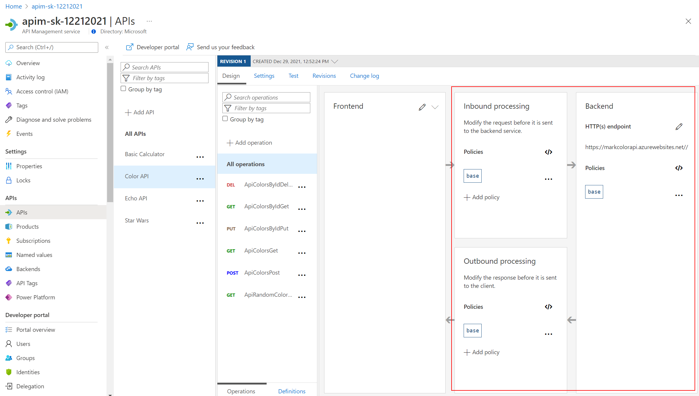
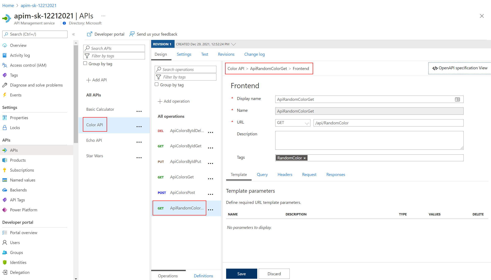
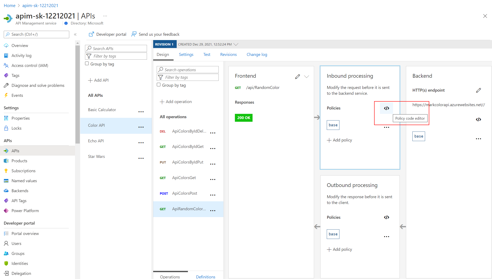

## Policy Expressions

Policy Expressions are used to control traffic to and modify the behavior of the Backend API. Using C# statements and an ability to access the API context, as well as your API Management service configuration, Policy Expressions are a powerful way to modify the behavior of the API at runtime.

Don't hesitate to read the [documentation](https://docs.microsoft.com/en-us/azure/api-management/api-management-policies)

We had a brief look earlier at setting CORS policies.  Lets dive in a bit deeper.

Policies can be applied at multiple scopes and follow this hierarchy:

### Getting Started - Frontend/Inbound/Outbound/Backend

Select an API e.g. Color API
- Notice you can configure the Frontend, Inbound processing, Outbound processing, Backend
  - Just select the Pencil icon to edit each part
- Also notice, the configuration can be scoped to the API (All operations) or to an individual operation

Edit the Frontend ...
  - If editing an Operation - this gives a choice of the 'Code View' editor or Forms-based editor
  - If editing an API - the only option is the 'Code View' editor
  - The 'Code View' editor allows amendments to the Swagger (OpenAPI) definition

- Edit Inbound processing / Outbound processing / Backend
  - Have a choice of the 'Code View' editor or selecting an [Add Policy] Form

