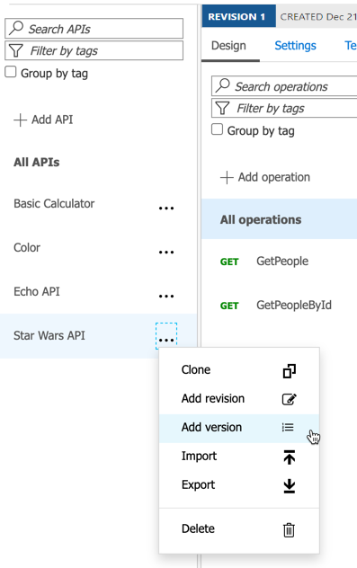

### Version

#### Add a new version

- Select the Star Wars API
- Add a new version
  - Set the name and identifier to `v2`
  - Select the `Path` versioning scheme
  - Add the `Starter` and `Unlimited` products

#### Test the new version

- Browse to the developer portal
- Select APIs and choose the `v2` version of the Star Wars API
- Notice the request URL and the inclusion of `v2` in the path
- Test the `GetPeople` operation

