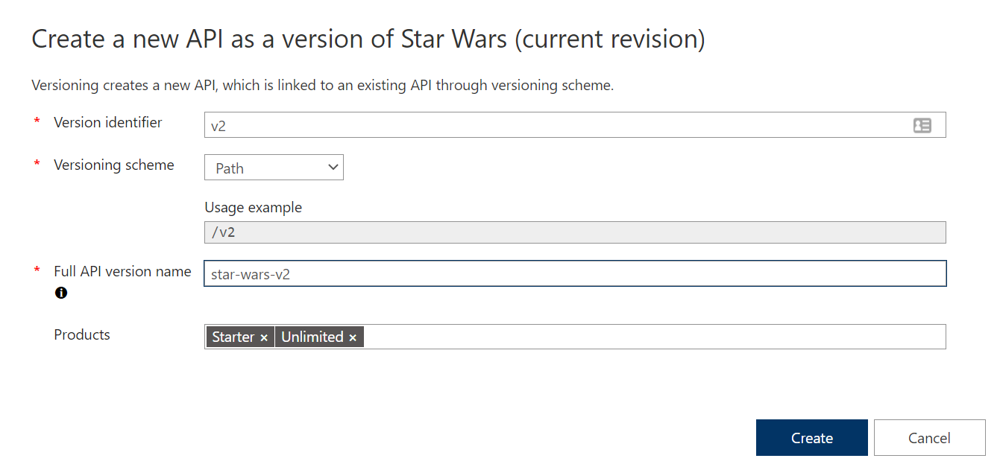

## Version

Proper version management not only helps organize your API, it also aids in API Management. In this exercise we are going to version an existing API.

> Integrate version management from the beginning with a `v1` or similar identifier. 

### Add a new version

- Select the Star Wars API.
- Add a new version:
  - Version identifier: **v2**  
  - Versioning scheme: **Path**
  - Full API version name: **star-wars-v2**
    > This name must be unique across the APIM instance. Therefore, a combination of the API name and its version identifier is both semantic and suitable.
  - Products: **Starter** and **Unlimited**

    
    

  - The new version, _v2_, is now added in the Star Wars API. 
    > Any previous implementation of the newly-versioned API will simply be set to _Original_. This is a purely organizational change within APIM. The  version continues to operate on the same previous URL without a version identifier - there is no impact to the consumers.

    

### Test the new version

- Open the Developer Portal.
- Select APIs and choose the `v2` version of the Star Wars API.

  

- Notice the request URL and the inclusion of `v2` in the path.

  

- Test the `GetPeople` operation.

  

### What Versions Enable

Now that you have created a new version of the API, you have the ability to introduce breaking changes. Often times a breaking change in a backend API necessitates an API version change in APIM. Leaving a legacy implementation behind to focus on more contemporary API implementations also is a common versioning use case. Whatever the reason may be, APIM provides means to abstract breaking changes in a responsible and safe manner.  