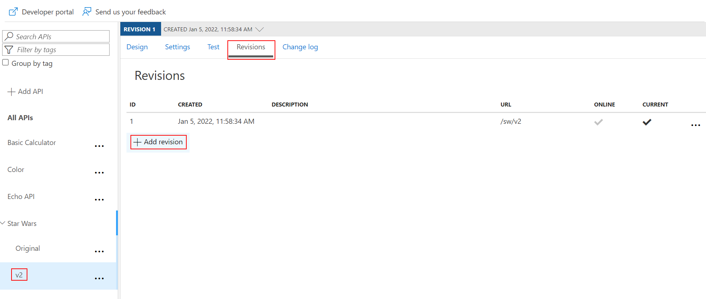
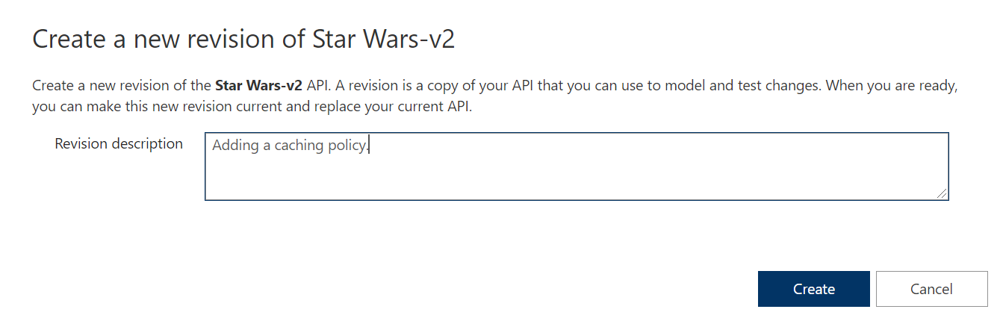
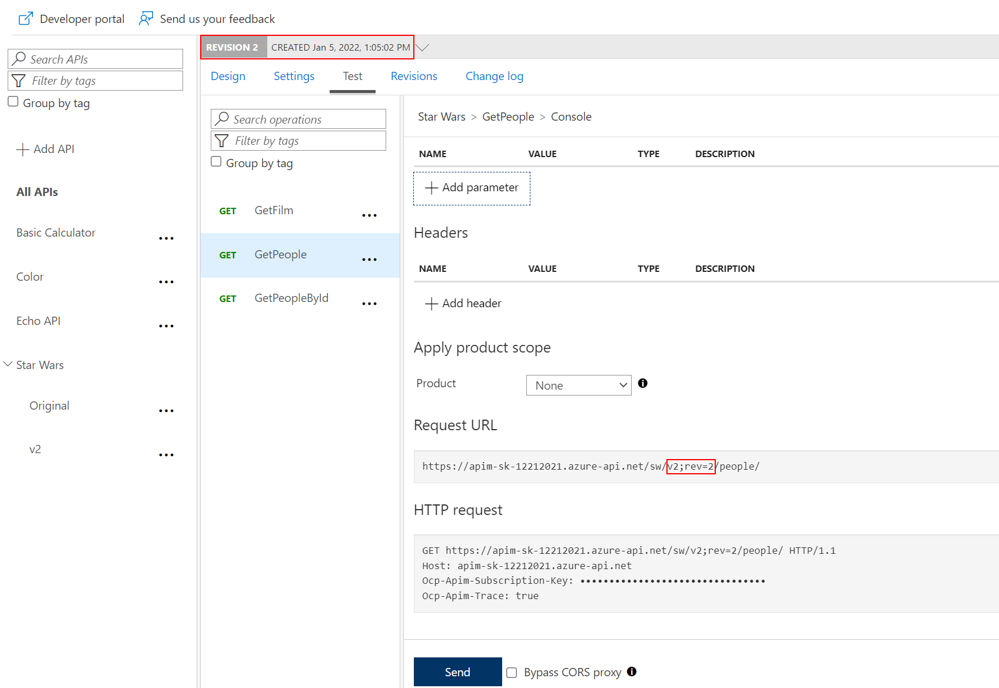
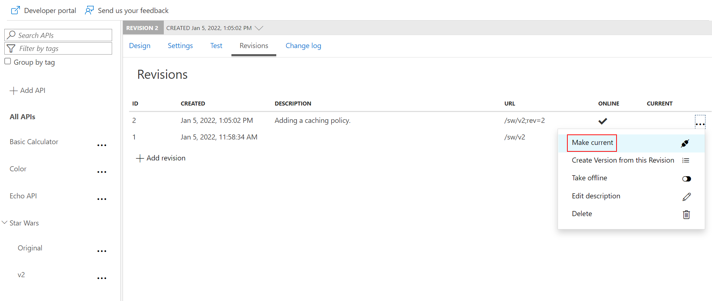

### Revisions

#### Add a new revision

- Select the Star Wars API
- Select `Revisions`
- Add a new revision called `rev2`

#### Add caching

- Select the `GetPeople` operation
- Add a caching policy for 10 seconds at the operation level

#### Test the new revision

- From the Azure portal, test the `GetPeople` operation
- Note the revision number at the top of the page as well as in the request URL.

The request URL should look similar to: `https://<your-apim-name>.azure-api.net/sw;rev=2/people/`.

#### Make current revision

- Select the Revisions tab
- Make `rev2` the current revision

