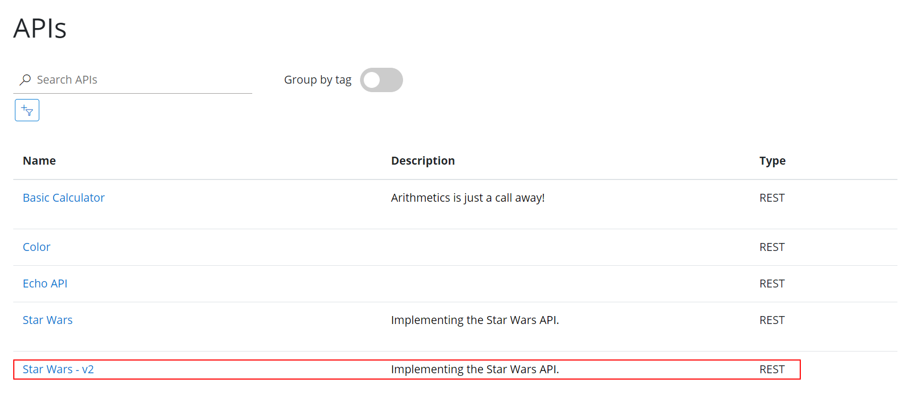

## Version and Revisions

Versions and revisions provide you with an elegant way to manage change and the lifecycle of your APIs. [https://azure.microsoft.com/en-us/blog/versions-revisions/](https://azure.microsoft.com/en-us/blog/versions-revisions/)

Revisions allow you to safely make non-breaking changes to your API. Developers who consume the API can be given details about the changes. Revisions also allow you to rollback changes.

### Version

#### Add a new version

- Select the Star Wars API
- Add a new version
  - Set the name and identifier to `v2`
  - Select the `Path` versioning scheme
  - Add the `Starter` and `Unlimited` products

#### Test the new version

- Browse to the developer portal
- Select APIs and choose the `v2` version of the Star Wars API
- Notice the request URL and the inclusion of `v2` in the path
- Test the `GetPeople` operation

### Revisions

#### Add a new revision

- Select the Star Wars API
- Select `Revisions`
- Add a new revision called `rev2`

#### Add caching

- Select the `GetPeople` operation
- Add a caching policy for 10 seconds at the operation level

#### Test the new revision

- From the Azure portal, test the `GetPeople` operation
- Note the revision number at the top of the page as well as in the request URL.

The request URL should look similar to: `https://<your-apim-name>.azure-api.net/sw;rev=2/people/`.

#### Make current revision

- Select the Revisions tab
- Make `rev2` the current revision

