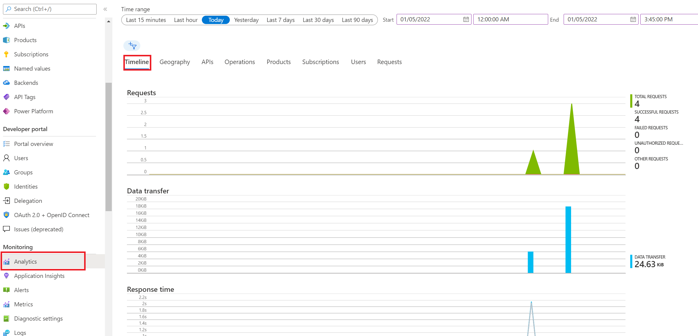
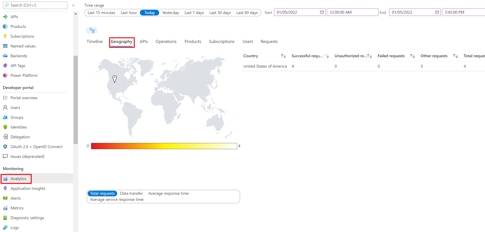
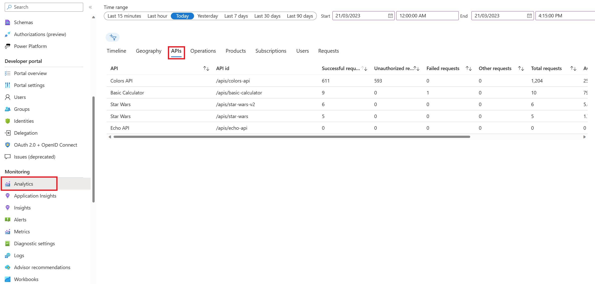

## Basics Monitoring with Azure Monitor

Analytics is available on the _Analytics_ blade in APIM.

- The dashboard has several tabs on it. For example, here are _Timeline_, _Geography_, and _APIs_:

  

  

  

**VIDEO**: There is a video example that walks through using Azure Monitor & Application insights that you can find [HERE](https://youtu.be/-8JWforFbww?si=4f1id4NuK5BgQn8p)