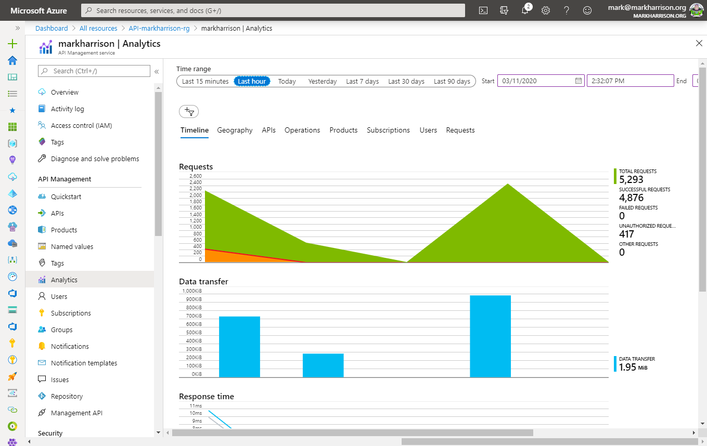
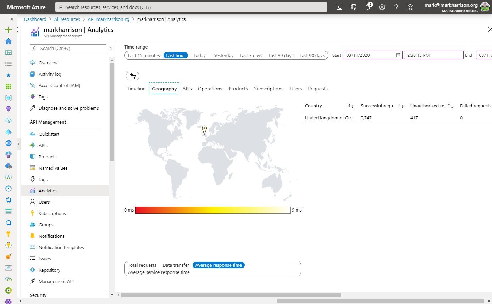
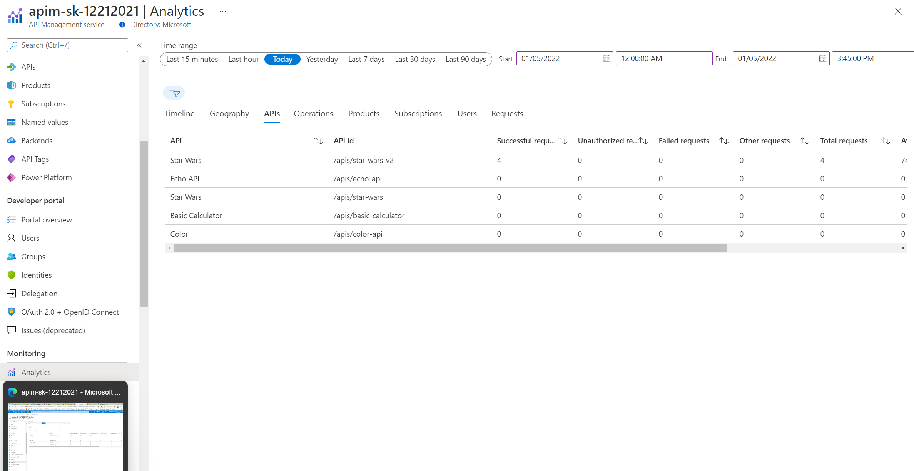

## Basic Monitoring with Azure Monitor

Analytics is available on the _Analytics_ blade in APIM.

- The dashboard has several tabs on it. For example, here are _Timeline_, _Geography_, and _APIs_:

  

  

  

