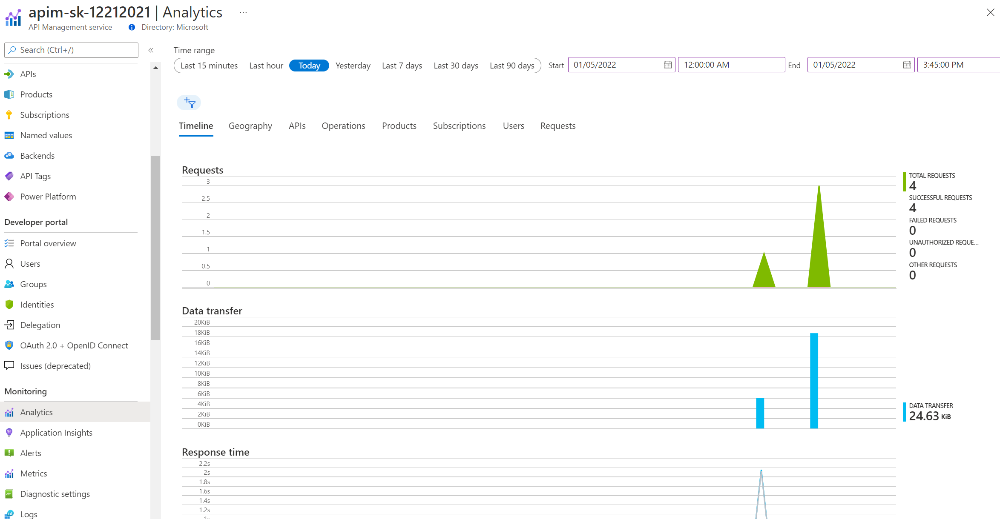
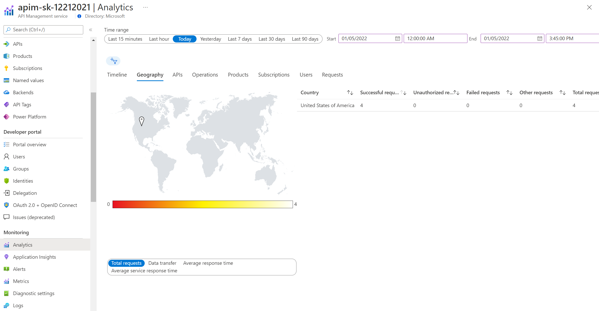

# Basic Monitoring with Azure Monitor

Analytics is available in the Azure management portal from the Analytics blade.

- Look at the dashboard and detailed :  Timeline , Geography , APIs , Operations , Products , Subscriptions , Users , Requests

