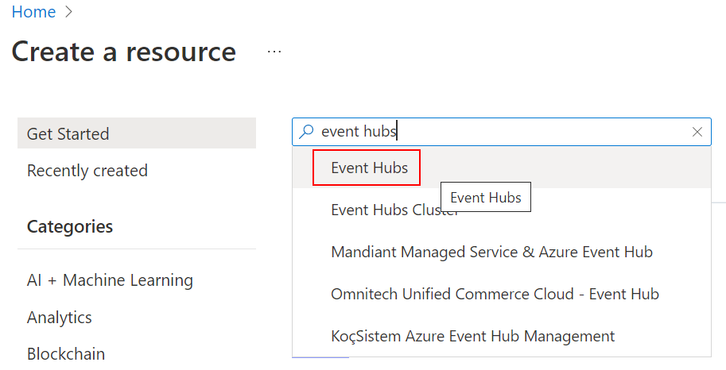
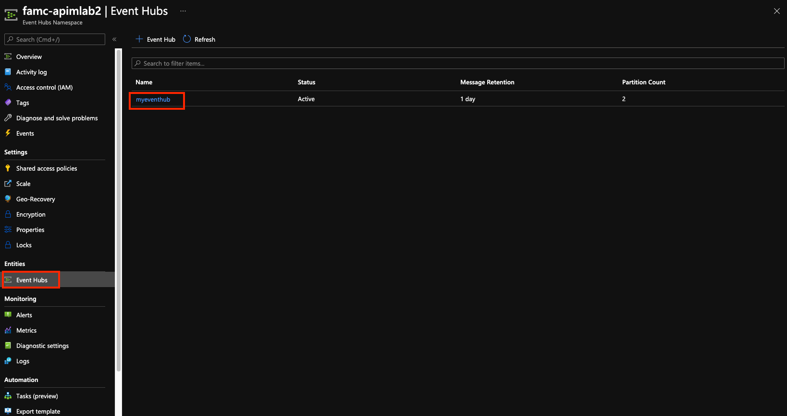
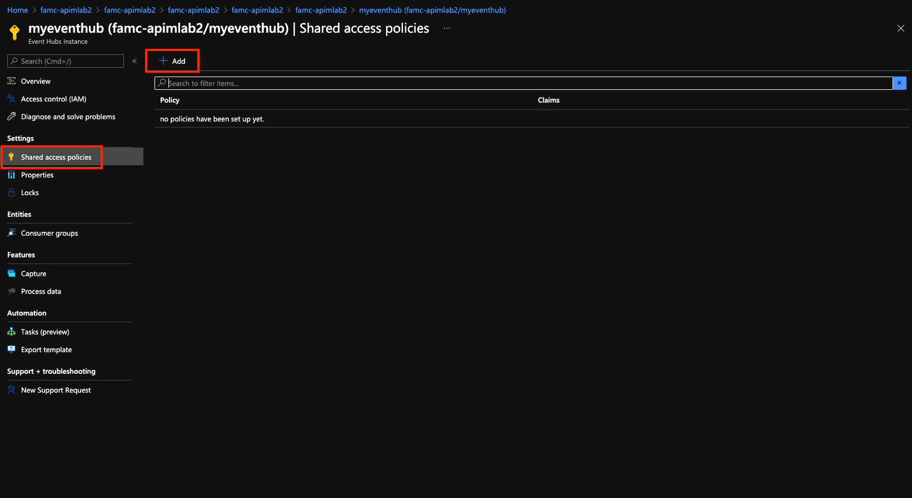
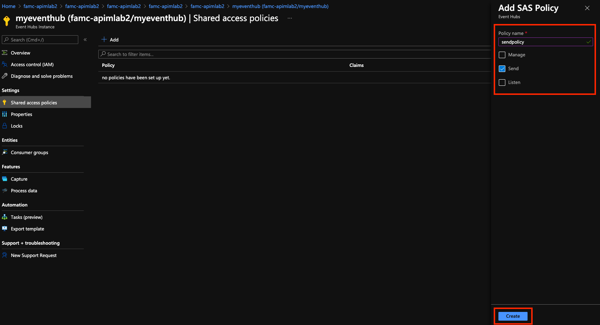
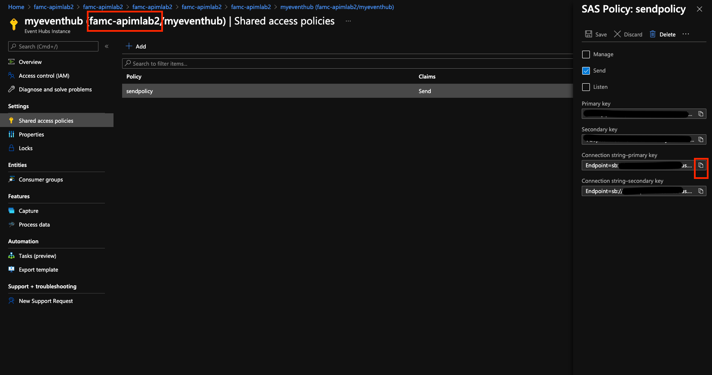
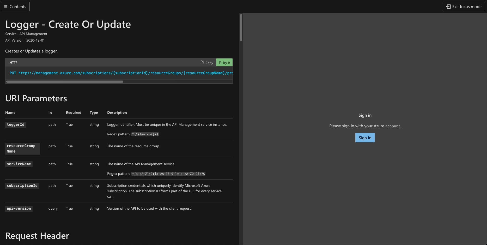
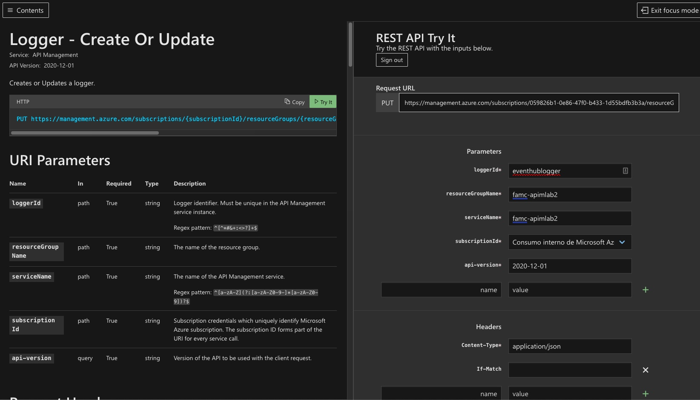
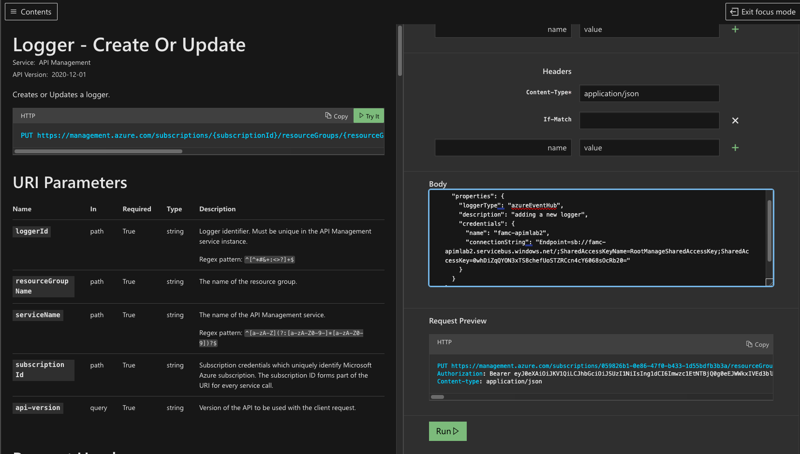
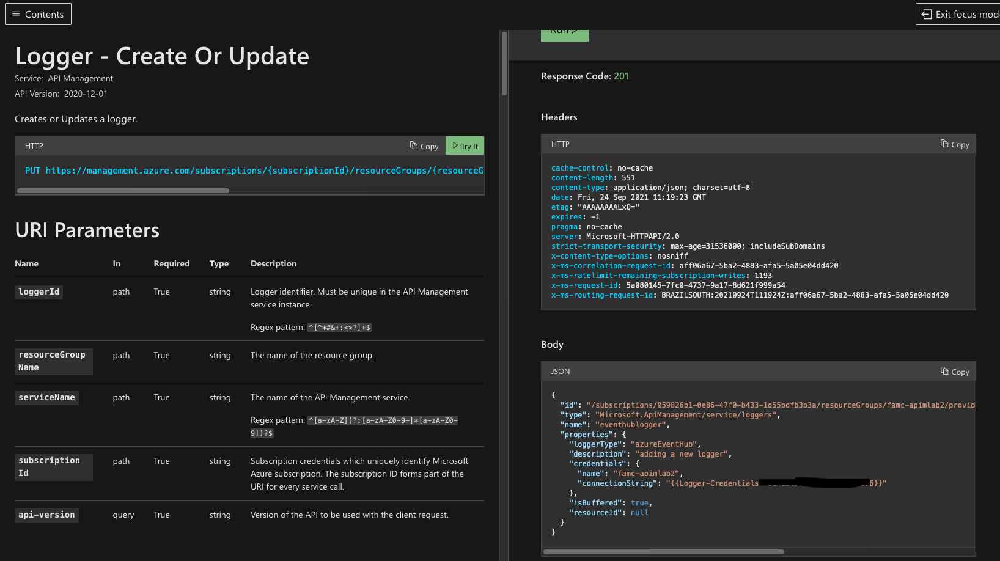

## Create and Event Hubs namespace

An Event Hubs namespace provides a unique scoping container, in which you create one or more event hubs. To create a namespace in your resource group using the portal, do the following actions:

1. In the Azure portal, and select **Create a resource** at the top left of the screen.
1. Select **All services** in the left menu, and select **star (`*`)** next to **Event Hubs** in the **Analytics** category. Confirm that **Event Hubs** is added to **FAVORITES** in the left navigational menu. 
    
   
1. Select **Event Hubs** under **FAVORITES** in the left navigational menu, and select **Add** on the toolbar.

   
1. On the **Create namespace** page, take the following steps:  
   1. Select the **subscription** in which you want to create the namespace.  
   1. Select the **resource group** you created in the previous step.   
   1. Enter a **name** for the namespace. The system immediately checks to see if the name is available.  
   1. Select a **location** for the namespace.
   1. Choose **Basic** for the **pricing tier**. To learn about differences between tiers, see [Quotas and limits](event-hubs-quotas.md), [Event Hubs Premium](event-hubs-premium-overview.md), and [Event Hubs Dedicated](event-hubs-dedicated-overview.md) articles. 
   1. Leave the **throughput units** (for standard tier) or **processing units** (for premium tier) settings as it is. To learn about throughput units or processing units: [Event Hubs scalability](event-hubs-scalability.md).  
   1. Select **Review + Create** at the bottom of the page.
      
      
   1. On the **Review + Create** page, review the settings, and select **Create**. Wait for the deployment to complete. 
      
      
      
   1. On the **Deployment** page, select **Go to resource** to navigate to the page for your namespace. 
      
        
   1. Confirm that you see the **Event Hubs Namespace** page similar to the following example:   
      
             

      > [!NOTE]
      > Azure Event Hubs provides you with a Kafka endpoint. This endpoint enables your Event Hubs namespace to natively understand [Apache Kafka](https://kafka.apache.org/intro) message protocol and APIs. With this capability, you can communicate with your event hubs as you would with Kafka topics without changing your protocol clients or running your own clusters. Event Hubs supports [Apache Kafka versions 1.0](https://kafka.apache.org/10/documentation.html) and later. For more information, see [Use Event Hubs from Apache Kafka applications](event-hubs-for-kafka-ecosystem-overview.md).


## Create and Event Hub

To create an event hub within the namespace, do the following actions:

1. On the Event Hubs Namespace page, select **Event Hubs** in the left menu.
1. At the top of the window, select **+ Event Hub**.
   
    
1. Type a name for your event hub, then select **Create**.
   
    

    The **partition count** setting allows you to parallelize consumption across many consumers. For more information, see [Partitions](event-hubs-scalability.md#partitions).

    The **message retention** setting specifies how long the Event Hubs service keeps data. For more information, see [Event retention](event-hubs-features.md#event-retention).
1. You can check the status of the event hub creation in alerts. After the event hub is created, you see it in the list of event hubs.

    

1. Finally we need to create an access connection to our new Event Hub, for this lets do the following:
    1. Lets go to the `Event Hubs` option
    1. Choose your new Event Hub `myeventhub` 



1. Go to the `Shared Access Policies` menu 
1. Click on `Add`



1. Add a ´sendpolicy´ with just ´Send´ permissions




1. Click on the new policy created, and copy the primary connection string and also the name of the eventhub namespace




# Create an API Management logger
Now that you have an Event Hub, the next step is to configure a [Logger](/rest/api/apimanagement/2020-12-01/logger) in your API Management service so that it can log events to the Event Hub.

API Management loggers are configured using the [API Management REST API](/rest/api/apimanagement/ApiManagementREST/API-Management-REST). For this example we are going to use the "REST API Try it" Functionality to create the logger:

1. Open the following link [Rest API try it](https://docs.microsoft.com/en-us/rest/api/apimanagement/2020-12-01/logger/create-or-update#code-try-0)



1. We are going to sign in with our azure credentials
1. Fill in the following fields:
    1. `loggerId` with a name like `eventhublogger`
    1. `resourceGroupName` the name of your resource group 
    1. `serviceName` the name of your azure api management instance



1. In the body of the request you need the following json object with you EventHub namespace name and credentials and then click the Run button:

```json
{
  "properties": {
    "loggerType": "azureEventHub",
    "description": "adding a new logger",
    "credentials": {
      "name": "hydraeventhub",
      "connectionString": "Endpoint=sb://hydraeventhub-ns.servicebus.windows.net/;SharedAccessKeyName=RootManageSharedAccessKey;SharedAccessKey=********="
    }
  }
}
```



1. You should get a 200 response 



# Configure log-to-eventhub policies

Once your logger is configured in API Management, you can configure your log-to-eventhub policy to log the desired events. The log-to-eventhub policy can be used in either the inbound policy section or the outbound policy section.

1. Browse to your APIM instance.
2. Select the API tab.
3. Select the API to which you want to add the policy. In this example, we're adding a policy to the **Echo API** in the **Unlimited** product.
4. Select **All operations**.
5. On the top of the screen, select the Design tab.
6. In the Inbound or Outbound processing window, click the triangle (next to the pencil).
7. Select the Code editor. 
8. Position your cursor in the `inbound` or `outbound` policy section.
9. In the window on the right, select **Advanced policies** > **Log to EventHub**. This inserts the `log-to-eventhub` policy statement template.

```xml
<log-to-eventhub logger-id="logger-id">
    @{
        return new JObject(
            new JProperty("EventTime", DateTime.UtcNow.ToString()),
            new JProperty("ServiceName", context.Deployment.ServiceName),
            new JProperty("RequestId", context.RequestId),
            new JProperty("RequestIp", context.Request.IpAddress),
            new JProperty("OperationName", context.Operation.Name)
        ).ToString();
    }
</log-to-eventhub>
```
Replace `logger-id` with the value you used for `{loggerId}` in the request URL to create the logger in the previous step.

You can use any expression that returns a string as the value for the `log-to-eventhub` element. In this example, a string in JSON format containing the date and time, service name, request ID, request IP address, and operation name is logged.

Click **Save** to save the updated policy configuration. As soon as it is saved the policy is active and events are logged to the designated Event Hub.

> [!NOTE]
> The maximum supported message size that can be sent to an event hub from this API Management policy is 200 kilobytes (KB). If a message that is sent to an event hub is larger than 200 KB, it will be automatically truncated, and the truncated message will be transferred to event hubs.


