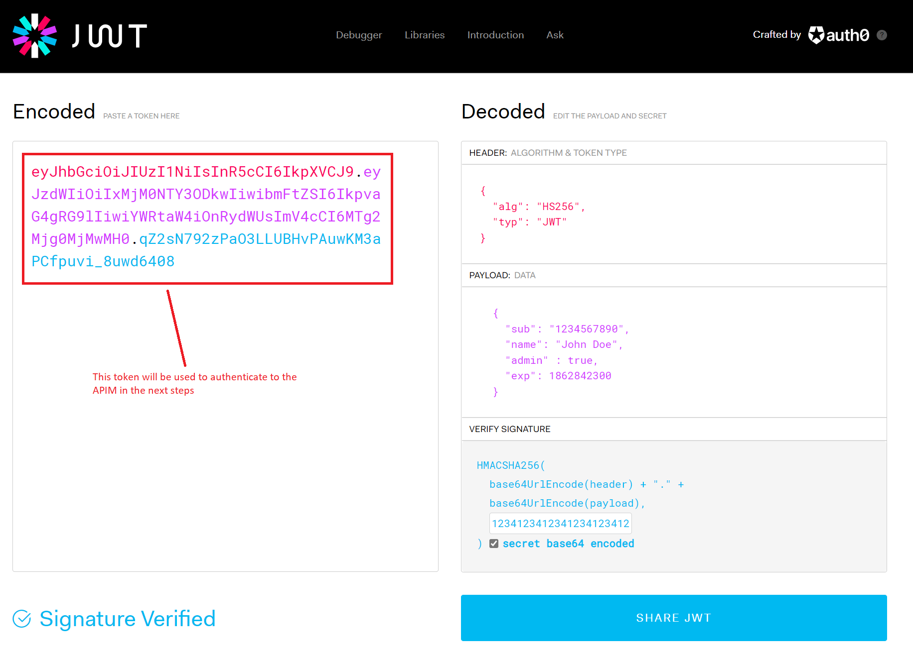
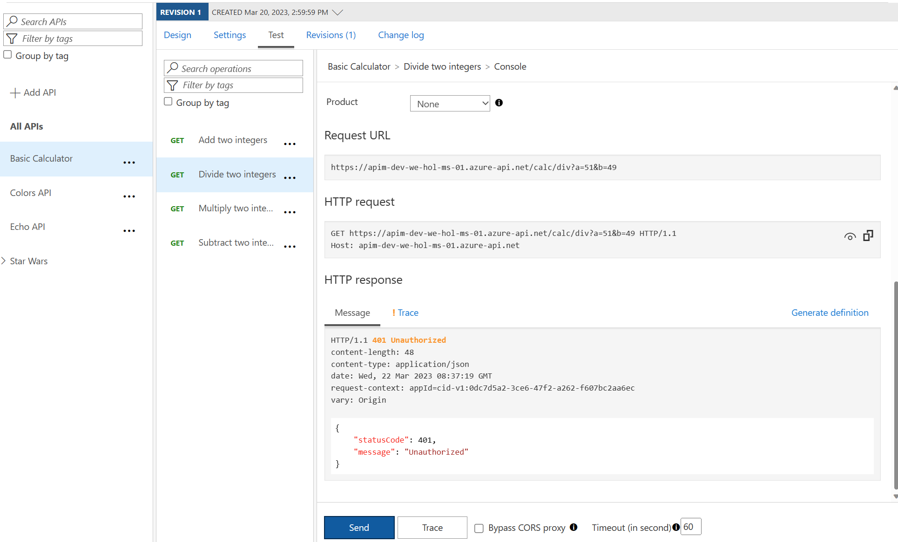
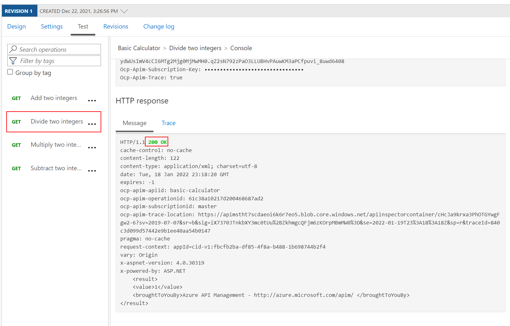

## Security

In this lab, we are going to see how to use JSON Web Tokens with your APIs.

### JSON Web Tokens (JWT)

JSON Web Tokens are an open-industry standard method for representing claims securely between two parties. More info at <https://jwt.io>. 

Use the following sites:
- <https://www.unixtimestamp.com> to get a future date using the Epoch Unix Timestamp _at least one hour from the current time_ as the JWT will not work otherwise (e.g. 01/11/2029 = `1862842300`)

- <https://jwt.io> to create a JWT with payload modeled after this one:
    ```json
      {
        "sub": "1234567890",
        "name": "John Doe",
        "admin" : true,
        "exp": 1862842300
      }
    ```
  - In the signature area use a key that matches the value in the policy expression (see below - e.g. `123412341234123412341234`). Also be sure to check the option that says **secret base64 encoded**.

  - Your configuration should be similar to this:

    

### JSON Web Tokens (JWT) - validate

- Open the Calculator API 'Code View',
- Add the inbound policy to validate the JWT. The example shows the use of variables in an expression - useful if a value is repeated.

  ```xml
  <!-- Inbound -->
  <set-variable name="signingKey" value="123412341234123412341234" />
  <validate-jwt header-name="Authorization" failed-validation-httpcode="401" failed-validation-error-message="Unauthorized">
      <issuer-signing-keys>
          <key>@((string)context.Variables["signingKey"])</key>
      </issuer-signing-keys>
  </validate-jwt>
  ```

- Invoke the API ... should get a [401 Unauthorized error]
- Invoke the API with a request header containing the security token (got above from <https://jwt.io/>) ... should get a 200 success
  - Name: Authorization
  - Value: bearer `JWT token`  (space between bearer and token)

No JWT:



Valid JWT in the header:

Note the bearer token in the Request payload.
Make sure your JWT token has an expiry date in the future.



#### JSON Web Tokens (JWT) - check a claim exists

- Open the Calculator API 'Code View'
- Add the inbound policy to validate that JWT is valid and that the claim 'admin' exists
- Invoke the API - with Authorization header as above ... should get a 200 success
- Amend the policy with a claim name that doesn't exist e.g. 'adminx'
- Invoke the API - with Authorization header as above ... should get a 401 Unauthorized error

```xml
<!-- Inbound -->
        <set-variable name="signingKey" value="123412341234123412341234" />
        <validate-jwt header-name="Authorization" failed-validation-httpcode="401" failed-validation-error-message="Unauthorized">
            <issuer-signing-keys>
                <key>@((string)context.Variables["signingKey"])</key>
            </issuer-signing-keys>
            <required-claims>
                <claim name="admin" match="any">
                    <value>true</value>
                </claim>
            </required-claims>
        </validate-jwt>
```

Checking for admin claim:


Checking for adminx claim:

```xml
                <claim name="adminx" match="any">
```


#### JSON Web Tokens (JWT) - extract claim and pass to backend

- Open the Calculator API 'Code View'
- Add the inbound policy to:
  - validate the JWT (as above)
  - extract the 'name' claim and set in header (below)
- Invoke the API - with Authorization header as above ... should get a 200 success
- Use the Trace feature to inspect what was passed to backend ... should see the use name from JWT

```xml
<!-- Inbound -->
<set-header exists-action="override" name="username">
    <value>@{
        Jwt jwt;
        context.Request.Headers.GetValueOrDefault("Authorization","scheme param")
                            .Split(' ').Last().TryParseJwt(out jwt);
        return jwt.Claims.GetValueOrDefault("name", "?");
        }
    </value>
</set-header>
```


