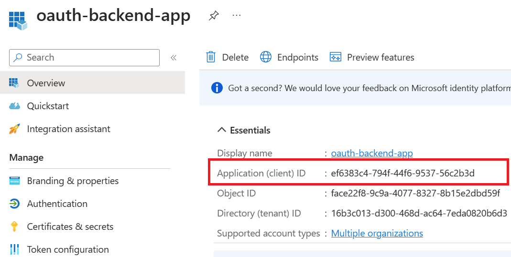
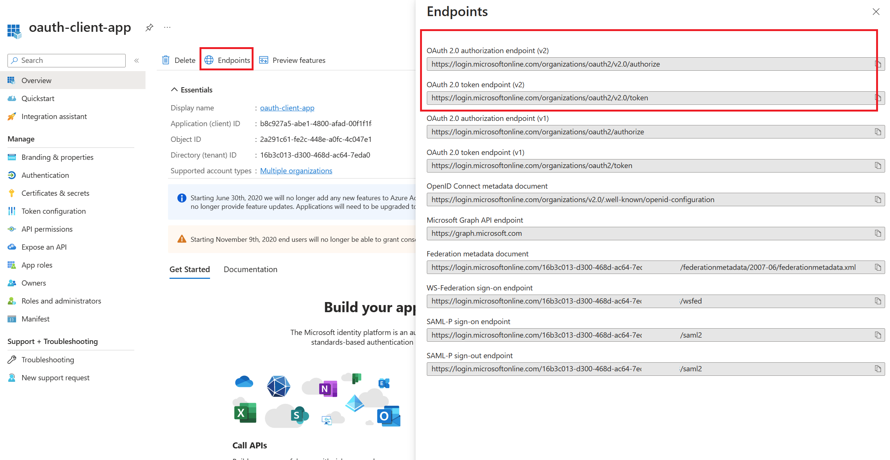
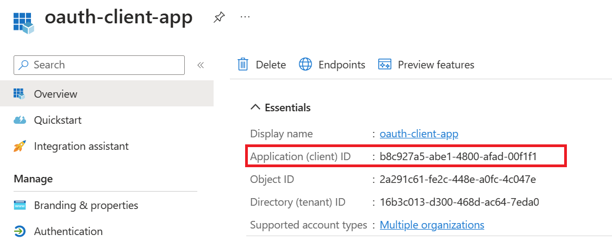

## Authorization Code

In Authorization code grant type, User is challenged to prove their identity providing user credentials. Upon successful authorization, the token end point is used to obtain an access token. The obtained token is sent to the resource server and gets validated before sending the secured data to the client application.

### Register an application (backend-app) in Azure AD to represent the Colors API​

To protect an API with Azure AD, first register an application in Azure AD that represents the API. The following steps use the Azure portal to register the application.

**First we need to access our the AAD tenant we created in the excercise before, be sure you are in the right tenant**. Then select App registrations under Azure Portal to register an application:

- Select New registration.

- In the Name section, enter a meaningful application name that will be displayed to users of the app. For example `oauth-backend-app`
- In the Supported account types section, select an option that suits your scenario.
- Leave the Redirect URI section empty.
- Select Register to create the application.

- On the app Overview page, find the Application (client) ID value and record it for later.

- Select Expose an API and set the Application ID URI with the default value. Record this value for later.
- Select the Add a scope button to display the Add a scope page. Then create a new scope that's supported by the API (for example, Colors.Read).
- Select the Add scope button to create the scope. Repeat this step to add all scopes supported by your API.
- When the scopes are created, make a note of them for use in a subsequent step.

### Register another application (client-app) in Azure AD to represent a client application that needs to call the API.​

Every client application that calls the API needs to be registered as an application in Azure AD. In this example, the client application is the Developer Console in the API Management developer portal. In this case we will register another application in Azure AD to represent the Developer Console:

- Select New registration.

- In the Name section, enter a meaningful application name that will be displayed to users of the app.  For example `oauth-client-app`
- In the Supported account types section, select an option that suits your scenario.
- Leave the Redirect URI section empty.
- Select Register to create the application.

- On the app Overview page, find the Application (client) ID value and record it for later.
- Create a client secret for this application to use in a subsequent step.
    - From the left menu options for your client app, select Certificates & secrets, and select New client secret.
    - Under Add a client secret, provide a Description. Choose when the key should expire and select Add. When the secret is created, note the key value for use in a subsequent step.

### Enable OAuth 2.0 in the Developer Console for Authorization Code Grant type

At this point, we have created the applications in Azure AD, and granted proper permissions to allow the client-app to call the backend-app.

In this demo, the Developer Console is the client-app and has a walk through on how to enable OAuth 2.0 user authorization in the Developer Console.
Steps mentioned below:

- In Azure portal, browse to your API Management instance and Select OAuth 2.0 > Add.
- Provide a Display name and Description.
- For the Client registration page URL, enter a placeholder value, such as http://localhost.
- For Authorization grant types, select Authorization code.

Specify the Authorization endpoint URL and Token endpoint URL. These values can be retrieved from the Endpoints page in your Azure AD tenant. Browse to the client App registrations page again and select Endpoints.

#### Endpoints versions

We recommend using v2 endpoints. When using v2 endpoints, use the scope you created for the backend-app in the Default scope field. Also, make sure to set the value for the accessTokenAcceptedVersion property to 2 in your application manifest in Azure AD Client APP and Backend app.

- Next, specify the client credentials. These are the credentials for the client-app.
- For Client ID, use the Application ID of the client-app.

- For Client secret, use the key you created for the client-app earlier.
- Immediately following the client secret is the redirect_urls

- Go back to your client-app registration in Azure Active Directory under Authentication.
- Paste the redirect_url under Redirect URI, and  check the issuer tokens then click on Configure button to save.

Now that you have configured an OAuth 2.0 authorization server, the Developer Console can obtain access tokens from Azure AD.

The next step is to enable OAuth 2.0 user authorization for your API. This enables the Developer Console to know that it needs to obtain an access token on behalf of the user, before making calls to your API.

- Go to APIs menu under the APIM
- Select the API you want to protect and Go to Settings.
- Under Security, choose OAuth 2.0, select the OAuth 2.0 server you configured earlier and select save.

#### Calling the API from the Developer Portal

### Validate-jwt policy to pre-authorize requests with AD token:
