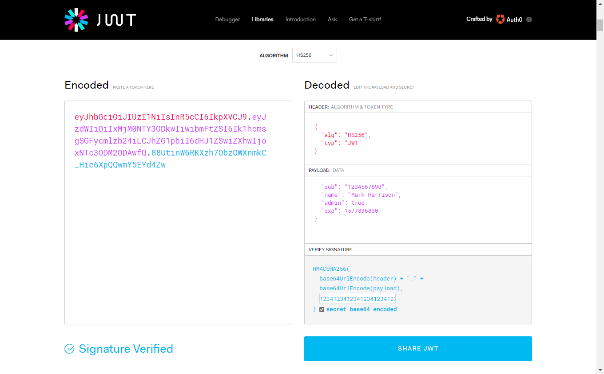
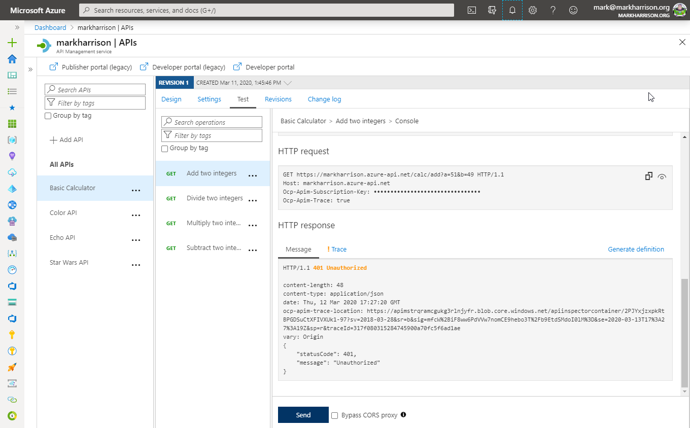
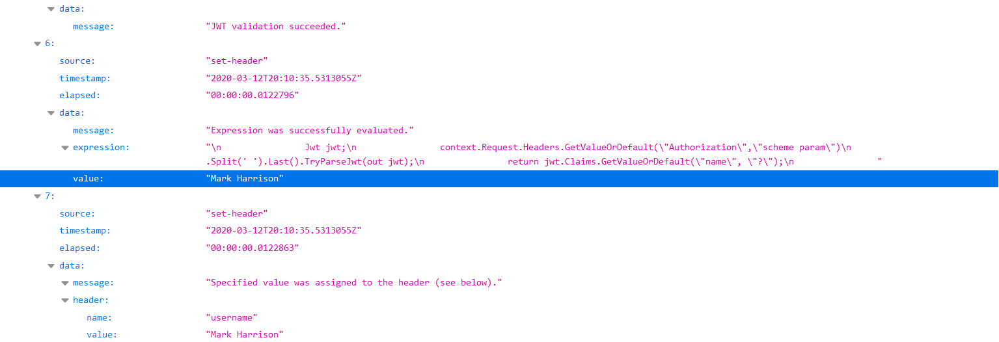

## Security

### JSON Web Tokens (JWT)

JSON Web Tokens are an open-industry standard method for representing claims securely between two parties. More info at <https://jwt.io/>

- Use the following sites
  - <https://jwt.io/> to create a JWT
    - Use a key that matches the value in the policy expression e.g. 123412341234123412341234
  - <https://www.unixtimestamp.com/index.php>
    - i.e. 01/01/2020  = 1577836800



In this lab, we are going to see how to use the token with your APIs

#### JSON Web Tokens (JWT) - validate

Open the Calculator API 'Code View'
- Add the inbound policy to validate that JWT is valid
  - The example shows the use of variables in an expression - useful if a value is repeated

```xml
<!-- Inbound -->
<set-variable name="signingKey" value="123412341234123412341234" />
<validate-jwt header-name="Authorization" failed-validation-httpcode="401" failed-validation-error-message="Unauthorized">
    <issuer-signing-keys>
        <key>@((string)context.Variables["signingKey"])</key>
    </issuer-signing-keys>
</validate-jwt>

```

- Invoke the API ... should get a [401 Unauthorized error]
- Invoke the API with a request header containing the security token (got above from <https://jwt.io/>) ... should get a 200 success
  - Name: Authorization
  - Value: bearer `JWT token`  (space between bearer and token)

No JWT:



Valid JWT in the header:

Note the bearer token in the Request payload.
Make sure your JWT token has an expiry date in the future.


#### JSON Web Tokens (JWT) - check a claim exists

- Open the Calculator API 'Code View'
- Add the inbound policy to validate that JWT is valid and that the claim 'admin' exists
- Invoke the API - with Authorization header as above ... should get a 200 success
- Amend the policy with a claim name that doesn't exist e.g. 'adminx'
- Invoke the API - with Authorization header as above ... should get a 401 Unauthorized error

```xml
<!-- Inbound -->
        <set-variable name="signingKey" value="123412341234123412341234" />
        <validate-jwt header-name="Authorization" failed-validation-httpcode="401" failed-validation-error-message="Unauthorized">
            <issuer-signing-keys>
                <key>@((string)context.Variables["signingKey"])</key>
            </issuer-signing-keys>
            <required-claims>
                <claim name="admin" match="any">
                    <value>true</value>
                </claim>
            </required-claims>
        </validate-jwt>
```

Checking for admin claim:


Checking for adminx claim:

```xml
                <claim name="adminx" match="any">
```


#### JSON Web Tokens (JWT) - extract claim and pass to backend

- Open the Calculator API 'Code View'
- Add the inbound policy to:
  - validate the JWT (as above)
  - extract the 'name' claim and set in header (below)
- Invoke the API - with Authorization header as above ... should get a 200 success
- Use the Trace feature to inspect what was passed to backend ... should see the use name from JWT

```xml
<!-- Inbound -->
<set-header exists-action="override" name="username">
    <value>@{
        Jwt jwt;
        context.Request.Headers.GetValueOrDefault("Authorization","scheme param")
                            .Split(' ').Last().TryParseJwt(out jwt);
        return jwt.Claims.GetValueOrDefault("name", "?");
        }
    </value>
</set-header>
```




### Managed Service Identity

In Azure, an Active Directory identity can be assigned to a managed resource such as an Azure Function, App Service or even an API Management instance. Once an identity is assigned, it has many capabilities to work with other resources that leverage Azure AD for authentication, much like a service principal.

#### Register API Management with Active Directory


#### Key Vault - Create Key Vault and add a secret

- Create a Key Vault instance
- Add a [secret](https://docs.microsoft.com/en-us/azure/key-vault/secrets/quick-create-portal#add-a-secret-to-key-vault) to the Key Vault instance
  - Name:`favoritePerson`
  - Value: `3`


#### Key Vault - Access policy and principal assignment

Create an access policy


Select the `Get` operation from the list of Secret permissions


Select the principal and search for the name of your API Management instance


Remember to click **Save**


#### API Management, Key Vault and Managed Service Identity

- Add a new operation to the Star Wars API
- Update the policies for the new operation


```xml
<!-- Inbound -->
<base />
<send-request mode="new" response-variable-name="secretResponse" timeout="20" ignore-error="false">
    <set-url>https://{your-keyvault-base-uri}.azure.net/secrets/favoritePerson/?api-version=7.0</set-url>
    <set-method>GET</set-method>
    <authentication-managed-identity resource="https://vault.azure.net" />
</send-request>
<set-variable name="favoritePersonRequest" value="@{
    var secret = ((IResponse)context.Variables["secretResponse"]).Body.As<JObject>();
    return "/people/" + secret["value"].ToString() + "/";
}" />
<rewrite-uri template="@((string)context.Variables["favoritePersonRequest"])" />
```

#### Test the operation

- Test the operation (use the developer portal, Azure portal or tools like Postman and curl)
- Notice the request URL will be similar to: `https://{your-apim-instance}.azure-api.net/sw/favorite`

