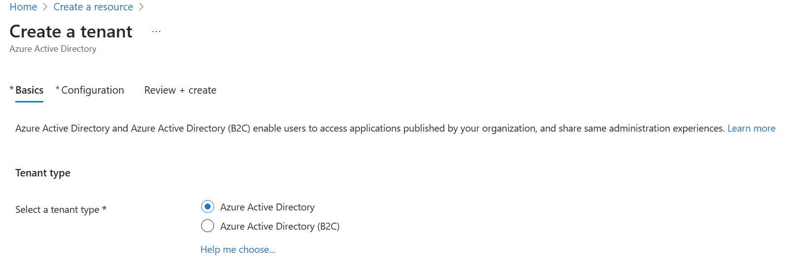
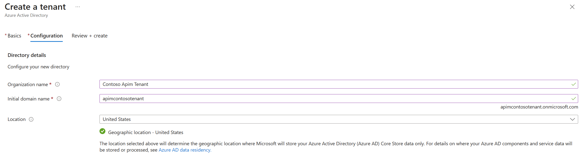

## AAD Create a new tenant

1. Sign in to your organization's [Azure portal](https://portal.azure.com/).

1. From the Azure portal menu, select **Create a resource**.  
 
1. Select **Identity**, and then select **Azure Active Directory**.

    

    The **Create directory** page appears.

    

1.  On the **Create directory** page, enter the following information with a unique available value:
    - **Organization name**
    - **Initial domain name**
    
    - Finaly, leave the _United States_ option in the **Country or region** box.

    

1. Select **Create**.

Your new tenant is created with the domain `<your domain>.onmicrosoft.com`.
