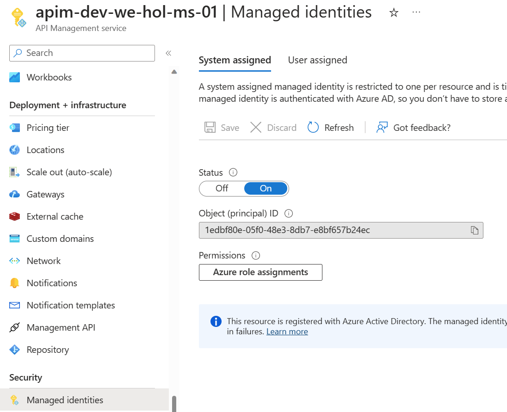
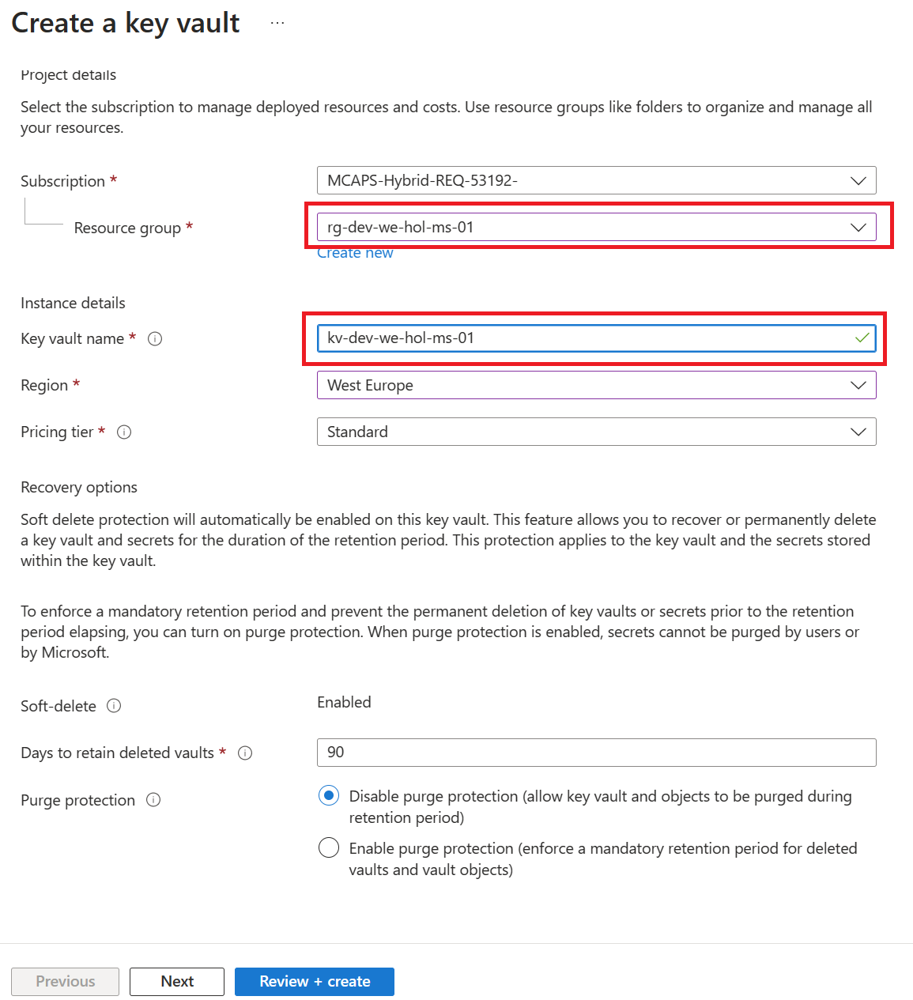
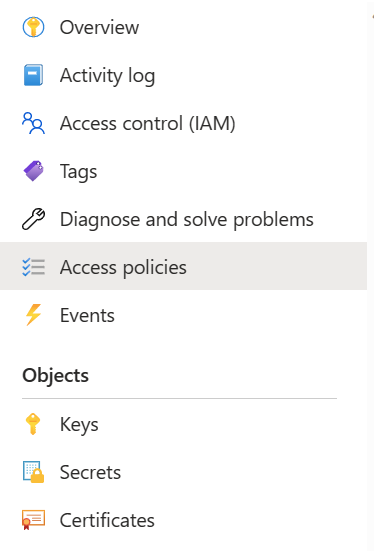
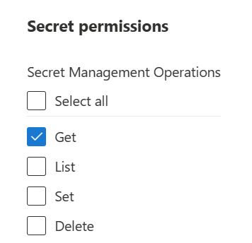
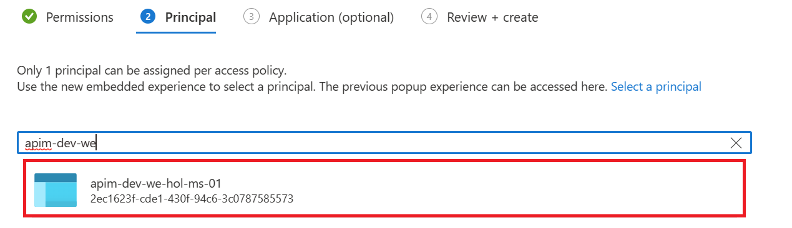
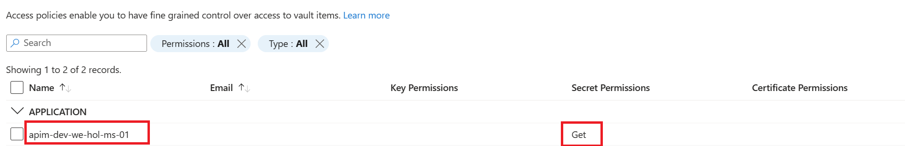
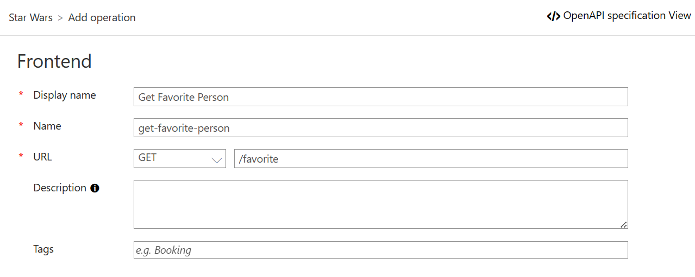

## Managed Identities

In Azure, an Active Directory identity can be assigned to a managed resource such as an Azure Function, App Service or even an Azure API Management instance. Once an identity is assigned, it has many capabilities to work with other resources that leverage Azure AD for authentication, much like a service principal.

### Register Azure API Management with Active Directory



## Key Vault 

### Create Key Vault and add a secret

- Create a **Key Vault** instance, the naming convention is: `kv-<environment>-<region>-<application-name>-<owner>-<instance>`



- Next, add a [secret](https://docs.microsoft.com/en-us/azure/key-vault/secrets/quick-create-portal#add-a-secret-to-key-vault) to the Key Vault instance
  - Name:`favoritePerson`
  - Secret value: `3`

### Access policy and principal assignment

Create an access policy



Select the `Get` operation from the list of Secret permissions



Select the principal and search for the name of your Azure API Management instance



Remember to click **Create**

You should see something like this:



### Azure API Management, Key Vault and Managed Service Identity

- Go back to your APIM
- Add a new operation to the **Star Wars** API (if you did the previous parts of the labs, choose the version of the API you want)



- Update the policies for **this** new operation

```xml
<inbound>
  <base />
  <send-request mode="new" response-variable-name="secretResponse" timeout="20" ignore-error="false">
      <set-url>https://{your-keyvault-name}.vault.azure.net/secrets/favoritePerson/?api-version=7.0</set-url>
      <set-method>GET</set-method>
      <authentication-managed-identity resource="https://vault.azure.net" />
  </send-request>
  <set-variable name="favoritePersonRequest" value="@{
      var secret = ((IResponse)context.Variables["secretResponse"]).Body.As<JObject>();
      return "/people/" + secret["value"].ToString() + "/";
  }" />
  <rewrite-uri template="@((string)context.Variables["favoritePersonRequest"])" />
</inbound>
```

Don't forget to change the `set-url` value with your Key Vault name.

### Test the operation

- Sign in to the developer portal and test this new operation
- Notice the request URL will be similar to: `https://{your-apim-instance}.azure-api.net/sw/favorite`

