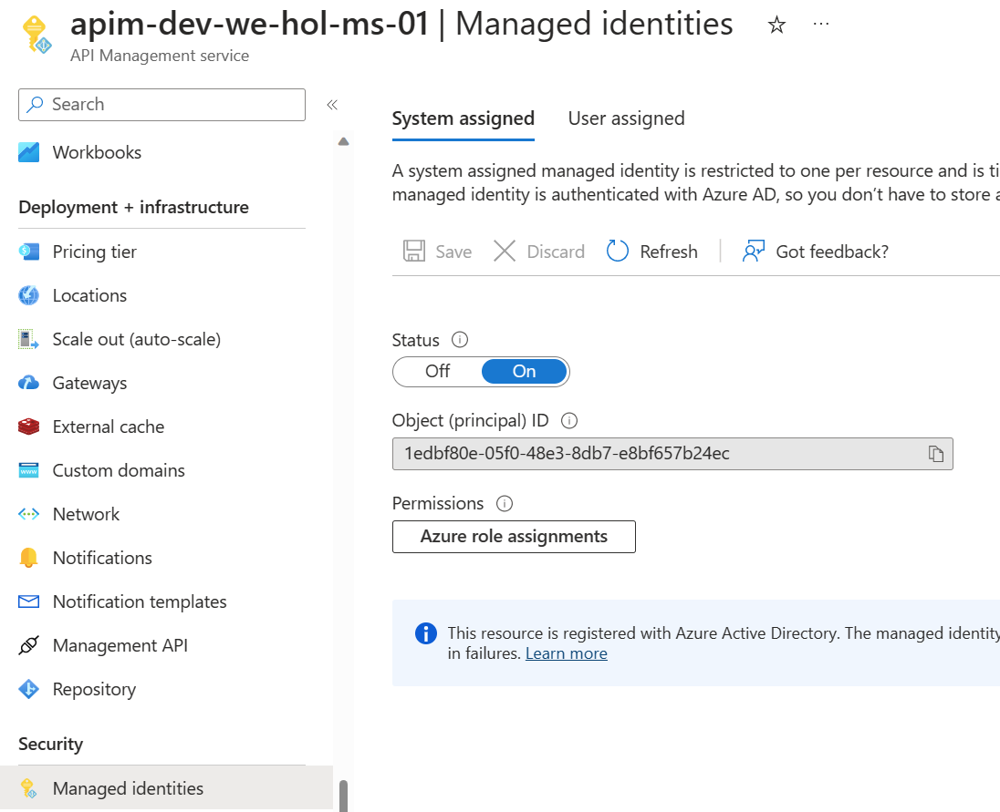
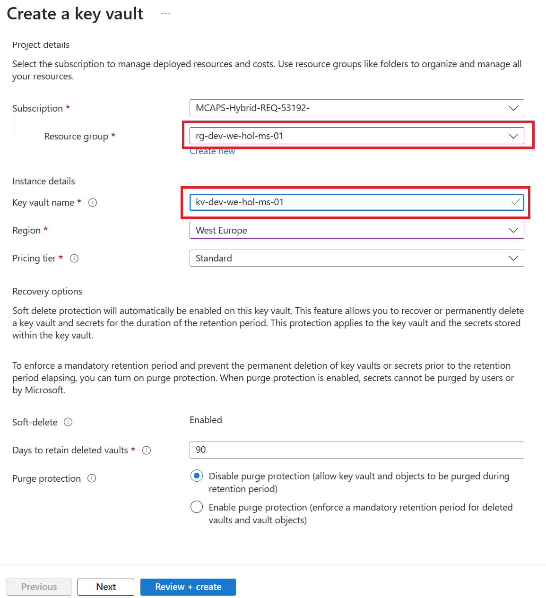
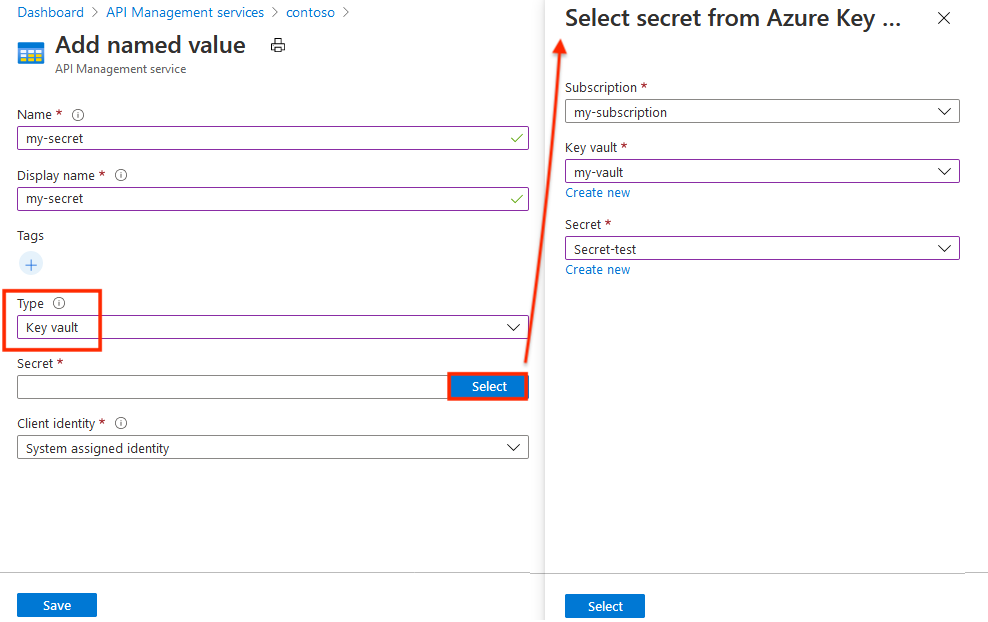
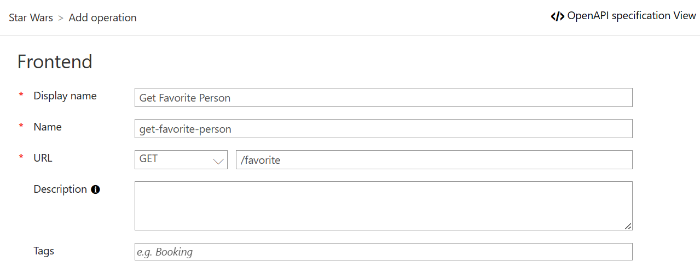

## Managed Identities

In Azure, an Active Directory identity can be assigned to a managed resource such as an Azure Function, App Service or even an Azure API Management instance. Once an identity is assigned, it has many capabilities to work with other resources that leverage Azure AD for authentication, much like a service principal. This section will demonstrate how to access "Named Values" of type Secrets from Key Vault. 

### Register Azure API Management with Active Directory by enabling its Managed Idenity



## Key Vault 

### Create Key Vault

- Create a **Key Vault** instance, the naming convention is: `kv-<environment>-<region>-<application-name>-<owner>-<instance>`



#### Next, add a [secret](https://docs.microsoft.com/en-us/azure/key-vault/secrets/quick-create-portal#add-a-secret-to-key-vault) to the Key Vault instance
  - Name:`Secret-test`
  - Secret value: `3`
    
### Steps to grant the API Management managed identity the appropriate RBAC permissions on the Key Vault

1. In the left menu, select Access control (IAM).
1. On the Access control (IAM) page, select Add role assignment.
1. On the Role tab, select Key Vault Secrets User, then select Next.
1. On the Members tab, select Managed identity > + Select members.
1. On the Select managed identity page, select the system-assigned managed identity associated with your API Management instance, and then select Select.
1. Select Review + assign.

### Steps to create a Key Valut based secret as Named Value in Azure API Management

1. In the Azure portal, navigate to your API Management instance.
1. Under APIs, select Named values > + Add.
1. Enter a Name identifier, and enter a Display name used to reference the property in policies.
1. Add one or more optional Tags to help organize your named values.
1. In the Type drop-down, select Key vault.
1. Enter the identifier of a key vault secret (without version), or choose Select to select a secret from a key vault.
1. In Client identity, select a system-assigned or an existing user-assigned managed identity. Learn how to add or modify managed identities in your API Management service.
1. Select Save, then select Create.


### Azure API Management, Key Vault and Managed Service Identity

- Go back to your APIM
- Add a new operation to the **Star Wars** API (if you did the previous parts of the labs, choose the version of the API you want)



- Update the policies for **this** new operation

```xml
<inbound>
  <base />
  <rewrite-uri template="/people/{{my-secret}}/" />
</inbound>
```

### Test the operation

- Sign in to the developer portal and test this new operation
- Notice the request URL will be similar to: `https://{your-apim-instance}.azure-api.net/sw/favorite`


