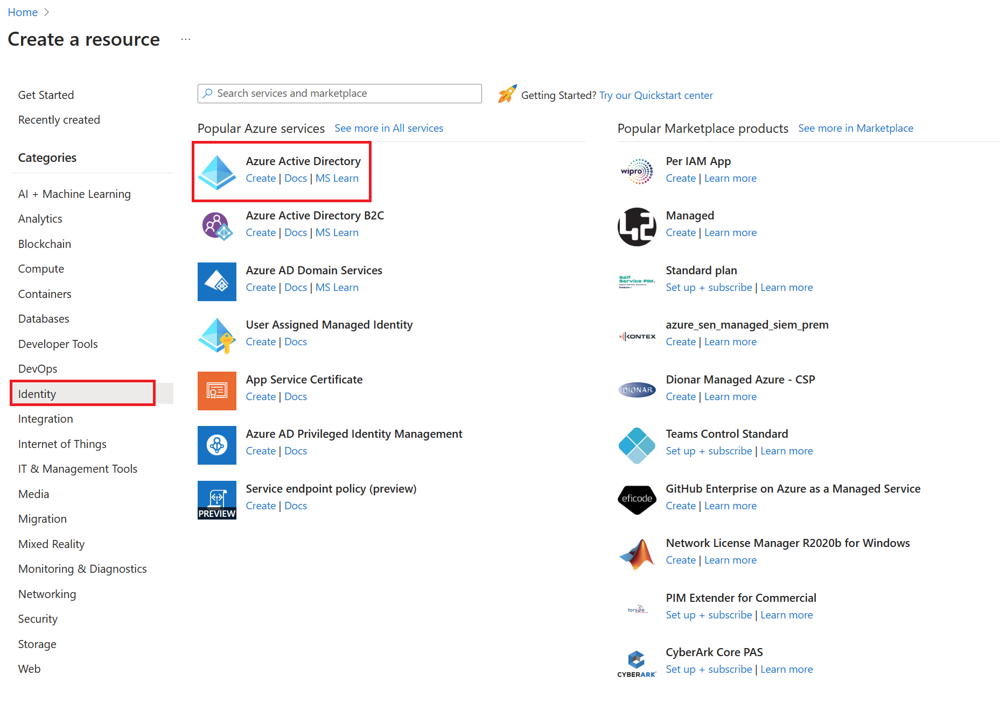
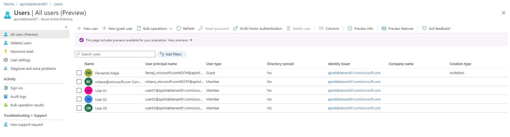

## Additional Topics - Azure Active Directory Integration

## AAD Create a new tenant

1. Sign in to your organization's [Azure portal](https://portal.azure.com/).

1. From the Azure portal menu, select **Create a resource**.  

    

1. Select **Identity**, and then select **Azure Active Directory**.

    The **Create directory** page appears.

    

1.  On the **Create directory** page, enter the following information:
    
    - Type _Contoso_ into the **Organization name** box.

    - Type _Contoso_ into the **Initial domain name** box.

    - Leave the _United States_ option in the **Country or region** box.

1. Select **Create**.

Your new tenant is created with the domain labapimtenant.onmicrosoft.com.

## AAD Create a new users and groups

## Add a new user

You can create a new user using the Azure Active Directory portal.

To add a new user, follow these steps:

1. Sign in to the [Azure portal](https://portal.azure.com/) as a User administrator for the organization.

1. Search for and select *Azure Active Directory* from any page.

1. Select **Users**, and then select **New user**.

    

2. On the **User** page, enter information for this user:

   - **Name**. Required. The first and last name of the new user. For example, *Mary Parker*.

   - **User name**. Required. The user name of the new user. For example, `mary@contoso.com`.

     The domain part of the user name must use either the initial default domain name, *\<yourdomainname>.onmicrosoft.com*, or a custom domain name, such as *contoso.com*. For more information about how to create a custom domain name, see [Add your custom domain name using the Azure Active Directory portal](add-custom-domain.md).

   - **Groups**. Optionally, you can add the user to one or more existing groups. You can also add the user to groups at a later time. For more information about adding users to groups, see [Create a basic group and add members using Azure Active Directory](active-directory-groups-create-azure-portal.md).

   - **Directory role**: If you require Azure AD administrative permissions for the user, you can add them to an Azure AD role. You can assign the user to be a Global administrator or one or more of the limited administrator roles in Azure AD. For more information about assigning roles, see [How to assign roles to users](active-directory-users-assign-role-azure-portal.md).

   - **Job info**: You can add more information about the user here, or do it later. For more information about adding user info, see [How to add or change user profile information](active-directory-users-profile-azure-portal.md).

3. Copy the autogenerated password provided in the **Password** box. You'll need to give this password to the user to sign in for the first time.

4. Select **Create**.

The user is created and added to your Azure AD organization.

# Create a basic group and add members using Azure Active Directory
You can create a basic group using the Azure Active Directory (Azure AD) portal. For the purposes of this article, a basic group is added to a single resource by the resource owner (administrator) and includes specific members (employees) that need to access that resource. For more complex scenarios, including dynamic memberships and rule creation, see the [Azure Active Directory user management documentation](../users-groups-roles/index.yml).

## Group and membership types
There are several group and membership types. The following information explains each group and membership type and why they are used, to help you decide which options to use when you create a group.

### Group types:
- **Security**. Used to manage member and computer access to shared resources for a group of users. For example, you can create a security group for a specific security policy. By doing it this way, you can give a set of permissions to all the members at once, instead of having to add permissions to each member individually. A security group can have users, devices, groups and service principals as its members and users and service principals as its owners. For more info about managing access to resources, see [Manage access to resources with Azure Active Directory groups](active-directory-manage-groups.md).
- **Microsoft 365**. Provides collaboration opportunities by giving members access to a shared mailbox, calendar, files, SharePoint site, and more. This option also lets you give people outside of your organization access to the group. A Microsoft 365 group can have only users as its members. Both users and service principals can be owners of a Microsoft 365 group. For more info about Microsoft 365 Groups, see [Learn about Microsoft 365 Groups](https://support.office.com/article/learn-about-office-365-groups-b565caa1-5c40-40ef-9915-60fdb2d97fa2).

### Membership types:
- **Assigned.** Lets you add specific users to be members of this group and to have unique permissions. For the purposes of this article, we're using this option.
- **Dynamic user.** Lets you use dynamic membership rules to automatically add and remove members. If a member's attributes change, the system looks at your dynamic group rules for the directory to see if the member meets the rule requirements (is added) or no longer meets the rules requirements (is removed).
- **Dynamic device.** Lets you use dynamic group rules to automatically add and remove devices. If a device's attributes change, the system looks at your dynamic group rules for the directory to see if the device meets the rule requirements (is added) or no longer meets the rules requirements (is removed).

    > [!IMPORTANT]
    > You can create a dynamic group for either devices or users, but not for both. You also can't create a device group based on the device owners' attributes. Device membership rules can only reference device attributions. For more info about creating a dynamic group for users and devices, see [Create a dynamic group and check status](../users-groups-roles/groups-create-rule.md)

## Create a basic group and add members
You can create a basic group and add your members at the same time. To create a basic group and add members use the following procedure:

1. Sign in to the [Azure portal](https://portal.azure.com) using a Global administrator account for the directory.

1. Search for and select **Azure Active Directory**.

1. On the **Active Directory** page, select **Groups** and then select **New group**.

    

1. The **New Group** pane will appear and you must fill out the required information.

    

1. Select a pre-defined **Group type**. For more information on group types, see [Group and membership types](#group-types).

1. Create and add a **Group name.** Choose a name that you'll remember and that makes sense for the group. A check will be performed to determine if the name is already in use by another group. If the name is already in use, to avoid duplicate naming, you'll be asked to change the name of your group.

1. Add a **Group email address** for the group, or keep the email address that is filled in automatically.

1. **Group description.** Add an optional description to your group.

1. Select a pre-defined **Membership type (required).** For more information on membership types, see [Group and membership types](#membership-types).

1. Select **Create**. Your group is created and ready for you to add members.

1. Select the **Members** area from the **Group** page, and then begin searching for the members to add to your group from the **Select members** page.

    

1. When you're done adding members, choose **Select**.

    The **Group Overview** page updates to show the number of members who are now added to the group.

    

    Create user1, user2, user3
    Group blue
        Add user1
    Group green
        Add user1
        Add user2
        Add user3
    Group red
        Add user3
        

## AAD Register apps 
    Register Frontend - msal authenticate the user , obtain user group claim 
    Register api management , validate jwt 
    Register el backend legacy SOAP - certificate auth, networking firewall ///

## Modify Frontend with AAD login 
    Add a view to asp.net core frontend with msal authentication

## APIM configure OAUTH2 server
    Add oauth2 server
    Add oauth2 server to webservice
    Add jwt-validate policy 
    Transform, get user group claim and pass to legacy backend

## Legacy Backend,
    Secure using networking 

## Add legacy backend to apim

## Cofigure legacy webservice to apim

---
[Home](README.md)  
